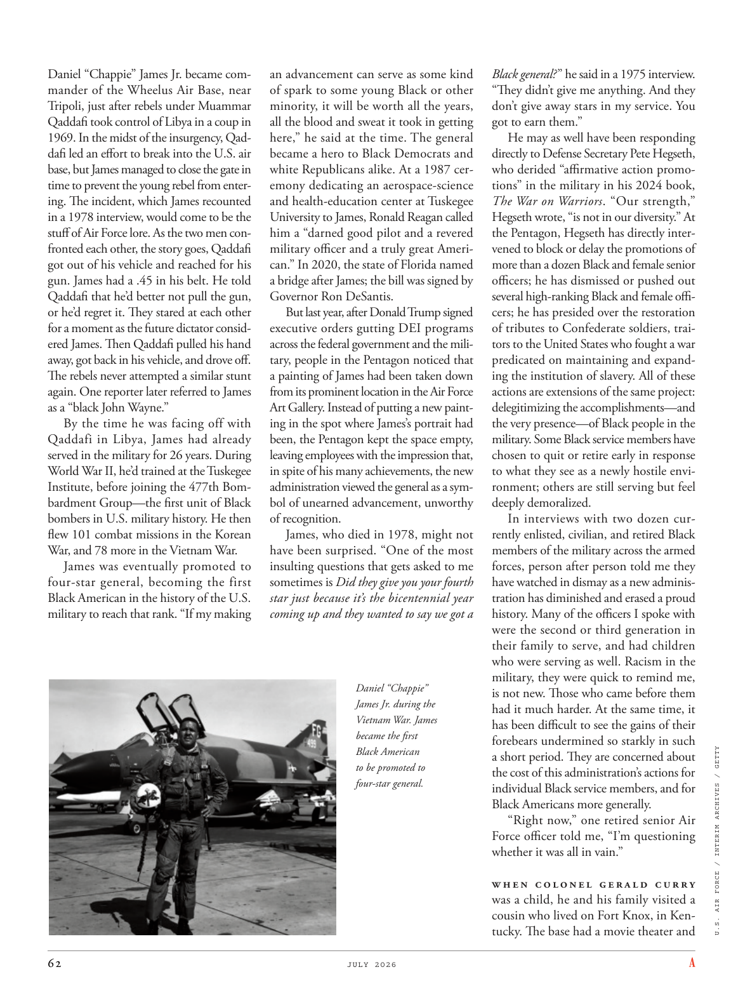

# The Atlantic — July 2026

## Page 64

---

Daniel “Chappie” James Jr. became commander of the Wheelus Air Base, near Tripoli, just after rebels under Muammar Qaddafi took control of Libya in a coup in 1969. In the midst of the insurgency, Qaddafiled an effort to break into the U.S. air base, but James managed to close the gate in time to prevent the young rebel from entering. The incident, which James recounted in a 1978 interview, would come to be the stuff of Air Force lore. As the two men confronted each other, the story goes, Qaddafi got out of his vehicle and reached for his gun. James had a .45 in his belt. He told Qaddafi that he’d better not pull the gun, or he’d regret it. They stared at each other for a moment as the future dictator considered James. Then Qaddafi pulled his hand away, got back in his vehicle, and drove off.

**【中文翻译】** 1969 年穆阿迈尔·卡扎菲领导的叛乱分子通过政变控制了利比亚后，小丹尼尔·“查皮”·詹姆斯 (Daniel “Chappie” James Jr.) 成为的黎波里附近的惠勒斯空军基地 (Wheelus Air Base) 的指挥官。在叛乱期间，卡扎菲试图闯入美国空军基地，但詹姆斯及时关闭了大门，阻止了年轻的叛军进入。詹姆斯在 1978 年的一次采访中讲述了这一事件，后来成为空军的传奇故事。据说，当两人对峙时，卡扎菲下了车，伸手去拿枪。詹姆斯的腰带上有 0.45 的分数。他告诉卡扎菲他最好不要拔枪，否则他会后悔的。当未来的独裁者考虑着詹姆斯时，他们互相凝视了一会儿。然后卡扎菲把手抽开，回到车里，开车离开。

The rebels never attempted a similar stunt again. One reporter later referred to James as a “black John Wayne.” By the time he was facing off with Qaddafi in Libya, James had already served in the military for 26 years. During World War II, he’d trained at the Tuskegee Institute, before joining the 477th Bombardment Group—the first unit of Black bombers in U.S. military history. He then flew 101 combat missions in the Korean War, and 78 more in the Vietnam War.

**【中文翻译】** 叛乱分子再也没有尝试过类似的伎俩。一位记者后来将詹姆斯称为“黑人约翰·韦恩”。当詹姆斯在利比亚与卡扎菲对峙时，他已经在军队服役了26年。第二次世界大战期间，他在塔斯基吉学院接受训练，然后加入第 477 轰炸大队——美国军事历史上第一支黑人轰炸机部队。随后，他在朝鲜战争中执行了 101 次战斗任务，在越南战争中执行了 78 次战斗任务。

James was eventually promoted to four-star general, becoming the first Black American in the history of the U.S. military to reach that rank. “If my making an advancement can serve as some kind of spark to some young Black or other minority, it will be worth all the years, all the blood and sweat it took in getting here,” he said at the time. The general became a hero to Black Democrats and white Republicans alike. At a 1987 ceremony dedicating an aerospace-science and health-education center at Tuskegee University to James, Ronald Reagan called him a “darned good pilot and a revered military officer and a truly great American.” In 2020, the state of Florida named a bridge after James; the bill was signed by Governor Ron DeSantis.

**【中文翻译】** 詹姆斯最终晋升为四星上将，成为美国军队历史上第一位达到这一军衔的黑人。他当时表示：“如果我的进步能够为一些年轻的黑人或其他少数族裔带来某种火花，那么所有这些年来、所有的血汗都值得来到这里。”这位将军成为黑人民主党人和白人共和党人的英雄。 1987 年，在塔斯基吉大学为詹姆斯设立一个航空航天科学和健康教育中心的落成仪式上，罗纳德·里根称他为“一位非常优秀的飞行员、一位受人尊敬的军官和一位真正伟大的美国人”。 2020年，佛罗里达州以詹姆斯的名字命名了一座桥；该法案由州长罗恩·德桑蒂斯签署。

But last year, after Donald Trump signed executive orders gutting DEI programs across the federal government and the military, people in the Pentagon noticed that a painting of James had been taken down from its prominent location in the Air Force Art Gallery. Instead of putting a new painting in the spot where James’s portrait had been, the Pentagon kept the space empty, leaving employees with the impression that, in spite of his many achievements, the new administration viewed the general as a symbol of unearned advancement, unworthy of recognition.

**【中文翻译】** 但去年，在唐纳德·特朗普签署行政命令，废除联邦政府和军队的 DEI 项目后，五角大楼的人们注意到，一幅詹姆斯的画被从空军美术馆的显着位置拿了下来。五角大楼没有在詹姆斯肖像所在的地方放上一幅新画，而是将这个空间保留为空，这给员工留下了这样的印象：尽管他取得了许多成就，但新政府将这位将军视为不劳而获的进步的象征，不值得认可。

James, who died in 1978, might not have been surprised. “One of the most insulting questions that gets asked to me sometimes is Did they give you your fourth star just because it’s the bicentennial year coming up and they wanted to say we got a Daniel “Chappie” James Jr. during the Vietnam War. James became the first Black American to be promoted to four-star general.

**【中文翻译】** 1978 年去世的詹姆斯可能对此并不感到惊讶。 “有时我会被问到的最具侮辱性的问题之一是，他们是否给了你第四颗星，只是因为即将到来的二百周年，他们想说我们在越南战争期间得到了一个丹尼尔“查派”詹姆斯小。詹姆斯成为第一个晋升为四星将军的美国黑人。

Black general? ” he said in a 1975 interview. “They didn’t give me anything. And they don’t give away stars in my service. You got to earn them.”

**【中文翻译】** 黑将军？ ”他在 1975 年接受采访时说道。“他们没有给我任何东西。他们不会在我的服务中赠送星星。你必须赢得它们。”

He may as well have been responding directly to Defense Secretary Pete Hegseth, who derided “affirmative action promotions” in the military in his 2024 book, The War on Warriors . “Our strength,” Hegseth wrote, “is not in our diversity.” At the Pentagon, Hegseth has directly intervened to block or delay the promotions of more than a dozen Black and female senior officers; he has dismissed or pushed out several high-ranking Black and female officers; he has presided over the restoration of tributes to Confederate soldiers, traitors to the United States who fought a war predicated on maintaining and expanding the institution of slavery. All of these actions are extensions of the same project: delegitimizing the accomplishments— and the very presence—of Black people in the military. Some Black service members have chosen to quit or retire early in response to what they see as a newly hostile environment; others are still serving but feel deeply demoralized.

**【中文翻译】** 他也可能是直接回应国防部长皮特·赫格斯 (Pete Hegseth)，后者在 2024 年出版的著作《勇士之战》中嘲笑军队中的“平权行动晋升”。赫格斯写道：“我们的优势不在于我们的多样性。”在五角大楼，赫格斯直接介入阻止或推迟十多名黑人和女性高级军官的晋升；他解雇或驱逐了几名高级黑人和女性军官；他主持恢复了对南部邦联士兵的致敬，这些士兵是美国的叛徒，他们为维持和扩大奴隶制而进行了战争。所有这些行动都是同一个项目的延伸：剥夺黑人在军队中的成就和存在的合法性。一些黑人军人选择退出或提前退休，以应对他们所看到的新的敌对环境；其他人仍在服役，但士气低落。

In interviews with two dozen currently enlisted, civilian, and retired Black members of the military across the armed forces, person after person told me they have watched in dismay as a new administration has diminished and erased a proud history. Many of the officers I spoke with were the second or third generation in their family to serve, and had children who were serving as well. Racism in the military, they were quick to remind me, is not new. Those who came before them had it much harder. At the same time, it has been difficult to see the gains of their forebears undermined so starkly in such

**【中文翻译】** 在对武装部队中二十多名现役、文职和退役黑人军人的采访中，一个又一个的人告诉我，他们沮丧地看到新政府削弱并抹去了一段令人自豪的历史。我采访过的许多军官都是他们家族中服役的第二代或第三代，他们的孩子也在服役。他们很快提醒我，军队中的种族主义并不新鲜。那些在他们之前的人的处境要困难得多。与此同时，很难看到他们的祖先的成果在这样的情况下受到如此明显的破坏。

*U.S. AIR FORCE / INTERIM ARCHIVES / GETTY*

*【图注与署名】美国空军/临时档案/盖蒂图片社*

a short period. They are concerned about the cost of this administration’s actions for individual Black service members, and for Black Americans more generally.

**【中文翻译】** 很短的一段时间。他们担心本届政府的行动给个别黑人军人以及更广泛的美国黑人带来的代价。

“Right now,” one retired senior Air Force officer told me, “I’m questioning whether it was all in vain.” W h e n C o lo n e l G e r a l d C u r r y was a child, he and his family visited a cousin who lived on Fort Knox, in Kentucky. The base had a movie theater and

**【中文翻译】** “现在，”一位退休高级空军军官告诉我，“我怀疑这一切是否都是徒劳的。”当杰拉尔德·库里上校还是个孩子的时候，他和家人拜访了住在肯塔基州诺克斯堡的表弟。基地有一个电影院和
