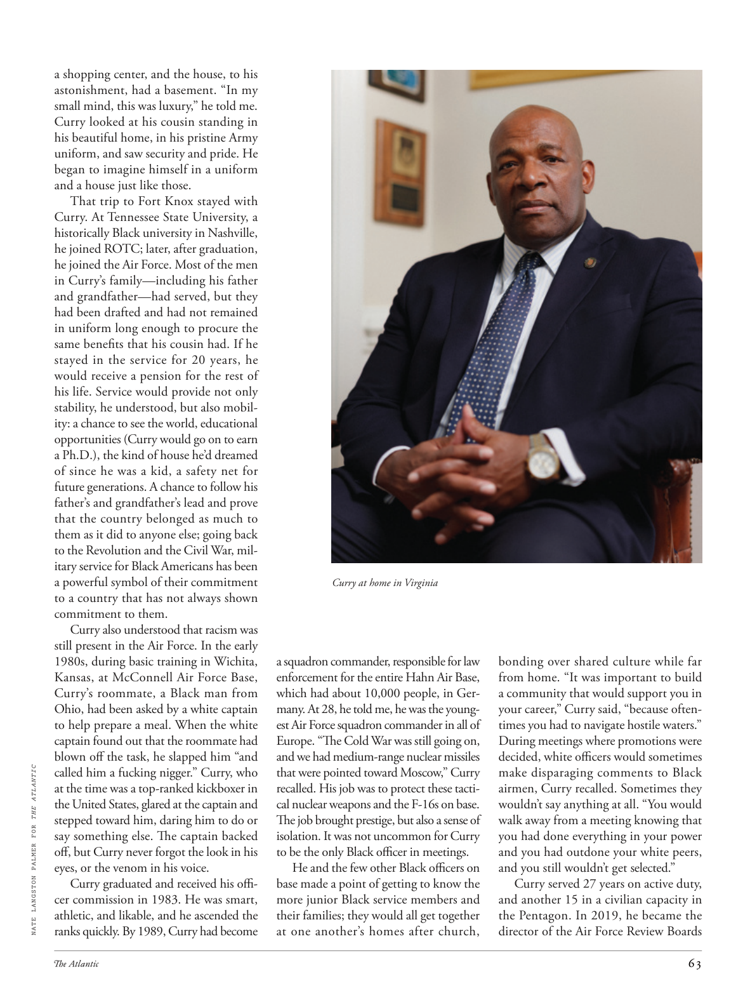

# The Atlantic — July 2026

## Page 65

---

a shopping center, and the house, to his astonishment, had a basement. “In my small mind, this was luxury,” he told me. Curry looked at his cousin standing in his beautiful home, in his pristine Army uniform, and saw security and pride. He began to imagine himself in a uniform and a house just like those.

**【中文翻译】** 令他惊讶的是，这所房子还有一个地下室。 “在我小小的心目中，这是奢侈的，”他告诉我。库里看着他的表弟穿着崭新的军装站在他美丽的家中，看到了安全感和自豪感。他开始想象自己穿着制服，住在这样的房子里。

That trip to Fort Knox stayed with Curry. At Tennessee State University, a historically Black university in Nashville, he joined ROTC; later, after graduation, he joined the Air Force. Most of the men in Curry’s family— including his father and grandfather— had served, but they had been drafted and had not remained in uniform long enough to procure the same benefits that his cousin had. If he stayed in the service for 20 years, he would receive a pension for the rest of his life. Service would provide not only stability, he understood, but also mobility: a chance to see the world, educational opportunities (Curry would go on to earn a Ph.D.), the kind of house he’d dreamed of since he was a kid, a safety net for future generations. A chance to follow his father’s and grandfather’s lead and prove that the country belonged as much to them as it did to anyone else; going back to the Revolution and the Civil War, military service for Black Americans has been a powerful symbol of their commitment to a country that has not always shown commitment to them.

**【中文翻译】** 那次诺克斯堡之行一直伴随着库里。在田纳西州立大学（纳什维尔的一所历史悠久的黑人大学），他加入了后备军官训练队（ROTC）；后来，毕业后，他加入了空军。库里家族中的大多数男人——包括他的父亲和祖父——都曾服役过，但他们都是应征入伍的，服役时间不够长，无法获得与他表弟相同的福利。如果他服役20年，他将领取终生养老金。他明白，服务不仅能提供稳定，还能提供流动性：有机会见识世界、受教育的机会（库里后来获得了博士学位）、他从小就梦想的那种房子、为子孙后代提供的安全网。有机会追随父亲和祖父的脚步，证明这个国家既属于他们，也属于其他任何人；追溯到美国独立战争和内战时期，美国黑人服兵役一直是他们对一个并不总是表现出对他们的承诺的国家的承诺的有力象征。

Curry also understood that racism was still present in the Air Force. In the early 1980s, during basic training in Wichita, Kansas, at McConnell Air Force Base, Curry’s roommate, a Black man from Ohio, had been asked by a white captain to help prepare a meal. When the white captain found out that the roommate had blown off the task, he slapped him “and NATE LANGSTON PALMER FOR THE ATLANTIC called him a fucking nigger.” Curry, who at the time was a top-ranked kickboxer in the United States, glared at the captain and stepped toward him, daring him to do or say something else. The captain backed off, but Curry never forgot the look in his eyes, or the venom in his voice.

**【中文翻译】** 库里还了解到空军中仍然存在种族主义。 20 世纪 80 年代初，在堪萨斯州威奇托的麦康奈尔空军基地进行基础训练时，库里的室友、来自俄亥俄州的黑人被一位白人上尉要求帮忙准备饭菜。当白人船长发现室友没有完成任务时，他打了他一巴掌，“《大西洋》杂志的内特·兰斯顿·帕尔默称他为他妈的黑鬼。”库里当时是美国顶级跆拳道运动员，他瞪了队长一眼，并向他走来，挑衅他做点什么或者说点什么。队长后退了，但库里永远不会忘记他的眼神，或者他声音中的毒液。

Curry graduated and received his officer commission in 1983. He was smart, athletic, and likable, and he ascended the ranks quickly. By 1989, Curry had become Curry at home in Virginia a squadron commander, responsible for law enforcement for the entire Hahn Air Base, which had about 10,000 people, in Germany. At 28, he told me, he was the youngest Air Force squadron commander in all of Europe. “The Cold War was still going on, and we had medium-range nuclear missiles that were pointed toward Moscow,” Curry recalled. His job was to protect these tactical nuclear weapons and the F-16s on base.

**【中文翻译】** 库里于 1983 年毕业并获得军官委任。他聪明、运动、讨人喜欢，而且晋升很快。到了1989年，库里在弗吉尼亚州的家乡成为了一名中队指挥官，负责整个德国哈恩空军基地的执法工作，该基地约有10,000人。 28 岁时，他告诉我，他是全欧洲最年轻的空军中队指挥官。 “冷战仍在继续，我们有中程核导弹瞄准莫斯科，”库里回忆道。他的工作是保护这些战术核武器和基地的 F-16 战斗机。

The job brought prestige, but also a sense of isolation. It was not uncommon for Curry to be the only Black officer in meetings. He and the few other Black officers on base made a point of getting to know the more junior Black service members and their families; they would all get together at one another’s homes after church, bonding over shared culture while far from home. “It was important to build a community that would support you in your career,” Curry said, “because oftentimes you had to navigate hostile waters.”

**【中文翻译】** 这份工作带来了声望，但也带来了孤立感。库里成为会议上唯一的黑人官员并不罕见。他和基地里的其他少数黑人军官特意去了解资历较浅的黑人军人及其家人。教堂结束后，他们都会在彼此的家里聚会，在远离家乡的情况下通过共同的文化建立联系。库里说：“建立一个支持你职业生涯的社区非常重要，因为你常常必须在充满敌意的水域中航行。”

During meetings where promotions were decided, white officers would sometimes make disparaging comments to Black airmen, Curry recalled. Sometimes they wouldn’t say anything at all. “You would walk away from a meeting knowing that you had done everything in your power and you had outdone your white peers, and you still wouldn’t get selected.”

**【中文翻译】** 库里回忆道，在决定晋升的会议上，白人军官有时会对黑人飞行员发表贬低性的言论。有时他们根本不会说什么。 “当你离开会议时，知道你已经做了你力所能及的一切，而且你已经超越了你的白人同龄人，但你仍然不会被选中。”

Curry served 27 years on active duty, and another 15 in a civilian capacity in the Pentagon. In 2019, he became the director of the Air Force Review Boards

**【中文翻译】** 库里现役 27 年，并在五角大楼以文职身份服役 15 年。 2019年，他成为空军审查委员会主任
