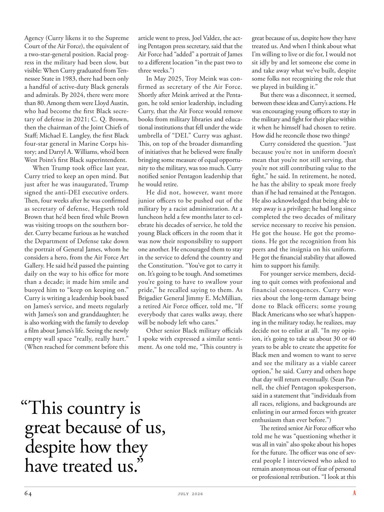

# The Atlantic — July 2026

## Page 66

---

Agency (Curry likens it to the Supreme Court of the Air Force), the equivalent of a two-star-general position. Racial progress in the military had been slow, but visible: When Curry graduated from Tennessee State in 1983, there had been only a handful of active-duty Black generals and admirals. By 2024, there were more than 80. Among them were Lloyd Austin, who had become the first Black secretary of defense in 2021; C. Q. Brown, then the chairman of the Joint Chiefs of Staff; Michael E. Langley, the first Black four-star general in Marine Corps history; and Darryl A. Williams, who’d been West Point’s first Black superintendent.

**【中文翻译】** 机构（库里将其比作空军最高法院），相当于两星上将的职位。军队中的种族进步虽然缓慢，但显而易见：库里 1983 年从田纳西州立大学毕业时，只有少数现役黑人将军和海军上将。到 2024 年，这一数字已超过 80 人。其中包括 2021 年成为第一位黑人国防部长的劳埃德·奥斯汀 (Lloyd Austin)； C. Q. 布朗，时任参谋长联席会议主席；迈克尔·E·兰利 (Michael E. Langley)，海军陆战队历史上第一位黑人四星上将；还有达里尔·A·威廉姆斯（Darryl A. Williams），他是西点军校的第一位黑人校长。

When Trump took office last year, Curry tried to keep an open mind. But just after he was inaugurated, Trump signed the anti-DEI executive orders.

**【中文翻译】** 去年特朗普上任时，库里试图保持开放的态度。但就职后不久，特朗普就签署了反DEI行政命令。

Then, four weeks after he was confirmed as secretary of defense, Hegseth told Brown that he’d been fired while Brown was visiting troops on the southern border. Curry became furious as he watched the Department of Defense take down the portrait of General James, whom he considers a hero, from the Air Force Art Gallery. He said he’d passed the painting daily on the way to his office for more than a decade; it made him smile and buoyed him to “keep on keeping on.”

**【中文翻译】** 然后，在他被确认担任国防部长四个星期后，赫格斯告诉布朗，他在布朗访问南部边境的部队时被解雇了。当库里看到国防部从空军美术馆取下他认为是英雄的詹姆斯将军的肖像时，他勃然大怒。他说十多年来，他每天去办公室的路上都会经过这幅画。这让他微笑并激励他“继续坚持下去”。

Curry is writing a leadership book based on James’s service, and meets regularly with James’s son and granddaughter; he is also working with the family to develop a film about James’s life. Seeing the newly empty wall space “really, really hurt.”

**【中文翻译】** 库里正在根据詹姆斯的服务撰写一本领导力书籍，并定期与詹姆斯的儿子和孙女会面。他还与家人合作制作一部关于詹姆斯生活的电影。看到新空的墙壁空间“真的真的很受伤”。

(When reached for comment before this

**【中文翻译】** （在此之前联系到征求意见时

### “This country is

**【标题翻译】** “这个国家是

### great because of us,

**【标题翻译】** 因为我们而伟大，

### despite how they

**【标题翻译】** 尽管他们如何

### have treated us.”

**【标题翻译】** 对待过我们。”

article went to press, Joel Valdez, the acting Pentagon press secretary, said that the Air Force had “added” a portrait of James to a different location “in the past two to three weeks.”) In May 2025, Troy Meink was confirmed as secretary of the Air Force.

**【中文翻译】** 文章付印时，五角大楼代理新闻秘书乔尔·瓦尔迪兹 (Joel Valdez) 表示，空军“在过去两到三周内”在另一个地点“添加”了詹姆斯的肖像。）2025 年 5 月，特洛伊·梅克 (Troy Meink) 被确认为空军部长。

Shortly after Meink arrived at the Pentagon, he told senior leadership, including Curry, that the Air Force would remove books from military libraries and educational institutions that fell under the wide umbrella of “DEI.” Curry was aghast.

**【中文翻译】** 梅克到达五角大楼后不久，他告诉包括库里在内的高级领导层，空军将从军事图书馆和教育机构中删除属于“DEI”广泛保护范围的书籍。库里惊呆了。

This, on top of the broader dismantling of initiatives that he believed were finally bringing some measure of equal opportunity to the military, was too much. Curry notified senior Pentagon leadership that he would retire.

**【中文翻译】** 他认为，除了更广泛地废除那些最终为军队带来某种程度的平等机会的举措之外，这一举措也太过分了。库里通知五角大楼高级领导层，他将退休。

He did not, however, want more junior officers to be pushed out of the military by a racist administration. At a luncheon held a few months later to celebrate his decades of service, he told the young Black officers in the room that it was now their responsibility to support one another. He encouraged them to stay in the service to defend the country and the Constitution. “You’ve got to carry it on. It’s going to be tough. And sometimes you’re going to have to swallow your pride,” he recalled saying to them. As Brigadier General Jimmy E. Mc Millian, a retired Air Force officer, told me, “If everybody that cares walks away, there will be nobody left who cares.”

**【中文翻译】** 然而，他不希望种族主义政府将更多下级军官赶出军队。几个月后，在一次庆祝他服役数十年的午餐会上，他告诉房间里的年轻黑人军官，现在他们有责任互相支持。他鼓励他们继续服役以保卫国家和宪法。 “你必须坚持下去。这将是艰难的。有时你不得不放下你的骄傲，”他记得对他们说。正如退役空军军官吉米·E·麦克米利安准将告诉我的那样：“如果所有关心此事的人都离开了，那么就没有人关心此事了。”

Other senior Black military officials I spoke with expressed a similar sentiment. As one told me, “This country is great because of us, despite how they have treated us. And when I think about what I’m willing to live or die for, I would not sit idly by and let someone else come in and take away what we’ve built, despite some folks not recognizing the role that we played in building it.”

**【中文翻译】** 我采访过的其他黑人高级军事官员也表达了类似的观点。正如有人告诉我的那样，“这个国家因为我们而伟大，不管他们如何对待我们。当我想到我愿意为之而生或为之而死的事情时，我不会袖手旁观，让其他人进来夺走我们所建立的东西，尽管有些人没有认识到我们在建设它过程中所扮演的角色。”

But there was a disconnect, it seemed, between these ideas and Curry’s actions. He was encouraging young officers to stay in the military and fight for their place within it when he himself had chosen to retire.

**【中文翻译】** 但这些想法和库里的行动之间似乎存在脱节。当他自己选择退休时，他鼓励年轻军官留在军队并为自己的位置而奋斗。

How did he reconcile those two things? Curry considered the question. “Just because you’re not in uniform doesn’t mean that you’re not still serving, that you’re not still contributing value to the fight,” he said. In retirement, he noted, he has the ability to speak more freely than if he had remained at the Pentagon.

**【中文翻译】** 他是如何调和这两件事的呢？库里考虑了这个问题。 “仅仅因为你没有穿制服，并不意味着你不再服役，也不意味着你不再为战斗做出贡献，”他说。他指出，退休后，他有能力比留在五角大楼时更自由地发表言论。

He also acknowledged that being able to step away is a privilege; he had long since completed the two decades of military service necessary to receive his pension.

**【中文翻译】** 他还承认，能够离开是一种荣幸。他早已完成了领取养老金所需的二十年兵役。

He got the house. He got the promotions. He got the recognition from his peers and the insignia on his uniform. He got the financial stability that allowed him to support his family.

**【中文翻译】** 他得到了房子。他得到了晋升。他得到了同行的认可，并在他的制服上佩戴了徽章。他的经济稳定使他能够养家糊口。

For younger service members, deciding to quit comes with professional and financial consequences. Curry worries about the long-term damage being done to Black officers; some young Black Americans who see what’s happening in the military today, he realizes, may decide not to enlist at all. “In my opinion, it’s going to take us about 30 or 40 years to be able to create the appetite for Black men and women to want to serve and see the military as a viable career option,” he said. Curry and others hope that day will return eventually. (Sean Parnell, the chief Pentagon spokesperson, said in a statement that “individuals from all races, religions, and backgrounds are enlisting in our armed forces with greater enthusiasm than ever before.”) The retired senior Air Force officer who told me he was “questioning whether it was all in vain” also spoke about his hopes for the future. The officer was one of several people I interviewed who asked to remain anonymous out of fear of personal or professional retribution. “I look at this

**【中文翻译】** 对于年轻的军人来说，决定退出会带来职业和经济上的后果。库里担心黑人警官受到的长期损害；他意识到，一些看到当今军队发生的事情的年轻美国黑人可能会决定根本不参军。 “在我看来，我们需要大约 30 或 40 年的时间才能激发黑人男女服役的兴趣，并将参军视为可行的职业选择，”他说。库里和其他人希望这一天最终能够回归。 （五角大楼首席发言人肖恩·帕内尔在一份声明中表示，“来自不同种族、宗教和背景的人都以前所未有的热情加入我们的武装部队。”）那位告诉我他“质疑这一切是否都是徒劳”的退休高级空军军官也谈到了他对未来的希望。该官员是我采访的几位因担心个人或职业报复而要求保持匿名的人之一。 “我看着这个
