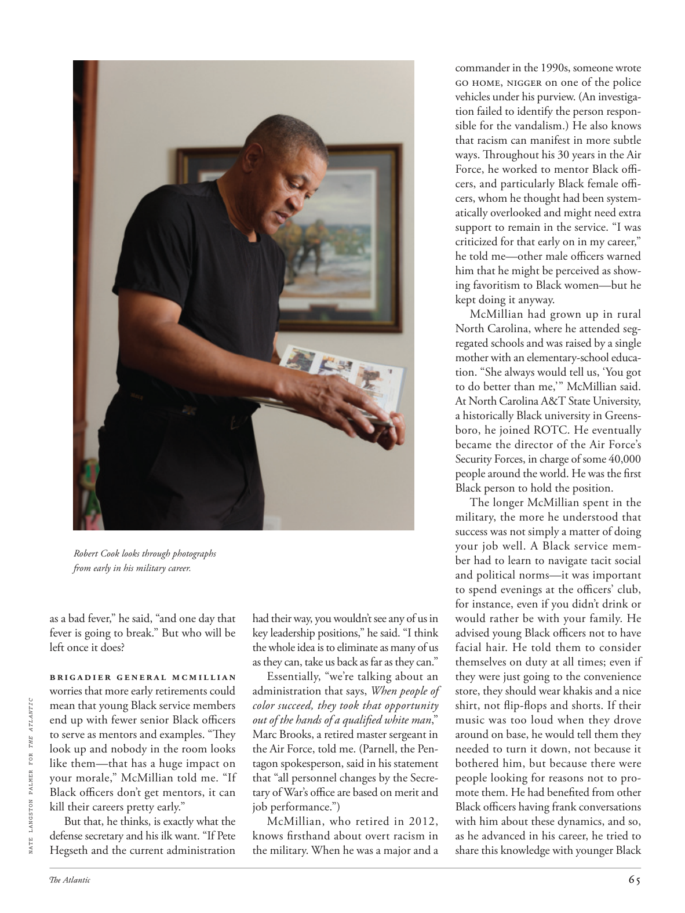

# The Atlantic — July 2026

## Page 67

---

Robert Cook looks through photographs from early in his military career. as a bad fever,” he said, “and one day that fever is going to break.” But who will be left once it does?

**【中文翻译】** 罗伯特·库克翻阅他军事生涯早期的照片。就像一场严重的发烧一样，”他说，“有一天，发烧会消失。”但一旦发生，谁会被留下呢？

Brigadier General McMillian worries that more early retirements could NATE LANGSTON PALMER FOR THE ATLANTIC mean that young Black service members end up with fewer senior Black officers to serve as mentors and examples. “They look up and nobody in the room looks like them— that has a huge impact on your morale,” McMillian told me. “If Black officers don’t get mentors, it can kill their careers pretty early.”

**【中文翻译】** 麦克米兰准将担心，更多的提前退休可能意味着年轻的黑人军人最终会减少担任导师和榜样的高级黑人军官。 “他们抬头一看，房间里没有人看起来像他们——这对你的士气有巨大的影响，”麦克米利安告诉我。 “如果黑人警官得不到导师，他们的职业生涯可能会很早就被毁掉。”

But that, he thinks, is exactly what the defense secretary and his ilk want. “If Pete Hegseth and the current administration had their way, you wouldn’t see any of us in key leadership positions,” he said. “I think the whole idea is to eliminate as many of us as they can, take us back as far as they can.”

**【中文翻译】** 但他认为，这正是国防部长及其同僚想要的。 “如果皮特·赫格斯和现任政府按他们的方式行事，你就不会看到我们中的任何人担任关键领导职务，”他说。 “我认为整个想法是尽可能多地消灭我们，把我们带回尽可能远的地方。”

Essentially, “we’re talking about an administration that says, When people of color succeed, they took that opportunity out of the hands of a qualified white man ,” Marc Brooks, a retired master sergeant in the Air Force, told me. (Parnell, the Pentagon spokesperson, said in his statement that “all personnel changes by the Secretary of War’s office are based on merit and job performance.”) McMillian, who retired in 2012, knows firsthand about overt racism in the military. When he was a major and a commander in the 1990s, someone wrote Go Home, Nigger on one of the police vehicles under his purview. (An investigation failed to identify the person responsible for the vandalism.) He also knows that racism can manifest in more subtle ways. Throughout his 30 years in the Air Force, he worked to mentor Black officers, and particularly Black female officers, whom he thought had been systematically overlooked and might need extra support to remain in the service. “I was criticized for that early on in my career,” he told me—other male officers warned him that he might be perceived as showing favoritism to Black women—but he kept doing it anyway.

**【中文翻译】** 从本质上讲，“我们谈论的是一个政府，它说，当有色人种成功时，他们就从合格的白人手中夺走了这个机会，”空军退役军士长马克·布鲁克斯告诉我。 （五角大楼发言人帕内尔在声明中表示，“战争部长办公室的所有人事变动都是基于功绩和工作表现。”）麦克米利安于 2012 年退休，对军队中公开的种族主义有着第一手的了解。 20世纪90年代，当他还是一名少校和指挥官时，有人在他管辖的一辆警车上写下“黑鬼回家吧”。 （调查未能确定破坏行为的责任人。）他还知道种族主义可以以更微妙的方式表现出来。在空军的 30 年里，他致​​力于指导黑人军官，特别是黑人女军官，他认为她们被系统性地忽视，可能需要额外的支持才能继续服役。 “我在职业生涯的早期就因此受到了批评，”他告诉我——其他男性警官警告他，他可能会被认为对黑人女性表现出偏袒——但他还是继续这样做。

McMillian had grown up in rural North Carolina, where he attended segregated schools and was raised by a single mother with an elementary-school education. “She always would tell us, ‘You got to do better than me,’ ” McMillian said.

**【中文翻译】** 麦克米利安在北卡罗来纳州农村长大，在那里他上的是种族隔离学校，由一位受过小学教育的单亲母亲抚养长大。 “她总是告诉我们，‘你必须比我做得更好，’”麦克米利安说。

At North Carolina A&T State University, a historically Black university in Greensboro, he joined ROTC. He eventually became the director of the Air Force’s Security Forces, in charge of some 40,000 people around the world. He was the first Black person to hold the position.

**【中文翻译】** 在北卡罗来纳州 A&T 州立大学（位于格林斯博罗的一所历史悠久的黑人大学），他加入了后备军官训练队 (ROTC)。他最终成为空军安全部队的负责人，负责管理世界各地约 40,000 名人员。他是第一位担任该职位的黑人。

The longer McMillian spent in the military, the more he understood that success was not simply a matter of doing your job well. A Black service member had to learn to navigate tacit social and political norms— it was important to spend evenings at the officers’ club, for instance, even if you didn’t drink or would rather be with your family. He advised young Black officers not to have facial hair. He told them to consider themselves on duty at all times; even if they were just going to the convenience store, they should wear khakis and a nice shirt, not flip-flops and shorts. If their music was too loud when they drove around on base, he would tell them they needed to turn it down, not because it bothered him, but because there were people looking for reasons not to promote them. He had benefited from other Black officers having frank conversations with him about these dynamics, and so, as he advanced in his career, he tried to share this knowledge with younger Black

**【中文翻译】** 麦克米利安在军队服役的时间越长，他就越明白成功不仅仅是做好工作的问题。黑人军人必须学会驾驭默认的社会和政治规范——例如，在军官俱乐部度过晚上很重要，即使你不喝酒或者更愿意和家人在一起。他建议年轻的黑人军官不要留胡子。他告诉他们任何时候都要考虑自己在值班；即使他们只是去便利店，他们也应该穿卡其裤和漂亮的衬衫，而不是人字拖和短裤。如果他们在基地开车时音乐太大声，他会告诉他们需要把声音关小，不是因为这让他烦恼，而是因为有人在寻找理由不宣传他们。他从其他黑人军官与他就这些动态进行坦诚对话中受益匪浅，因此，随着他职业生涯的进步，他试图与年轻的黑人分享这些知识
