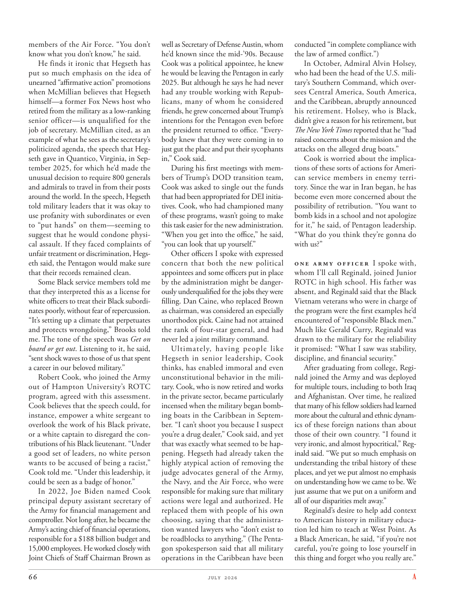

# The Atlantic — July 2026

## Page 68

---

members of the Air Force. “You don’t know what you don’t know,” he said. He finds it ironic that Hegseth has put so much emphasis on the idea of unearned “affirmative action” promotions when McMillian believes that Hegseth himself—a former Fox News host who retired from the military as a lowranking senior officer—is un qualified for the job of secretary. McMillian cited, as an example of what he sees as the secretary’s politicized agenda, the speech that Hegseth gave in Quantico, Virginia, in September 2025, for which he’d made the unusual decision to require 800 generals and admirals to travel in from their posts around the world. In the speech, Hegseth told military leaders that it was okay to use profanity with subordinates or even to “put hands” on them—seeming to suggest that he would condone physical assault. If they faced complaints of unfair treatment or discrimination, Hegseth said, the Pentagon would make sure that their records remained clean.

**【中文翻译】** 空军成员。 “你不知道你不知道什么，”他说。他觉得讽刺的是，赫格斯如此过分强调不劳而获的“平权行动”晋升的想法，而麦克米利安认为赫格斯本人——前福克斯新闻主持人，以低级高级军官身份从军队退役——没有资格担任秘书一职。麦克米利安引用了赫格斯 2025 年 9 月在弗吉尼亚州匡蒂科发表的演讲作为他认为国务卿政治化议程的一个例子，为此他做出了一个不同寻常的决定，要求 800 名将军和海军上将从世界各地的岗位赶来。在演讲中，赫格斯告诉军事领导人，可以对下属使用脏话，甚至可以对他们“动手”——这似乎表明他会纵容人身攻击。赫格斯说，如果他们面临不公平待遇或歧视的投诉，五角大楼将确保他们的记录保持干净。

Some Black service members told me that they interpreted this as a license for white officers to treat their Black subordinates poorly, without fear of repercussion.

**【中文翻译】** 一些黑人军人告诉我，他们将此解读为白人军官可以虐待黑人下属，而不必担心受到报复。

“It’s setting up a climate that perpetuates and protects wrongdoing,” Brooks told me. The tone of the speech was Get on board or get out . Listening to it, he said, “sent shock waves to those of us that spent a career in our beloved military.”

**【中文翻译】** “这正在营造一种延续和保护不法行为的氛围，”布鲁克斯告诉我。讲话的语气是“要么上船，要么滚蛋”。他说，听到这首歌“给我们这些在我们心爱的军队度过了职业生涯的人带来了冲击波。”

Robert Cook, who joined the Army out of Hampton University’s ROTC program, agreed with this assessment. Cook believes that the speech could, for instance, empower a white sergeant to overlook the work of his Black private, or a white captain to disregard the contributions of his Black lieutenant. “Under a good set of leaders, no white person wants to be accused of being a racist,” Cook told me. “Under this leadership, it could be seen as a badge of honor.”

**【中文翻译】** 从汉普顿大学后备军官训练队项目加入陆军的罗伯特·库克同意这一评估。库克认为，这篇演讲可以让一名白人中士忽视他的黑人士兵的工作，或者让一名白人上尉无视他的黑人中尉的贡献。 “在一群优秀的领导人的领导下，没有白人愿意被指控为种族主义者，”库克告诉我。 “在这样的领导下，这可以被视为一种荣誉徽章。”

In 2022, Joe Biden named Cook principal deputy assistant secretary of the Army for financial management and comptroller. Not long after, he became the Army’s acting chief of financial operations, responsible for a $188 billion budget and 15,000 employees. He worked closely with Joint Chiefs of Staff Chairman Brown as well as Secretary of Defense Austin, whom he’d known since the mid-’90s. Because Cook was a political appointee, he knew he would be leaving the Pentagon in early 2025. But although he says he had never had any trouble working with Republicans, many of whom he considered friends, he grew concerned about Trump’s intentions for the Pentagon even before the president returned to office. “Everybody knew that they were coming in to just gut the place and put their sycophants in,” Cook said.

**【中文翻译】** 2022 年，乔·拜登任命库克为陆军首席副助理部长，负责财务管理和审计长。不久之后，他成为陆军代理财务运营主管，负责 1,880 亿美元的预算和 15,000 名员工。他与参谋长联席会议主席布朗以及国防部长奥斯汀密切合作，他从上世纪 90 年代中期就认识他们了。由于库克是一名政治任命者，他知道自己将于 2025 年初离开五角大楼。不过，尽管他表示自己与共和党人（其中许多人被他视为朋友）合作从未遇到过任何麻烦，但甚至在总统重返办公室之前，他就开始担心特朗普对五角大楼的意图。库克说：“每个人都知道，他们来这里只是为了破坏这个地方，并把他们的阿谀奉承者放进去。”

During his first meetings with members of Trump’s DOD transition team, Cook was asked to single out the funds that had been appropriated for DEI initiatives. Cook, who had championed many of these programs, wasn’t going to make this task easier for the new administration.

**【中文翻译】** 在与特朗普国防部过渡团队成员的第一次会面中，库克被要求列出用于 DEI 计划的资金。库克曾支持许多此类计划，但他不会让新政府的这项任务变得更容易。

“When you get into the office,” he said, “you can look that up yourself.” Other officers I spoke with expressed concern that both the new political appointees and some officers put in place by the administration might be dangerously underqualified for the jobs they were filling. Dan Caine, who replaced Brown as chairman, was considered an especially unorthodox pick. Caine had not attained the rank of four-star general, and had never led a joint military command.

**【中文翻译】** “当你进入办公室时，”他说，“你可以自己查一下。”与我交谈过的其他官员表示担心，新的政治任命人员和政府任命的一些官员可能严重不适合他们所担任的职位。接替布朗担任董事长的丹·凯恩被认为是一个特别非正统的人选。凯恩并未获得四星上将军衔，也从未领导过联合军事指挥。

Ultimately, having people like Hegseth in senior leadership, Cook thinks, has enabled immoral and even un constitutional behavior in the military. Cook, who is now retired and works in the private sector, became particularly incensed when the military began bombing boats in the Caribbean in September. “I can’t shoot you because I suspect you’re a drug dealer,” Cook said, and yet that was exactly what seemed to be happening. Hegseth had already taken the highly atypical action of removing the judge advocates general of the Army, the Navy, and the Air Force, who were responsible for making sure that military actions were legal and authorized. He replaced them with people of his own choosing, saying that the administration wanted lawyers who “don’t exist to be roadblocks to anything.” (The Pentagon spokesperson said that all military operations in the Caribbean have been conducted “in complete compliance with the law of armed conflict.”) In October, Admiral Alvin Holsey, who had been the head of the U.S. military’s Southern Command, which oversees Central America, South America, and the Caribbean, abruptly announced his retirement. Holsey, who is Black, didn’t give a reason for his retirement, but The New York Times reported that he “had raised concerns about the mission and the attacks on the alleged drug boats.”

**【中文翻译】** 库克认为，最终，让赫格斯这样的人担任高级领导职务，导致了军队中不道德甚至违反宪法的行为。库克现已退休，在私营部门工作，当军方于 9 月份开始轰炸加勒比海的船只时，他变得尤其愤怒。库克说：“我不能开枪射杀你，因为我怀疑你是毒贩。”但事实似乎正是如此。赫格斯已经采取了非常非典型的行动，罢免了陆军、海军和空军的军法署署长，他们负责确保军事行动合法和授权。他用自己选择的人取代了他们，并表示政府希望“不存在的律师成为任何事情的障碍”。 （五角大楼发言人表示，在加勒比地区的所有军事行动都是“完全遵守武装冲突法”。）10月，负责监管中美洲、南美洲和加勒比地区的美军南方司令部司令阿尔文·霍尔西上将突然宣布退休。霍尔西是黑人，他没有给出退休的原因，但《纽约时报》报道称，他“对此次任务和对涉嫌贩毒船的袭击表示担忧”。

Cook is worried about the implications of these sorts of actions for American service members in enemy territory. Since the war in Iran began, he has become even more concerned about the possibility of retribution. “You want to bomb kids in a school and not apologize for it,” he said, of Pentagon leadership.

**【中文翻译】** 库克担心此类行动对敌方领土上的美国军人造成的影响。自从伊朗战争爆发以来，他更加担心遭到报复的可能性。 “你想轰炸学校里的孩子而不为此道歉，”他谈到五角大楼的领导层时说道。

“What do you think they’re gonna do with us?” One Army officer I spoke with, whom I’ll call Reginald, joined Junior ROTC in high school. His father was absent, and Reginald said that the Black Vietnam veterans who were in charge of the program were the first examples he’d encountered of “responsible Black men.”

**【中文翻译】** “你觉得他们会拿我们做什么？”我采访过的一位陆军军官，我称之为雷金纳德，在高中时加入了少年后备军官训练队。他的父亲缺席，雷金纳德说，负责该计划的黑人越南退伍军人是他遇到的第一个“负责任的黑人”的例子。

Much like Gerald Curry, Reginald was drawn to the military for the reliability it promised: “What I saw was stability, discipline, and financial security.”

**【中文翻译】** 就像杰拉德·库里一样，雷金纳德之所以被军队所吸引，是因为它所承诺的可靠性：“我看到的是稳定、纪律和财务安全。”

After graduating from college, Reginald joined the Army and was deployed for multiple tours, including to both Iraq and Afghanistan. Over time, he realized that many of his fellow soldiers had learned more about the cultural and ethnic dynamics of these foreign nations than about those of their own country. “I found it very ironic, and almost hypocritical,” Reginald said. “We put so much emphasis on understanding the tribal history of these places, and yet we put almost no emphasis on understanding how we came to be. We just assume that we put on a uniform and all of our disparities melt away.”

**【中文翻译】** 大学毕业后，雷金纳德加入了陆军，并多次被部署到伊拉克和阿富汗。随着时间的推移，他意识到他的许多战友对这些外国的文化和种族动态的了解比对自己国家的文化和种族动态的了解更多。 “我觉得这非常讽刺，而且几乎是虚伪的，”雷金纳德说。 “我们非常重视了解这些地方的部落历史，但我们几乎不重视了解我们是如何形成的。我们只是假设我们穿上制服，所有的差异都会消失。”

Reginald’s desire to help add context to American history in military education led him to teach at West Point. As a Black American, he said, “if you’re not careful, you’re going to lose yourself in this thing and forget who you really are.”

**【中文翻译】** 雷金纳德希望在军事教育中帮助增加美国历史的背景，这促使他在西点军校任教。作为一名美国黑人，他说，“如果你不小心，你就会在这件事中迷失自己，忘记自己真正是谁。”
