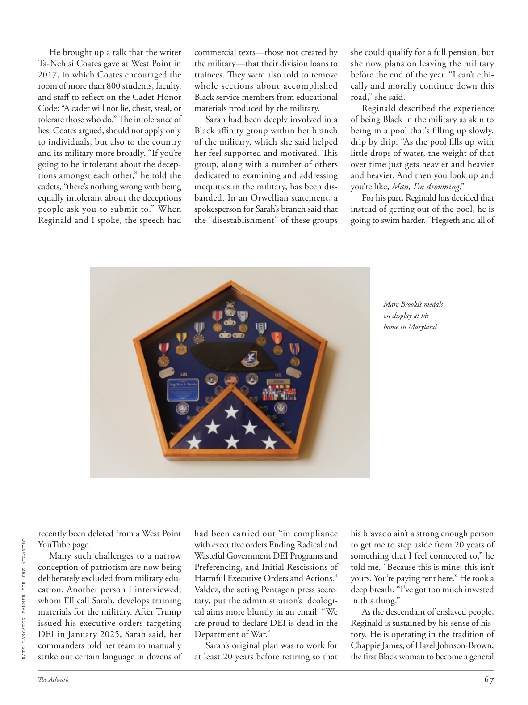

# The Atlantic — July 2026

## Page 69

---

He brought up a talk that the writer Ta‑Nehisi Coates gave at West Point in 2017, in which Coates encouraged the room of more than 800 students, faculty, and staff to reflect on the Cadet Honor Code: “A cadet will not lie, cheat, steal, or tolerate those who do.” The in tolerance of lies, Coates argued, should not apply only to individuals, but also to the country and its military more broadly. “If you’re going to be intolerant about the decep‑ tions amongst each other,” he told the cadets, “there’s nothing wrong with being equally intolerant about the deceptions people ask you to submit to.” When Reginald and I spoke, the speech had recently been deleted from a West Point NATE LANGSTON PALMER FOR THE ATLANTIC YouTube page.

**【中文翻译】** 他提到了作家塔内西·科茨 (Ta‑Nehisi Coates) 2017 年在西点军校发表的一次演讲，科茨在演讲中鼓励全场 800 多名学生、教职员工反思学员荣誉准则：“学员不会说谎、欺骗、偷窃，也不会容忍这样做的人。”科茨认为，对谎言的容忍不仅适用于个人，也适用于更广泛的国家及其军队。 “如果你们不能容忍彼此之间的欺骗，”他告诉学员们，“那么同样不能容忍人们要求你们接受的欺骗也没有什么错。”当雷金纳德和我讲话时，该演讲最近已从西点军校内特·兰斯顿·帕尔默为大西洋的 YouTube 页面删除。

Many such challenges to a narrow conception of patriotism are now being deliberately excluded from military edu‑ cation. Another person I interviewed, whom I’ll call Sarah, develops training materials for the military. After Trump issued his executive orders targeting DEI in January 2025, Sarah said, her commanders told her team to manually strike out certain language in dozens of commercial texts—those not created by the military—that their division loans to trainees. They were also told to remove whole sections about accomplished Black service members from educational materi als produced by the military.

**【中文翻译】** 许多此类对狭隘爱国主义概念的挑战现在被故意排除在军事教育之外。我采访的另一个人，我称之为莎拉，为军队开发培训材料。莎拉说，特朗普于 2025 年 1 月发布针对 DEI 的行政命令后，她的指挥官告诉她的团队手动删除他们部门借给学员的数十份商业文本（这些文本不是由军方创建的）中的某些语言。他们还被告知从军队制作的教育材料中删除有关有成就的黑人军人的全部部分。

Sarah had been deeply involved in a Black affinity group within her branch of the military, which she said helped her feel supported and motivated. This group, along with a number of others dedicated to examining and addressing inequities in the military, has been dis‑ banded. In an Orwellian statement, a spokesperson for Sarah’s branch said that the “disestablishment” of these groups had been carried out “in compliance with executive orders Ending Radical and Wasteful Government DEI Programs and Preferencing, and Initial Rescissions of Harmful Executive Orders and Actions.”

**【中文翻译】** 莎拉深入参与了她所在军队部门内的一个黑人亲和团体，她说这让她感到支持和动力。该组织以及其他一些致力于审查和解决军队不平等问题的组织已被解散。在一份奥威尔式的声明中，莎拉分支的发言人表示，这些团体的“解散”是“根据终止激进和浪费的政府 DEI 计划和偏好以及初步废除有害行政命令和行动的行政命令”进行的。

Valdez, the acting Pentagon press secre‑ tary, put the administration’s ideologi‑ cal aims more bluntly in an email: “We are proud to declare DEI is dead in the Department of War.”

**【中文翻译】** 五角大楼代理新闻秘书瓦尔迪兹在一封电子邮件中更直白地表达了政府的意识形态目标：“我们自豪地宣布 DEI 在战争部已经消亡。”

Sarah’s original plan was to work for at least 20 years before retiring so that she could qualify for a full pension, but she now plans on leaving the military before the end of the year. “I can’t ethi‑ cally and morally continue down this road,” she said.

**【中文翻译】** 莎拉最初的计划是在退休前至少工作20年，以便有资格领取全额养老金，但她现在计划在年底前离开军队。 “从道德上讲，我不能继续走这条路，”她说。

Reginald described the experience of being Black in the military as akin to being in a pool that’s filling up slowly, drip by drip. “As the pool fills up with little drops of water, the weight of that over time just gets heavier and heavier and heavier. And then you look up and you’re like, Man, I’m drowning .”

**【中文翻译】** 雷金纳德形容在军队中作为黑人的经历就像是在一个慢慢注满水的池子里。 “当池子里充满了小水滴时，随着时间的推移，它的重量会变得越来越重。然后你抬头一看，你会想，伙计，我快淹死了。”

For his part, Reginald has decided that instead of getting out of the pool, he is going to swim harder. “Hegseth and all of Marc Brooks’s medals on display at his home in Maryland his bravado ain’t a strong enough person to get me to step aside from 20 years of something that I feel connected to,” he told me. “Because this is mine; this isn’t yours. You’re paying rent here.” He took a deep breath. “I’ve got too much invested in this thing.”

**【中文翻译】** 就雷金纳德而言，他决定不再离开泳池，而是更加努力地游起来。 “赫格斯和马克·布鲁克斯在马里兰州家中展示的所有奖牌，他的虚张声势不足以让我放弃 20 年来与我有联系的事情，”他告诉我。 “因为这是我的；这不是你的。你要在这里付房租。”他深吸了一口气。 “我在这件事上投入太多了。”

As the descendant of enslaved people, Reginald is sustained by his sense of his‑ tory. He is operating in the tradition of Chappie James; of Hazel Johnson‑Brown, the first Black woman to become a general

**【中文翻译】** 作为奴隶的后裔，雷金纳德的历史感支撑着他。他继承了查派·詹姆斯的传统。黑兹尔·约翰逊·布朗 (Hazel Johnson-Brown)，第一位成为将军的黑人女性
