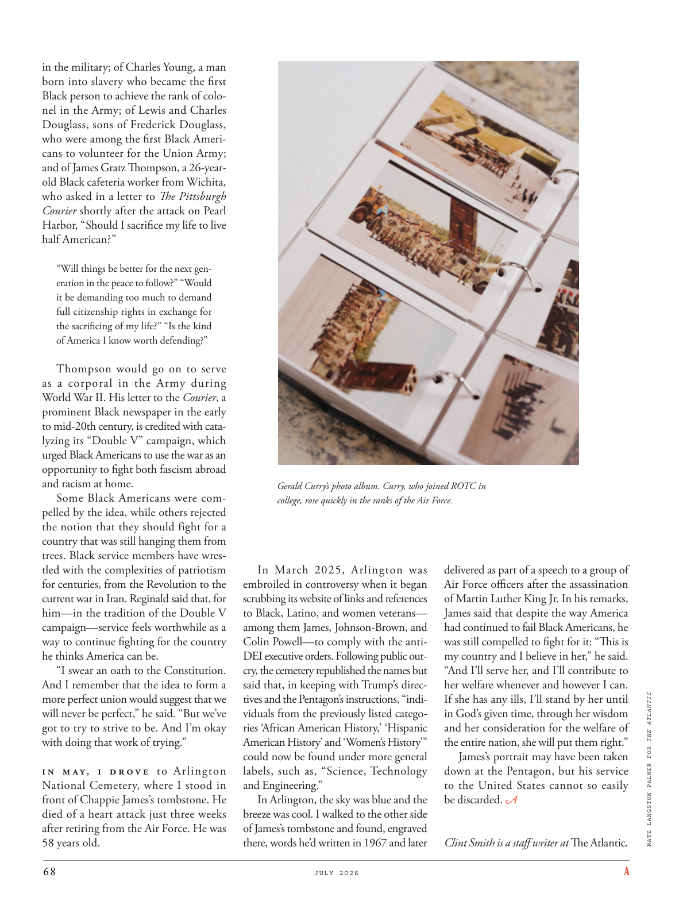

# The Atlantic — July 2026

## Page 70

---

in the military; of Charles Young, a man born into slavery who became the first Black person to achieve the rank of colonel in the Army; of Lewis and Charles Douglass, sons of Frederick Douglass, who were among the first Black Americans to volunteer for the Union Army; and of James Gratz Thompson, a 26-yearold Black cafeteria worker from Wichita, who asked in a letter to The Pittsburgh Courier shortly after the attack on Pearl Harbor, “ Should I sacrifice my life to live half American? ” “Will things be better for the next generation in the peace to follow?” “Would it be demanding too much to demand full citizenship rights in exchange for the sacrificing of my life?” “Is the kind of America I know worth defending?”

**【中文翻译】** 在军队；查尔斯·杨（Charles Young），一个出生于奴隶制的人，成为第一个在陆军中获得上校军衔的黑人；路易斯·道格拉斯和查尔斯·道格拉斯是弗雷德里克·道格拉斯的儿子，他们是第一批志愿加入联邦军的美国黑人之一；还有来自威奇托的 26 岁黑人自助餐厅工人詹姆斯·格拉茨·汤普森 (James Gratz Thompson)，他在珍珠港袭击事件后不久给《匹兹堡信使报》的一封信中问道，“我应该牺牲自己的生命来过上半个美国人的生活吗？”“在接下来的和平中，下一代的生活会更好吗？” “以牺牲生命来换取完全的公民权利，会不会要求太高了？” “我所知道的那种美国值得捍卫吗？”

Thompson would go on to serve as a corporal in the Army during World War II. His letter to the Courier , a prominent Black newspaper in the early to mid-20th century, is credited with catalyzing its “Double V” campaign, which urged Black Americans to use the war as an opportunity to fight both fascism abroad and racism at home.

**【中文翻译】** 第二次世界大战期间，汤普森继续在陆军中担任下士。他写给《信使报》（20 世纪初至中期一家著名的黑人报纸）的信被认为促进了该报的“双 V”运动，该运动敦促美国黑人以战争为契机，在国外与法西斯主义作斗争，在国内与种族主义作斗争。

Some Black Americans were compelled by the idea, while others rejected the notion that they should fight for a country that was still hanging them from trees. Black service members have wrestled with the complexities of patriotism for centuries, from the Revolution to the current war in Iran. Reginald said that, for him— in the tradition of the Double V campaign— service feels worthwhile as a way to continue fighting for the country he thinks America can be.

**【中文翻译】** 一些美国黑人被这个想法所吸引，而另一些人则拒绝接受他们应该为一个仍然把他们吊在树上的国家而战的想法。从革命到当前的伊朗战争，几个世纪以来，黑人军人一直在与爱国主义的复杂性作斗争。雷金纳德说，按照双 V 运动的传统，对他来说，服务是值得的，因为这是继续为他认为美国可以成为的国家而奋斗的一种方式。

“I swear an oath to the Constitution. And I remember that the idea to form a more perfect union would suggest that we will never be perfect,” he said. “But we’ve got to try to strive to be. And I’m okay with doing that work of trying.”

**【中文翻译】** “我向宪法宣誓。我记得，建立一个更完美的联邦的想法表明我们永远不会完美，”他说。 “但我们必须努力做到这一点。而且我很乐意做这种尝试。”

o n M ay, o d r o v e to Arlington National Cemetery, where I stood in front of Chappie James’s tombstone. He died of a heart attack just three weeks after retiring from the Air Force. He was 58 years old.

**【中文翻译】** 五月，我驱车前往阿灵顿国家公墓，站在查皮·詹姆斯的墓碑前。从空军退役仅三周后，他就因心脏病去世。他今年 58 岁。

Gerald Curry’s photo album. Curry, who joined ROTC in college, rose quickly in the ranks of the Air Force. In March 2025, Arlington was embroiled in controversy when it began scrubbing its website of links and references to Black, Latino, and women veterans— among them James, Johnson-Brown, and Colin Powell— to comply with the antiDEI executive orders. Following public outcry, the cemetery re published the names but said that, in keeping with Trump’s directives and the Pentagon’s instructions, “individuals from the previously listed categories ‘African American History,’ ‘Hispanic American History’ and ‘Women’s History’” could now be found under more general labels, such as, “Science, Technology and Engineering.”

**【中文翻译】** 杰拉德·库里的相册。库里在大学时加入了后备军官训练队，在空军的行列中迅速晋升。 2025 年 3 月，阿灵顿陷入争议，因为它开始删除其网站上有关黑人、拉丁裔和女性退伍军人（其中包括詹姆斯、约翰逊-布朗和科林·鲍威尔）的链接和提及，以遵守反 DEI 行政命令。在公众强烈抗议后，该墓地重新公布了这些名字，但表示，根据特朗普的指示和五角大楼的指示，“之前列出的‘非裔美国人历史’、‘西班牙裔美国人历史’和‘女性历史’类别中的个人”现在可以在更通用的标签下找到，例如“科学、技术和工程”。

In Arlington, the sky was blue and the breeze was cool. I walked to the other side of James’s tombstone and found, engraved there, words he’d written in 1967 and later delivered as part of a speech to a group of Air Force officers after the assassination of Martin Luther King Jr. In his remarks, James said that despite the way America had continued to fail Black Americans, he was still compelled to fight for it: “This is my country and I believe in her,” he said.

**【中文翻译】** 阿灵顿的天空蔚蓝，微风徐徐。我走到詹姆斯墓碑的另一边，发现上面刻着他在 1967 年写下的文字，后来作为马丁·路德·金遇刺后向一群空军军官发表的演讲的一部分，詹姆斯在讲话中表示，尽管美国继续让美国黑人失望，但他仍然被迫为之而战：“这是我的国家，我相信她，”他说。

“And I’ll serve her, and I’ll contribute to her welfare whenever and however I can. NATE LANGSTON PALMER FOR THE ATLANTIC If she has any ills, I’ll stand by her until in God’s given time, through her wisdom and her consideration for the welfare of the entire nation, she will put them right.”

**【中文翻译】** “我会为她服务，无论何时何地，我都会为她的福祉做出贡献。内特·兰斯顿·帕尔默《大西洋》如果她有任何弊病，我会支持她，直到上帝规定的时间，通过她的智慧和对整个国家福祉的考虑，她会纠正这些弊病。”

James’s portrait may have been taken down at the Pentagon, but his service to the United States cannot so easily be discarded.

**【中文翻译】** 詹姆斯的肖像可能已在五角大楼被撤下，但他对美国的贡献却不能轻易被抛弃。

*— Clint Smith is a staff writer at The Atlantic .*

*【作者署名】克林特·史密斯是《大西洋月刊》的特约撰稿人。*
