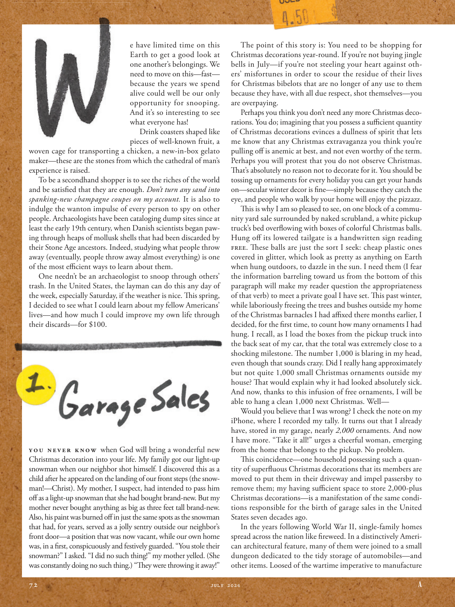

# The Atlantic — July 2026

## Page 74

---

e have limited time on this Earth to get a good look at one another’s belongings. We need to move on this—fast— because the years we spend alive could well be our only opportunity for snooping.

**【中文翻译】** 我们在地球上的时间有限，无法仔细查看彼此的物品。我们需要快速采取行动，因为我们活着的岁月很可能是我们窥探的唯一机会。

And it’s so interesting to see what everyone has! Drink coasters shaped like pieces of well-known fruit, a woven cage for transporting a chicken, a new-in-box gelato maker—these are the stones from which the cathedral of man’s experience is raised.

**【中文翻译】** 看看每个人都有什么真是太有趣了！形状像著名水果片的饮料杯垫、用于运输鸡的编织笼、新盒装的冰淇淋机——这些都是人类经验大教堂的石头。

To be a second hand shopper is to see the riches of the world and be satisfi ed that they are enough. Don’t turn any sand into spanking-new champagne coupes on my account. It is also to indulge the wanton impulse of every person to spy on other people. Archaeologists have been cataloging dump sites since at least the early 19th century, when Danish scientists began pawing through heaps of mollusk shells that had been discarded by their Stone Age ancestors. Indeed, studying what people throw away (eventually, people throw away almost everything) is one of the most effi cient ways to learn about them.

**【中文翻译】** 成为一名二手购物者，就是看到世界上的财富，并满足于这些就足够了。不要因为我的缘故把任何沙子变成全新的香槟小轿车。也是为了放纵每个人窥探他人的肆意冲动。考古学家至少从 19 世纪初就开始对垃圾场进行编目，当时丹麦科学家开始翻查石器时代祖先丢弃的成堆软体动物贝壳。事实上，研究人们扔掉的东西（最终，人们扔掉几乎所有东西）是了解它们的最有效方法之一。

One needn’t be an archaeologist to snoop through others’ trash. In the United States, the layman can do this any day of the week, especially Saturday, if the weather is nice. This spring, I decided to see what I could learn about my fellow Americans’ lives— and how much I could improve my own life through their discards— for $100.

**【中文翻译】** 一个人不需要成为一名考古学家就能窥探别人的垃圾。在美国，外行人可以在一周中的任何一天进行此操作，尤其是周六，如果天气好的话。今年春天，我决定花 100 美元看看我能从美国同胞的生活中了解到什么，以及通过他们的丢弃物我能在多大程度上改善自己的生活。

You never know when God will bring a wonderful new Christmas decoration into your life. My family got our light-up snowman when our neighbor shot himself. I discovered this as a child after he appeared on the landing of our front steps (the snowman!—Christ). My mother, I suspect, had intended to pass him off as a light-up snowman that she had bought brand-new. But my mother never bought anything as big as three feet tall brand-new.

**【中文翻译】** 你永远不知道上帝什么时候会给你的生活带来美妙的新圣诞装饰。当我们的邻居开枪自杀时，我的家人得到了发光的雪人。当我还是个孩子的时候，当他出现在我们门前台阶的平台上时，我就发现了这一点（雪人！——天哪）。我怀疑，我母亲本来打算把他当作她新买的一个会发光的雪人。但我妈妈从来没有买过三英尺高的全新东西。

Also, his paint was burned off in just the same spots as the snowman that had, for years, served as a jolly sentry outside our neighbor’s front door—a position that was now vacant, while our own home was, in a first, conspicuously and festively guarded. “You stole their snowman?” I asked. “I did no such thing!” my mother yelled. (She was constantly doing no such thing.) “They were throwing it away!”

**【中文翻译】** 而且，他的油漆被烧掉的地方与多年来一直在我们邻居前门外充当快乐哨兵的雪人一样——这个位置现在空着，而我们自己的家首先受到了显着和喜庆的守卫。 “你偷了他们的雪人？”我问。 “我没有做过这样的事！”我妈妈喊道。 （她一直没有做这样的事情。）“他们把它扔掉了！”

The point of this story is: You need to be shopping for Christmas decorations year-round. If you’re not buying jingle bells in July— if you’re not steeling your heart against others’ mis fortunes in order to scour the residue of their lives for Christmas bibelots that are no longer of any use to them because they have, with all due respect, shot themselves— you are overpaying.

**【中文翻译】** 这个故事的要点是：你需要全年购买圣诞装饰品。如果你在七月不买铃儿响叮当——如果你没有坚定自己的心去面对别人的厄运，以便在他们生命的残余中搜寻圣诞bibelots，而这些圣诞bibelots对他们来说不再有任何用处，因为他们，恕我直言，开枪自杀——你就付出了过高的代价。

Perhaps you think you don’t need any more Christmas decorations. You do; imagining that you possess a suffi cient quantity of Christmas decorations evinces a dullness of spirit that lets me know that any Christmas extravaganza you think you’re pulling off is anemic at best, and not even worthy of the term.

**【中文翻译】** 也许您认为不需要更多的圣诞装饰品。你做;想象你拥有足够数量的圣诞装饰品，这会表现出一种精神上的迟钝，这让我知道，你认为你正在完成的任何圣诞盛宴充其量都是贫乏的，甚至不值得这个词。

Perhaps you will protest that you do not observe Christmas. Th at’s absolutely no reason not to decorate for it. You should be tossing up ornaments for every holiday you can get your hands on— secular winter decor is fi ne— simply because they catch the eye, and people who walk by your home will enjoy the pizzazz.

**【中文翻译】** 也许你会抗议说你不庆祝圣诞节。这绝对没有理由不装饰它。你应该在你能得到的每个假期里都扔掉一些装饰品——世俗的冬季装饰很好——只是因为它们能吸引眼球，而且路过你家的人会喜欢它的活力。

This is why I am so pleased to see, on one block of a community yard sale surrounded by naked scrubland, a white pickup truck’s bed overflowing with boxes of colorful Christmas balls.

**【中文翻译】** 这就是为什么我如此高兴地看到，在社区庭院拍卖的一个街区，周围都是裸露的灌木丛，一辆白色皮卡车的车床上堆满了五颜六色的圣诞球盒。

Hung off its lowered tailgate is a handwritten sign reading FREE. These balls are just the sort I seek: cheap plastic ones covered in glitter, which look as pretty as anything on Earth when hung outdoors, to dazzle in the sun. I need them (I fear the information barreling toward us from the bottom of this paragraph will make my reader question the appropriateness of that verb) to meet a private goal I have set. This past winter, while laboriously freeing the trees and bushes outside my home of the Christmas barnacles I had affi xed there months earlier, I decided, for the first time, to count how many ornaments I had hung. I recall, as I load the boxes from the pickup truck into the back seat of my car, that the total was extremely close to a shocking milestone. The number 1,000 is blaring in my head, even though that sounds crazy. Did I really hang approximately but not quite 1,000 small Christmas ornaments outside my house? Th at would explain why it had looked absolutely sick.

**【中文翻译】** 降低的后挡板上挂着一块手写标牌，上面写着“免费”。这些球正是我想要的那种：廉价的塑料球，上面覆盖着闪光，当挂在户外时，它们看起来和地球上的任何东西一样漂亮，在阳光下闪闪发光。我需要它们（我担心从本段底部向我们涌来的信息会让我的读者质疑该动词的适当性）来实现我设定的个人目标。去年冬天，当我费力地清理我家外面的树木和灌木丛时，我几个月前就贴在那里的圣诞藤壶，我第一次决定数一数我挂了多少装饰品。我记得，当我把箱子从皮卡车上装到汽车后座时，总数非常接近一个令人震惊的里程碑。 1000这个数字在我脑海中回响，尽管这听起来很疯狂。我真的在屋外挂了大约但不到 1,000 个圣诞小装饰品吗？这就能解释为什么它看上去病态极了。

And now, thanks to this infusion of free ornaments, I will be able to hang a clean 1,000 next Christmas. Well— Would you believe that I was wrong? I check the note on my iPhone, where I recorded my tally. It turns out that I already have, stored in my garage, nearly 2,000 ornaments. And now I have more. “Take it all!” urges a cheerful woman, emerging from the home that belongs to the pickup. No problem.

**【中文翻译】** 现在，多亏了这些免费装饰品，明年圣诞节我就可以挂上 1,000 件干净的装饰品了。嗯——你相信我错了吗？我检查了 iPhone 上的笔记，我在那里记录了我的计数。事实证明，我的车库里已经存放了近 2000 件装饰品。现在我有更多了。 “全部拿走！”一位性格开朗的女士从皮卡车的家中走出来，催促道。没问题。

This coincidence— one household possessing such a quantity of superfl uous Christmas decorations that its members are moved to put them in their driveway and impel passersby to remove them; my having suffi cient space to store 2,000-plus Christmas decorations—is a manifestation of the same conditions responsible for the birth of garage sales in the United States seven decades ago.

**【中文翻译】** 巧合的是，有一个家庭拥有大量多余的圣诞装饰品，以至于其成员不得不将它们放在车道上，并迫使路人将它们移走；我有足够的空间来存放 2,000 多件圣诞装饰品，这与七十年前美国车库拍卖的诞生的条件相同。

In the years following World War II, single-family homes spread across the nation like fi reweed. In a distinctively American architectural feature, many of them were joined to a small dungeon dedicated to the tidy storage of automobiles— and other items. Loosed of the wartime imperative to manufacture

**【中文翻译】** 第二次世界大战后的几年里，单户住宅像杂草一样遍布全国。在独特的美国建筑特色中，其中许多都与一个小地牢相连，专门用来整齐地存放汽车和其他物品。摆脱了战时制造的束缚
