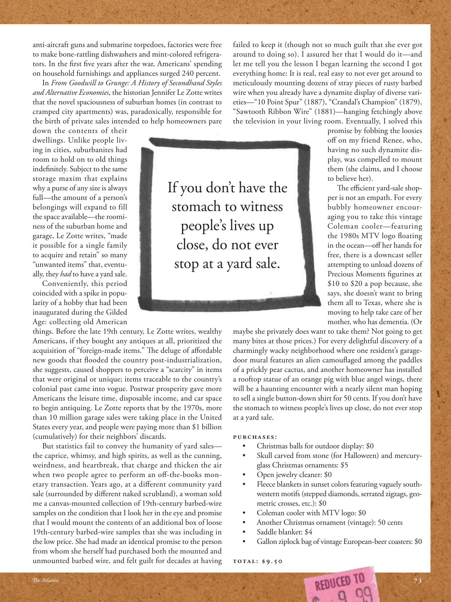

# The Atlantic — July 2026

## Page 75

---

anti-aircraft guns and submarine torpedoes, factories were free to make bone-rattling dishwashers and mint-colored refrigerators. In the first five years after the war, Americans’ spending on household furnishings and appliances surged 240 percent.

**【中文翻译】** 高射炮和潜艇鱼雷，工厂可以自由地制造令人震惊的洗碗机和薄荷色的冰箱。战后头五年，美国人在家居家具和电器上的支出激增 240%。

In From Goodwill to Grunge: A History of Secondhand Styles and Alternative Economies , the historian Jennifer Le Zotte writes that the novel spaciousness of suburban homes (in contrast to cramped city apartments) was, paradoxically, responsible for the birth of private sales intended to help homeowners pare down the contents of their dwellings. Unlike people living in cities, suburbanites had room to hold on to old things in defi nitely. Subject to the same storage maxim that explains why a purse of any size is always full—the amount of a person’s belongings will expand to fill the space available—the roominess of the suburban home and garage, Le Zotte writes, “made it possible for a single family to acquire and retain” so many “unwanted items” that, eventually, they had to have a yard sale.

**【中文翻译】** 历史学家詹妮弗·勒佐特（Jennifer Le Zotte）在《从善意到垃圾：二手风格和另类经济的历史》一书中写道，矛盾的是，郊区住宅的新颖宽敞（与狭窄的城市公寓相比）导致了旨在帮助房主削减住宅内容的私人销售的诞生。与城市居民不同，郊区居民绝对有空间保留旧事物。勒佐特写道，遵循同样的存储格言，解释为什么任何大小的钱包总是装满的——一个人的物品数量会增加，以填满可用的空间——郊区住宅和车库的宽敞，“使一个家庭有可能获得和保留”如此多的“不需要的物品”，最终，他们不得不进行庭院拍卖。

Conveniently, this period coincided with a spike in popularity of a hobby that had been inaugurated during the Gilded Age: collecting old American things. Before the late 19th century, Le Zotte writes, wealthy Americans, if they bought any antiques at all, prioritized the acquisition of “foreign-made items.” The deluge of aff ordable new goods that fl ooded the country post-industrialization, she suggests, caused shoppers to perceive a “scarcity” in items that were original or unique; items traceable to the country’s colonial past came into vogue. Postwar prosperity gave more Americans the leisure time, disposable income, and car space to begin antiquing. Le Zotte reports that by the 1970s, more than 10 million garage sales were taking place in the United States every year, and people were paying more than $1 billion (cumulatively) for their neighbors’ discards.

**【中文翻译】** 很巧的是，这一时期恰逢镀金时代兴起的一项爱好的流行高峰：收集美国旧物。勒佐特写道，在 19 世纪末之前，富有的美国人如果购买任何古董，都会优先购买“外国制造的物品”。她认为，后工业化时期，大量价格实惠的新商品涌入这个国家，导致购物者感到原创或独特的商品“稀缺”；源自该国殖民历史的物品开始流行。战后的繁荣为更多的美国人提供了闲暇时间、可支配收入和汽车空间来开始古董收藏。 Le Zotte 报道称，到 20 世纪 70 年代，美国每年进行超过 1000 万次车库拍卖，人们为邻居的丢弃物支付了超过 10 亿美元（累计）。

But statistics fail to convey the humanity of yard sales— the caprice, whimsy, and high spirits, as well as the cunning, weirdness, and heartbreak, that charge and thicken the air when two people agree to perform an off -the-books monetary transaction. Years ago, at a diff erent community yard sale (surrounded by diff erent naked scrubland), a woman sold me a canvas-mounted collection of 19th-century barbed-wire samples on the condition that I look her in the eye and promise that I would mount the contents of an additional box of loose 19thcentury barbed-wire samples that she was including in the low price. She had made an identical promise to the person from whom she herself had purchased both the mounted and unmounted barbed wire, and felt guilt for decades at having failed to keep it (though not so much guilt that she ever got around to doing so). I assured her that I would do it— and let me tell you the lesson I began learning the second I got everything home: It is real, real easy to not ever get around to meticulously mounting dozens of stray pieces of rusty barbed wire when you already have a dynamite display of diverse varieties— “10 Point Spur” (1887), “Crandal’s Champion” (1879), “Sawtooth Ribbon Wire” (1881)—hanging fetchingly above the television in your living room. Eventually, I solved this

**【中文翻译】** 但统计数据无法体现庭院旧货出售的人性——反复无常、奇思妙想、兴高采烈，以及狡猾、怪异和心碎，当两个人同意进行一笔账外的货币交易时，空气中弥漫着浓浓的气氛。几年前，在一个不同的社区庭院旧货拍卖会上（周围是不同的裸露灌木丛），一位女士向我出售了一套用画布装裱的 19 世纪带刺铁丝网样品，条件是我看着她的眼睛，并承诺我会额外装上一盒松散的 19 世纪带刺铁丝网样品，她以低价包含了这些样品。她向她自己购买了带刺铁丝网和未安装带刺铁丝网的人做出了同样的承诺，几十年来，她都因为未能遵守这一承诺而感到内疚（尽管她并没有抽出时间这样做）。我向她保证我会这么做——让我告诉你我在把所有东西都带回家后就开始学到的教训：当你已经拥有各种不同品种的炸药展示——“10 Point Spur”（1887）、“Crandal’s Champion”（1879）、“Sawtooth Ribbon”时，真的很容易抽不出时间来精心安装几十块生锈的铁丝网。 《电线》（1881）——迷人地挂在客厅电视上方。最终我解决了这个问题

### If you don’t have the

**【标题翻译】** 如果您没有

### stomach to witness

**【标题翻译】** 胃见证

### people’s lives up

**【标题翻译】** 人们的生活得到改善

### close, do not ever

**【标题翻译】** 关闭，永远不要

### stop at a yard sale.

**【标题翻译】** 在庭院旧货出售处停下来。

maybe she privately does want to take them? Not going to get many bites at those prices.) For every delightful discovery of a charmingly wacky neighborhood where one resident’s garagedoor mural features an alien camoufl aged among the paddles of a prickly pear cactus, and another homeowner has installed a rooftop statue of an orange pig with blue angel wings, there will be a haunting encounter with a nearly silent man hoping to sell a single button-down shirt for 50 cents. If you don’t have the stomach to witness people’s lives up close, do not ever stop at a yard sale.

**【中文翻译】** 也许她私下里确实想带走它们？以这样的价格，不会有太多人被咬。）每次令人愉快地发现一个迷人而古怪的社区，一个居民的车库门壁画上有一个外星人迷彩，在仙人掌的桨叶中，而另一个房主在屋顶上安装了一尊带有蓝色天使翅膀的橙色猪雕像，你会遇到一个几乎沉默的男人，他希望以 50 美分的价格出售一件带纽扣的衬衫。如果您没有勇气近距离观察人们的生活，请不要在旧货出售时停下来。

PURCHASES: • Christmas balls for outdoor display: $0 • Skull carved from stone (for Halloween) and mercuryglass Christmas ornaments: $5 • Open jewelry cleaner: $0 • Fleece blankets in sunset colors featuring vaguely southwestern motifs (stepped diamonds, serrated zigzags, geometric crosses, etc.): $0 • Coleman cooler with MTV logo: $0 • Another Christmas ornament (vintage): 50 cents • Saddle blanket: $4 • Gallon ziplock bag of vintage European-beer coasters: $0 TOTAL: $9.50 promise by fobbing the loosies off on my friend Renee, who, having no such dynamite display, was compelled to mount them (she claims, and I choose to believe her).

**【中文翻译】** 购买： • 户外展示圣诞球：0 美元 • 石头雕刻的头骨（万圣节用）和水银玻璃圣诞装饰品：5 美元 • 开放式珠宝清洁剂：0 美元 • 夕阳色羊毛毯，带有隐约西南图案（阶梯钻石、锯齿形、几何十字等）：0 美元 • 带有 MTV 标志的科尔曼冷却器：0 美元 • 另一种圣诞装饰品（复古）：50 美分 • 马鞍毯：4 美元• 一加仑自封袋的老式欧洲啤酒杯垫：0 美元，总计：9.50 美元，是我向我的朋友蕾妮骗过的承诺，她没有这样的炸药展示，被迫安装它们（她声称，我选择相信她）。

The effi cient yard-sale shopper is not an empath. For every bubbly homeowner encouraging you to take this vintage Coleman cooler—featuring the 1980s MTV logo fl oating in the ocean—off her hands for free, there is a downcast seller attempting to unload dozens of Precious Moments fi gurines at $10 to $20 a pop because, she says, she doesn’t want to bring them all to Texas, where she is moving to help take care of her mother, who has dementia. (Or

**【中文翻译】** 高效的旧货旧货出售购物者并不是一个有同理心的人。每一位热情洋溢的房主都会鼓励你免费拿走这款带有 1980 年代 MTV 标志的老式 Coleman 冷藏箱，从她手中免费拿走；而一位沮丧的卖家则试图以每个 10 至 20 美元的价格出售数十个 Precious Moments 雕像，因为她说，她不想把它们全部带到德克萨斯州，因为她要搬到那里帮助照顾患有痴呆症的母亲。 （或者
