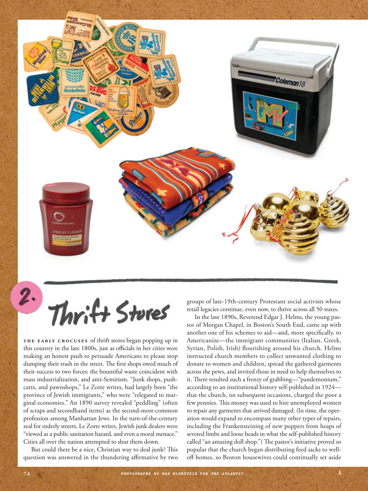

# The Atlantic — July 2026

## Page 76

---

The early crocuses of thrift stores began popping up in this country in the late 1800s, just as offi cials in her cities were making an honest push to persuade Americans to please stop dumping their trash in the street. The first shops owed much of their success to two forces: the bountiful waste coincident with mass industrialization, and anti-Semitism. “Junk shops, pushcarts, and pawnshops,” Le Zotte writes, had largely been “the province of Jewish immigrants,” who were “relegated to marginal economies.” An 1890 survey revealed “peddling” (often of scraps and second hand items) as the second-most-common profession among Manhattan Jews. In the turn-of-the-century zeal for orderly streets, Le Zotte writes, Jewish junk dealers were “viewed as a public sanitation hazard, and even a moral menace.”

**【中文翻译】** 早期的旧货店于 1800 年代末在这个国家开始出现，当时该国的官员正在诚实地劝说美国人停止在街上倾倒垃圾。第一批商店的成功很大程度上归功于两股力量：大规模工业化带来的大量浪费和反犹太主义。勒佐特写道，“旧货店、手推车和当铺”在很大程度上是“犹太移民的领地”，他们“被降级为边缘经济体”。 1890 年的一项调查显示，“兜售”（通常是废品和二手物品）是曼哈顿犹太人中第二常见的职业。勒佐特写道，在世纪之交对街道秩序的热衷中，犹太垃圾贩子“被视为公共卫生危害，甚至是道德威胁”。

Cities all over the nation attempted to shut them down. But could there be a nice, Christian way to deal junk? This question was answered in the thundering affi rmative by two groups of late-19th-century Protestant social activists whose retail legacies continue, even now, to thrive across all 50 states.

**【中文翻译】** 全国各地的城市都试图关闭它们。但有没有一种好的、基督教的方式来处理垃圾呢？这个问题得到了两组 19 世纪末新教社会活动家的热烈肯定的回答，他们的零售传统至今仍在全美 50 个州蓬勃发展。

In the late 1890s, Reverend Edgar J. Helms, the young pastor of Morgan Chapel, in Boston’s South End, came up with another one of his schemes to aid— and, more specifi cally, to Americanize— the immigrant communities (Italian, Greek, Syrian, Polish, Irish) fl ourishing around his church. Helms instructed church members to collect unwanted clothing to donate to women and children, spread the gathered garments across the pews, and invited those in need to help themselves to it. There resulted such a frenzy of grabbing— “pandemonium,” according to an institutional history selfpublished in 1924— that the church, on subsequent occasions, charged the poor a few pennies. This money was used to hire unemployed women to repair any garments that arrived damaged. (In time, the operation would expand to encompass many other types of repairs, including the Frankensteining of new poppets from heaps of severed limbs and loose heads in what the selfpublished history called “an amazing doll shop.”) The pastor’s initiative proved so popular that the church began distributing feed sacks to welloff homes, so Boston housewives could continually set aside

**【中文翻译】** 1890 年代末，波士顿南端摩根教堂的年轻牧师埃德加·J·赫尔姆斯牧师提出了另一项计划，以帮助——更具体地说，使他的教堂周围蓬勃发展的移民社区（意大利人、希腊人、叙利亚人、波兰人、爱尔兰人）美国化。赫尔姆斯指示教会成员收集不需要的衣服捐赠给妇女和儿童，将收集到的衣服铺在长椅上，并邀请有需要的人帮忙。根据 1924 年自行出版的一本机构历史记录，这导致了一场疯狂的掠夺——“混乱”——以至于教会在随后的场合向穷人收取了几便士的费用。这笔钱被用来雇用失业妇女来修理到达时损坏的衣服。 （随着时间的推移，这项行动将扩大到涵盖许多其他类型的修复，包括用成堆的断肢和松散的头颅制作出新的娃娃，自出版的历史书称其为“一家令人惊叹的娃娃店”。）事实证明，牧师的倡议非常受欢迎，以至于教会开始向富裕家庭分发饲料袋，这样波士顿的家庭主妇就可以不断地留出食物

*PHOTOGRAPHS BY MAX HIGHSTEIN FOR THE ATLANTIC*

*【图注与署名】MAX HIGHSTEIN 为《大西洋》拍摄的照片*
