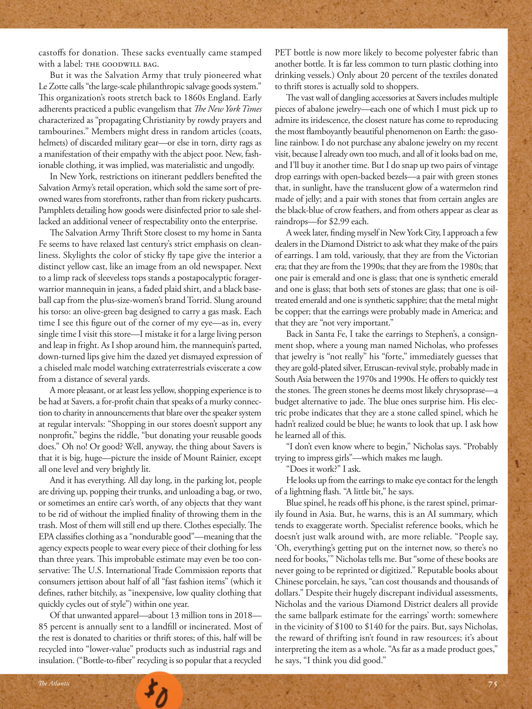

# The Atlantic — July 2026

## Page 77

---

castoff s for donation. These sacks eventually came stamped with a label: IHE GOODWILL BAG. But it was the Salvation Army that truly pioneered what Le Zotte calls “the large-scale philanthropic salvage goods system.”

**【中文翻译】** 废弃的捐赠。这些麻袋最终贴上了标签：IHE GOODWILL BAG。但救世军真正开创了勒佐特所说的“大规模慈善救助物资系统”。

This organization’s roots stretch back to 1860s England. Early adherents practiced a public evangelism that The New York Times characterized as “propagating Christianity by rowdy prayers and tambourines.” Members might dress in random articles (coats, helmets) of discarded military gear— or else in torn, dirty rags as a manifestation of their empathy with the abject poor. New, fashionable clothing, it was implied, was materialistic and ungodly.

**【中文翻译】** 该组织的历史可以追溯到 1860 年代的英国。早期的信徒实行公开传福音，《纽约时报》将其描述为“通过喧闹的祈祷和手鼓传播基督教”。成员们可能会随意穿着废弃军事装备的物品（外套、头盔），或者穿着破烂肮脏的破布，以表达他们对赤贫者的同情。有人暗示，新的、时尚的服装是物质主义的、不敬虔的。

In New York, restrictions on itinerant peddlers benefi ted the Salvation Army’s retail operation, which sold the same sort of preowned wares from storefronts, rather than from rickety pushcarts.

**【中文翻译】** 在纽约，对流动小贩的限制使救世军的零售业务受益，该组织从店面而不是摇摇晃晃的手推车上出售同类二手商品。

Pamphlets detailing how goods were disinfected prior to sale shellacked an additional veneer of respectability onto the enterprise. The Salvation Army Th rift Store closest to my home in Santa Fe seems to have relaxed last century’s strict emphasis on cleanliness. Skylights the color of sticky fly tape give the interior a distinct yellow cast, like an image from an old newspaper. Next to a limp rack of sleeveless tops stands a post apocalyptic foragerwarrior mannequin in jeans, a faded plaid shirt, and a black baseball cap from the plus-size-women’s brand Torrid. Slung around his torso: an olive-green bag designed to carry a gas mask. Each time I see this figure out of the corner of my eye— as in, every single time I visit this store— I mistake it for a large living person and leap in fright. As I shop around him, the mannequin’s parted, down-turned lips give him the dazed yet dismayed expression of a chiseled male model watching extraterrestrials eviscerate a cow from a distance of several yards.

**【中文翻译】** 详细介绍商品在销售前如何消毒的小册子给该企业增添了额外的体面外表。离我在圣达菲的家最近的救世军旧货店似乎放松了上个世纪对清洁的严格要求。粘蝇胶带颜色的天窗给室内带来明显的黄色色调，就像旧报纸上的图像一样。在一个软乎乎的无袖上衣架旁边，放着一个后世界末日的觅食战士人体模型，穿着牛仔裤、褪色的格子衬衫，戴着大码女装品牌 Torrid 的黑色棒球帽。他的躯干上挂着一个橄榄绿的袋子，用来装防毒面具。每次我用眼角的余光看到这个人影——就像每次我去这家商店——我都会误以为它是一个活生生的大人物，然后吓得跳了起来。当我在他周围购物时，人体模型张开、下弯的嘴唇给他一种茫然而沮丧的表情，就像一个轮廓分明的男模特看着外星人在几码的距离外掏出一头牛的内脏。

A more pleasant, or at least less yellow, shopping experience is to be had at Savers, a for-profi t chain that speaks of a murky connection to charity in announcements that blare over the speaker system at regular intervals: “Shopping in our stores doesn’t support any nonprofi t,” begins the riddle, “but donating your reusable goods does.” Oh no! Or good? Well, anyway, the thing about Savers is that it is big, huge— picture the inside of Mount Rainier, except all one level and very brightly lit.

**【中文翻译】** Savers 是一家营利性连锁店，可以提供更愉快、至少不那么黄色的购物体验，该连锁店通过扬声器系统定期播放的公告谈到了与慈善机构的模糊联系：“在我们的商店购物不支持任何非营利组织，”谜语开头，“但捐赠可重复使用的商品可以。”哦不！还是好？好吧，无论如何，Savers 的特点是它很大，巨大——想象一下雷尼尔山的内部，除了所有一层而且灯火通明。

And it has everything. All day long, in the parking lot, people are driving up, popping their trunks, and unloading a bag, or two, or sometimes an entire car’s worth, of any objects that they want to be rid of without the implied finality of throwing them in the trash. Most of them will still end up there. Clothes especially. The EPA classifi es clothing as a “non durable good”—meaning that the agency expects people to wear every piece of their clothing for less than three years. This improbable estimate may even be too conservative: The U.S. International Trade Commission reports that consumers jettison about half of all “fast fashion items” (which it defi nes, rather bitchily, as “inexpensive, low quality clothing that quickly cycles out of style”) within one year.

**【中文翻译】** 它拥有一切。一整天，人们都在停车场开车过来，打开后备箱，卸下一两个袋子，有时甚至是一整辆车的东西，他们想扔掉任何东西，而不是把它们扔进垃圾桶。他们中的大多数人最终仍会留在那里。衣服尤其。美国环保署将服装归类为“非耐用品”，这意味着该机构希望人们每件衣服的穿着时间不超过三年。这个不太可能的估计甚至可能过于保守：美国国际贸易委员会报告称，消费者在一年内抛弃了大约一半的“快时尚商品”（它相当刻薄地将其定义为“廉价、低质量的服装，很快就会过时”）。

Of that unwanted apparel—about 13 million tons in 2018— 85 percent is annually sent to a landfi ll or incinerated. Most of the rest is donated to charities or thrift stores; of this, half will be recycled into “lower-value” products such as industrial rags and insulation. (“Bottle-to-fi ber” recycling is so popular that a recycled PET bottle is now more likely to become polyester fabric than another bottle. It is far less common to turn plastic clothing into drinking vessels.) Only about 20 percent of the textiles donated to thrift stores is actually sold to shoppers.

**【中文翻译】** 在这些不需要的服装中（2018 年约为 1300 万吨），每年有 85% 被送往垃圾填埋场或焚烧。其余大部分捐赠给慈善机构或旧货店；其中一半将被回收成“低价值”产品，例如工业抹布和绝缘材料。 （“从瓶子到纤维”的回收非常流行，以至于回收的 PET 瓶现在比另一个瓶子更有可能变成聚酯纤维。将塑料衣服变成饮用器皿的情况要少得多。）捐赠给旧货店的纺织品中，只有大约 20% 实际上卖给了购物者。

The vast wall of dangling accessories at Savers includes multiple pieces of abalone jewelry— each one of which I must pick up to admire its iridescence, the closest nature has come to reproducing the most fl amboyantly beautiful phenomenon on Earth: the gasoline rainbow. I do not purchase any abalone jewelry on my recent visit, because I already own too much, and all of it looks bad on me, and I’ll buy it another time. But I do snap up two pairs of vintage drop earrings with open-backed bezels— a pair with green stones that, in sunlight, have the translucent glow of a watermelon rind made of jelly; and a pair with stones that from certain angles are the black-blue of crow feathers, and from others appear as clear as raindrops—for $2.99 each.

**【中文翻译】** Savers 的巨大悬挂配饰墙包括多件鲍鱼首饰——我必须拿起每一件来欣赏它的彩虹色，最接近的大自然再现了地球上最绚丽美丽的现象：汽油彩虹。我最近一次没有购买任何鲍鱼首饰，因为我已经拥有太多了，所有这些都看起来很糟糕，我会再买一次。但我确实抢购了两对带有开放式边框的复古吊式耳环——一对镶有绿色宝石，在阳光下会发出果冻西瓜皮的半透明光芒；另一对镶有绿色宝石，在阳光下会发出果冻西瓜皮的半透明光芒；另一对镶有绿色宝石，在阳光下会发出果冻西瓜皮的半透明光芒；另一对镶有绿色宝石，在阳光下会发出果冻西瓜皮的半透明光芒；另一对镶有绿色宝石，在阳光下会发出果冻西瓜皮的半透明光芒；另一对镶有绿色宝石，在阳光下会发出果冻西瓜皮的半透明光芒；另一对镶有绿色宝石，在阳光下会发出果冻西瓜皮的半透明光芒。还有一对宝石，从某些角度看是乌鸦羽毛的黑蓝色，从其他角度看则像雨滴一样清晰——每块售价 2.99 美元。

A week later, finding myself in New York City, I approach a few dealers in the Diamond District to ask what they make of the pairs of earrings. I am told, variously, that they are from the Victorian era; that they are from the 1990s; that they are from the 1980s; that one pair is emerald and one is glass; that one is synthetic emerald and one is glass; that both sets of stones are glass; that one is oiltreated emerald and one is synthetic sapphire; that the metal might be copper; that the earrings were probably made in America; and that they are “not very important.”

**【中文翻译】** 一周后，我来到了纽约市，找到了钻石区的几家经销商，询问他们对这对耳环的看法。有人告诉我，它们来自维多利亚时代；他们来自 20 世纪 90 年代；他们来自 20 世纪 80 年代；一对是祖母绿，一对是玻璃；一种是合成祖母绿，一种是玻璃；两组宝石都是玻璃；一种是经过油处理的祖母绿，一种是合成蓝宝石；该金属可能是铜；耳环可能是在美国制造的；并且它们“不是很重要”。

Back in Santa Fe, I take the earrings to Stephen’s, a consignment shop, where a young man named Nicholas, who professes that jewelry is “not really” his “forte,” immediately guesses that they are gold-plated silver, Etruscan-revival style, probably made in South Asia between the 1970s and 1990s. He offers to quickly test the stones. The green stones he deems most likely chrysoprase— a budget alternative to jade. The blue ones surprise him. His electric probe indicates that they are a stone called spinel, which he hadn’t realized could be blue; he wants to look that up. I ask how he learned all of this.

**【中文翻译】** 回到圣达菲，我把耳环带到了 Stephen’s 寄售店，那里有一位名叫尼古拉斯 (Nicholas) 的年轻人，自称珠宝“并不是”他的“专长”，但他立即猜测它们是镀金银器，伊特鲁里亚复兴风格，可能是 20 世纪 70 年代至 1990 年代在南亚制造的。他提议快速测试这些石头。他认为绿色宝石最有可能是绿玉髓——一种廉价的玉石替代品。蓝色的让他惊讶。他的电探针表明它们是一种叫做尖晶石的石头，他没有意识到它可能是蓝色的；他想查一下。我问他是如何得知这一切的。

“I don’t even know where to begin,” Nicholas says. “Probably trying to impress girls”— which makes me laugh. “Does it work?” I ask. He looks up from the earrings to make eye contact for the length of a lightning flash. “A little bit,” he says.

**【中文翻译】** “我什至不知道从哪里开始，”尼古拉斯说。 “可能是想给女孩留下深刻印象”——这让我笑了。 “有效吗？”我问。他从耳环上抬起头，目光接触了闪电般的时间。 “有一点，”他说。

Blue spinel, he reads off his phone, is the rarest spinel, primarily found in Asia. But, he warns, this is an AI summary, which tends to exaggerate worth. Specialist reference books, which he doesn’t just walk around with, are more reliable. “People say, ‘Oh, everything’s getting put on the internet now, so there’s no need for books,’ ” Nicholas tells me. But “some of these books are never going to be reprinted or digitized.” Reputable books about Chinese porcelain, he says, “can cost thousands and thousands of dollars.” Despite their hugely discrepant individual assessments, Nicholas and the various Diamond District dealers all provide the same ballpark estimate for the earrings’ worth: somewhere in the vicinity of $100 to $140 for the pairs. But, says Nicholas, the reward of thrifting isn’t found in raw resources; it’s about interpreting the item as a whole. “As far as a made product goes,” he says, “I think you did good.”

**【中文翻译】** 他从手机上读到，蓝色尖晶石是最稀有的尖晶石，主要产于亚洲。但他警告说，这是人工智能的总结，往往会夸大其价值。专业参考书比他随身携带的更可靠。 “人们说，‘哦，现在一切都放在互联网上，所以不需要书籍，’”尼古拉斯告诉我。但“其中一些书籍永远不会重印或数字化。”他说，有关中国瓷器的知名书籍“可能要花费数千美元”。尽管个人评估存在巨大差异，尼古拉斯和钻石区的各个经销商都对耳环的价值给出了相同的大致估计：一对耳环的价格约为 100 至 140 美元。但是，尼古拉斯说，节俭的回报并不存在于原始资源中；而是来自于原始资源。这是关于将项目作为一个整体进行解释。 “就成品而言，”他说，“我认为你做得很好。”
