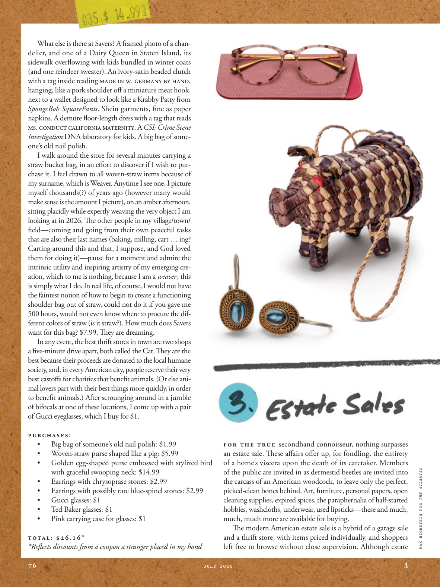

# The Atlantic — July 2026

## Page 78

---

What else is there at Savers? A framed photo of a chandelier, and one of a Dairy Queen in Staten Island, its sidewalk overflowing with kids bundled in winter coats (and one reindeer sweater). An ivory-satin beaded clutch with a tag inside reading Made in W. Germany by hand, hanging, like a pork shoulder off a miniature meat hook, next to a wallet designed to look like a Krabby Patty from SpongeBob SquarePants . Shein garments, fi ne as paper napkins. A demure floor-length dress with a tag that reads Ms. Conduct CALIFORNIA MATERNITY. A CSI: Crime Scene Investigation DNA laboratory for kids. A big bag of someone’s old nail polish.

**【中文翻译】** Savers 还有什么？一张镶在镜框里的枝形吊灯照片和史坦顿岛的冰雪皇后照片，人行道上挤满了穿着冬衣（还有一件驯鹿毛衣）的孩子们。这款象牙色缎面串珠手拿包内有标签，上面写着“西德手工制造”，就像微型肉钩上的猪肩肉一样悬挂着，旁边的钱包设计得像《海绵宝宝》中的蟹黄饼。 Shein 服装，精美如餐巾纸。这款端庄的及地连衣裙，带有标签，上面写着“Ms. Conduct CALIFORNIA MATERNITY”。儿童犯罪现场调查 DNA 实验室。一大袋某人的旧指甲油。

I walk around the store for several minutes carrying a straw bucket bag, in an eff ort to discover if I wish to purchase it. I feel drawn to all woven-straw items because of my surname, which is Weaver. Anytime I see one, I picture myself thousands(?) of years ago (however many would make sense is the amount I picture), on an amber afternoon, sitting placidly while expertly weaving the very object I am looking at in 2026. The other people in my village/town/ fi eld— coming and going from their own peaceful tasks that are also their last names (baking, milling, cart … ing?

**【中文翻译】** 我拎着一个草桶包在商店里走了几分钟，试图看看我是否愿意购买它。我对所有草编物品都很感兴趣，因为我的姓氏是 Weaver。每当我看到它时，我都会想象数千（？）年前的自己（尽管我想象的数量是有道理的），在一个琥珀色的下午，平静地坐着，同时熟练地编织我在 2026 年看到的物体。我的村庄/城镇/田野中的其他人 - 来来往往，从事他们自己的和平任务，这些任务也是他们的姓氏（烘焙，铣削，推车……？

Carting around this and that, I suppose, and God loved them for doing it)— pause for a moment and admire the intrinsic utility and inspiring artistry of my emerging creation, which to me is nothing, because I am a weaver ; this is simply what I do. In real life, of course, I would not have the faintest notion of how to begin to create a functioning shoulder bag out of straw, could not do it if you gave me 500 hours, would not even know where to procure the different colors of straw (is it straw?). How much does Savers want for this bag? $7.99. They are dreaming.

**【中文翻译】** 我想，上帝爱他们这样做）——暂停一下，欣赏我新兴创作的内在实用性和鼓舞人心的艺术性，这对我来说没什么，因为我是一个编织者；这就是我所做的。当然，在现实生活中，我对如何开始用稻草制作一个功能性的单肩包没有丝毫概念，即使给我 500 小时也做不到，甚至不知道在哪里可以获得不同颜色的稻草（是稻草吗？）。储户想要这款包多少钱？ 7.99 美元。他们在做梦。

In any event, the best thrift stores in town are two shops a five-minute drive apart, both called the Cat. They are the best because their proceeds are donated to the local humane society, and, in every American city, people reserve their very best castoff s for charities that benefi t animals. (Or else animal lovers part with their best things more quickly, in order to benefi t animals.) After scrounging around in a jumble of bifocals at one of these locations, I come up with a pair of Gucci eyeglasses, which I buy for $1.

**【中文翻译】** 无论如何，城里最好的旧货店是相距五分钟车程的两家商店，都叫“猫”。它们之所以是最好的，是因为它们的收益都捐给了当地的人道主义协会，而且在每个美国城市，人们都会将最好的废弃物留给造福动物的慈善机构。 （否则动物爱好者会更快地放弃自己最好的东西，以造福于动物。） 在其中一个地点的杂乱双光眼镜中搜寻后，我拿出一副古驰眼镜，花了 1 美元买下。

PURCHASES: • Big bag of someone’s old nail polish: $1.99 • Woven-straw purse shaped like a pig: $5.99 • Golden egg-shaped purse embossed with stylized bird with graceful swooping neck: $14.99 • Earrings with chrysoprase stones: $2.99 • Earrings with possibly rare blue-spinel stones: $2.99 • Gucci glasses: $1 • Ted Baker glasses: $1 • Pink carrying case for glasses: $1 TOTAL: $26.16 Refl ects discounts from a coupon a stranger placed in my hand For the true second hand connoisseur, nothing surpasses an estate sale. These aff airs off er up, for fondling, the entirety of a home’s viscera upon the death of its caretaker. Members of the public are invited in as dermestid beetles are invited into the carcass of an American woodcock, to leave only the perfect, picked-clean bones behind. Art, furniture, personal papers, open cleaning supplies, expired spices, the paraphernalia of halfstarted hobbies, washcloths, underwear, used lipsticks— these and much, much, much more are available for buying.

**【中文翻译】** 购买： • 大袋某人的旧指甲油：1.99 美元 • 猪形草编钱包：5.99 美元 • 金蛋形钱包，浮雕有优雅俯颈的风格鸟：14.99 美元 • 绿玉髓宝石耳环：2.99 美元 • 可能罕见的蓝色尖晶石耳环：2.99 美元 • 古驰眼镜： 1 美元 • Ted Baker 眼镜：1 美元 • 粉色眼镜手提箱：1 美元 总计：26.16 美元 反映了陌生人放在我手中的优惠券的折扣 对于真正的二手鉴赏家来说，没有什么比房地产销售更好的了。这些事情在看门人去世后，将一个家庭的全部内脏都奉献出来，以供抚摸。公众被邀请进入，就像皮甲虫被邀请进入美国山鹬的尸体一样，只留下完美的、干净的骨头。艺术品、家具、个人文件、打开的清洁用品、过期的香料、半生不熟的爱好的用具、毛巾、内衣、用过的口红——这些以及更多、更多、更多的东西都可以购买。

The modern American estate sale is a hybrid of a garage sale and a thrift store, with items priced individually, and shoppers left free to browse without close supervision. Although estate MAX HIGHSTEIN FOR THE ATLANTIC

**【中文翻译】** 现代美国的房地产拍卖是车库拍卖和旧货店的混合体，商品单独定价，购物者可以在没有严密监督的情况下自由浏览。尽管 MAX HIGHSTEIN 的大西洋庄园
