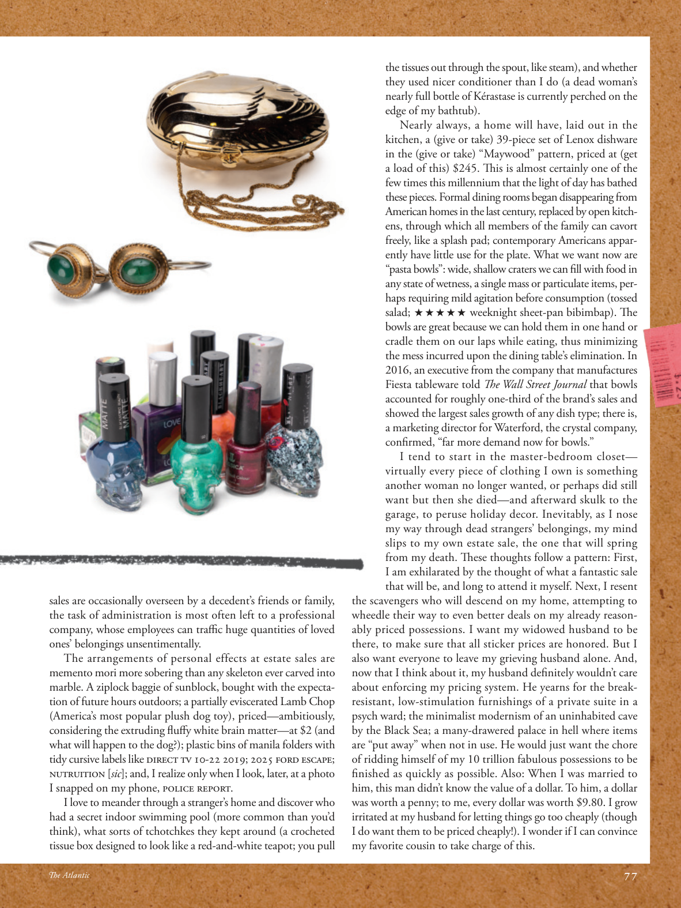

# The Atlantic — July 2026

## Page 79

---

sales are occasionally overseen by a decedent’s friends or family, the task of administration is most often left to a professional company, whose employees can traffi c huge quantities of loved ones’ belongings unsentimentally.

**【中文翻译】** 销售有时是由死者的朋友或家人监督的，管理任务通常留给专业公司，其员工可以不带感情地贩卖大量亲人的物品。

The arrangements of personal effects at estate sales are memento mori more sobering than any skeleton ever carved into marble. A ziplock baggie of sunblock, bought with the expectation of future hours outdoors; a partially eviscerated Lamb Chop (America’s most popular plush dog toy), priced— ambitiously, considering the extruding fl uff y white brain matter— at $2 (and what will happen to the dog?); plastic bins of manila folders with tidy cursive labels like Direct TV 1Ti-22 2Ti19; 2Ti25 Ford Escape; NUTRUITION [ sic ]; and, I realize only when I look, later, at a photo c I snapped on my phone, Police Report.

**【中文翻译】** 房地产销售中个人物品的排列方式比大理石上雕刻的任何骷髅都更能象征死亡。一袋防晒霜，是为了未来的户外活动而购买的；部分取出内脏的羊排（美国最受欢迎的毛绒狗玩具），考虑到挤出的蓬松的白色大脑物质，定价雄心勃勃，为 2 美元（狗会怎么样？）；塑料箱里装着马尼拉文件夹，上面有整齐的草书标签，如 Direct TV 1Ti-22 2Ti19； 2Ti25 福特翼虎；营养[原文如此]；后来，当我看到我用手机拍的一张照片《警察报告》时，我才意识到。

I love to meander through a stranger’s home and discover who had a secret indoor swimming pool (more common than you’d think), what sorts of tchotchkes they kept around (a crocheted tissue box designed to look like a red-and-white teapot; you pull the tissues out through the spout, like steam), and whether they used nicer conditioner than I do (a dead woman’s nearly full bottle of Kérastase is currently perched on the edge of my bathtub).

**【中文翻译】** 我喜欢在陌生人家里闲逛，看看谁有一个秘密的室内游泳池（比你想象的更常见），他们周围放着什么样的小玩意（一个钩编的纸巾盒，设计得像一个红白茶壶；你把纸巾从喷嘴里拿出来，就像蒸汽一样），以及他们是否使用了比我更好的护发素（一个死去的女人几乎满瓶的卡诗目前放在我的浴缸边缘）。

Nearly always, a home will have, laid out in the kitchen, a (give or take) 39-piece set of Lenox dishware in the (give or take) “Maywood” pattern, priced at (get a load of this) $245. This is almost certainly one of the few times this millennium that the light of day has bathed these pieces. Formal dining rooms began disappearing from American homes in the last century, replaced by open kitchens, through which all members of the family can cavort freely, like a splash pad; contemporary Americans apparently have little use for the plate. What we want now are “pasta bowls”: wide, shallow craters we can fi ll with food in any state of wetness, a single mass or particulate items, perhaps requiring mild agitation before consumption (tossed salad;  weeknight sheet-pan bibimbap). The bowls are great because we can hold them in one hand or cradle them on our laps while eating, thus minimizing the mess incurred upon the dining table’s elimination. In 2016, an executive from the company that manufactures Fiesta table ware told The Wall Street Journal that bowls accounted for roughly one-third of the brand’s sales and showed the largest sales growth of any dish type; there is, a marketing director for Waterford, the crystal company, confi rmed, “far more demand now for bowls.”

**【中文翻译】** 几乎每个家庭都会在厨房里摆放一套（赠送或拿走）39 件套的 Lenox 餐具，其形状为（赠送或拿走）“Maywood”图案，售价（拿一份）245 美元。几乎可以肯定，这是本世纪以来这些作品为数不多的一次被阳光沐浴的情况之一。上个世纪，正式的餐厅开始从美国家庭中消失，取而代之的是开放式厨房，所有家庭成员都可以像戏水池一样自由地在其中嬉戏。当代美国人显然对这个盘子没什么用处。我们现在想要的是“面食碗”：宽而浅的坑，我们可以在任何潮湿状态下填充食物，单一物质或颗粒状物品，也许需要在食用前轻微搅拌（拌沙拉；周日晚上平底锅石锅拌饭）。这些碗很棒，因为我们可以在吃饭时用一只手拿着它们，或者将它们放在腿上，从而最大程度地减少餐桌因拆除而造成的混乱。 2016年，Fiesta餐具制造公司的一位高管告诉《华尔街日报》，碗约占该品牌销售额的三分之一，并且是所有餐具类型中销售额增长最快的；水晶公司沃特福德的一位营销总监证实，“现在对碗的需求要大得多。”

I tend to start in the master-bedroom closet— virtually every piece of clothing I own is something another woman no longer wanted, or perhaps did still want but then she died— and afterward skulk to the garage, to peruse holiday decor. Inevitably, as I nose my way through dead strangers’ belongings, my mind slips to my own estate sale, the one that will spring from my death. These thoughts follow a pattern: First, I am exhilarated by the thought of what a fantastic sale that will be, and long to attend it myself. Next, I resent the scavengers who will descend on my home, attempting to wheedle their way to even better deals on my already reasonably priced possessions. I want my widowed husband to be there, to make sure that all sticker prices are honored. But I also want everyone to leave my grieving husband alone. And, now that I think about it, my husband defi nitely wouldn’t care about enforcing my pricing system. He yearns for the breakresistant, low-stimulation furnishings of a private suite in a psych ward; the minimalist modernism of an uninhabited cave by the Black Sea; a many-drawered palace in hell where items are “put away” when not in use. He would just want the chore of ridding himself of my 10 trillion fabulous possessions to be fi nished as quickly as possible. Also: When I was married to him, this man didn’t know the value of a dollar. To him, a dollar was worth a penny; to me, every dollar was worth $9.80. I grow irritated at my husband for letting things go too cheaply (though I do want them to be priced cheaply!). I wonder if I can convince my favorite cousin to take charge of this. l

**【中文翻译】** 我倾向于从主卧室的衣柜开始——几乎我拥有的每一件衣服都是另一个女人不再想要的，或者也许仍然想要但后来她死了——然后偷偷溜到车库，仔细研究节日装饰。当我在死去的陌生人的遗物中摸索时，我的思绪不可避免地会转移到我自己的遗产出售上，那是我死后即将发生的一件事。这些想法遵循一个模式：首先，我对这将是一场多么精彩的拍卖会感到兴奋，并且渴望亲自参加。接下来，我憎恨那些来到我家的拾荒者，他们试图以更好的价格以更好的价格出售我已经价格合理的财产。我希望我的丧偶丈夫能够在场，以确保所有标价都得到遵守。但我也希望大家不要打扰我悲伤的丈夫。而且，现在我想起来了，我的丈夫肯定不会关心执行我的定价系统。他渴望精神病房的私人套房拥有防摔、低刺激的家具；黑海沿岸无人居住的洞穴的极简主义现代主义；地狱里一座有许多抽屉的宫殿，里面的物品在不使用时被“收起来”。他只是希望尽快完成摆脱我 10 万亿美元的惊人财产的工作。另外：当我和他结婚时，这个男人不知道一美元的价值。对他来说，一美元值一分钱；对我来说，每一美元价值 9.80 美元。我对我的丈夫感到恼火，因为他把东西放得太便宜了（尽管我确实希望它们的价格便宜！）。我想知道我是否可以说服我最喜欢的表弟来负责这件事。我
