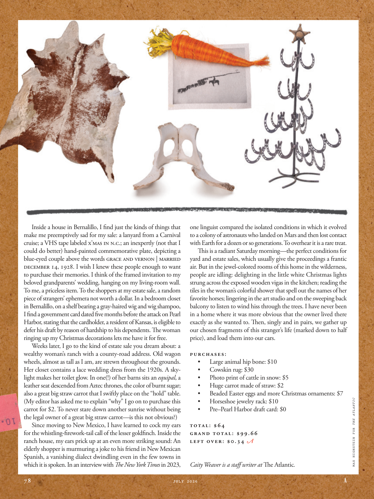

# The Atlantic — July 2026

## Page 80

---

Inside a house in Bernalillo, I find just the kinds of things that make me preemptively sad for my sale: a lanyard from a Carnival cruise; a VHS tape labeled X’MAS IN N.C.; an inexpertly (not that I could do better) hand-painted commemorative plate, depicting a blue-eyed couple above the words Grace and Vernon | Married December 14, 1928. I wish I knew these people enough to want to purchase their memories. I think of the framed invitation to my beloved grandparents’ wedding, hanging on my living-room wall.

**【中文翻译】** 在伯纳利欧的一所房子里，我发现了一些让我先发制人地为自己的出售而感到悲伤的东西：一条来自嘉年华游轮的挂绳；标有 X’MAS IN N.C. 的 VHS 磁带；一个不熟练的（不是我能做得更好）手绘纪念牌，描绘了一对蓝眼睛的夫妇，上面写着“格蕾丝和弗农|” 1928 年 12 月 14 日结婚。我希望我足够了解这些人，愿意购买他们的回忆。我想起了挂在客厅墙上的镶框邀请函，参加我心爱的祖父母的婚礼。

To me, a priceless item. To the shoppers at my estate sale, a random piece of strangers’ ephemera not worth a dollar. In a bedroom closet in Bernalillo, on a shelf bearing a gray-haired wig and wig shampoo, I find a government card dated five months before the attack on Pearl Harbor, stating that the cardholder, a resident of Kansas, is eligible to defer his draft by reason of hardship to his dependents. The woman ringing up my Christmas decorations lets me have it for free.

**【中文翻译】** 对我来说，是无价之宝。对于我的房地产拍卖会上的购物者来说，随机的一件陌生人的蜉蝣不值一美元。在伯纳利欧的一个卧室壁橱里，在一个放着白发假发和假发洗发水的架子上，我发现了一张政府卡片，日期是珍珠港袭击前五个月，上面写着持卡人是堪萨斯州居民，有资格因家属困难而推迟征兵。那位女士给我送来圣诞装饰品，让我免费得到它。

Weeks later, I go to the kind of estate sale you dream about: a wealthy woman’s ranch with a county-road address. Old wagon wheels, almost as tall as I am, are strewn throughout the grounds.

**【中文翻译】** 几周后，我去参加了你梦想的那种房地产拍卖会：一个富有的女人的牧场，地址在县道上。几乎和我一样高的旧马车车轮散落在地面上。

Her closet contains a lace wedding dress from the 1920s. A skylight makes her toilet glow. In one(!) of her barns sits an equipal , a leather seat descended from Aztec thrones, the color of burnt sugar; also a great big straw carrot that I swiftly place on the “hold” table.

**【中文翻译】** 她的衣柜里有一件 20 年代的蕾丝婚纱。天窗让她的厕所发光。她的一个（！）谷仓里坐着一张马鞍，一张源自阿兹特克王座的皮革座椅，颜色像焦糖；还有一根很大的稻草胡萝卜，我很快就把它放在“保留”桌子上。

(My editor has asked me to explain “why” I go on to purchase this carrot for $2. To never stare down another sunrise without being the legal owner of a great big straw carrot— is this not obvious?) Since moving to New Mexico, I have learned to cock my ears for the whistling-fi rework-tail call of the lesser goldfi nch. Inside the ranch house, my ears prick up at an even more striking sound: An elderly shopper is murmuring a joke to his friend in New Mexican Spanish, a vanishing dialect dwindling even in the few towns in which it is spoken. In an interview with The New York Times in 2023, one linguist compared the isolated conditions in which it evolved to a colony of astronauts who landed on Mars and then lost contact with Earth for a dozen or so generations. To overhear it is a rare treat.

**【中文翻译】** （我的编辑让我解释“为什么”我继续花 2 美元购买这根胡萝卜。如果没有成为一根大稻草胡萝卜的合法所有者，就永远不会凝视另一个日出——这不是显而易见的吗？）自从搬到新墨西哥州后，我学会了竖起耳朵聆听小金翅雀的哨声。在牧场房子里，我的耳朵竖起，听到一种更引人注目的声音：一位年长的购物者正在用新墨西哥西班牙语向他的朋友低声讲一个笑话，这种方言即使在少数几个讲这种语言的城镇中也正在减少。 2023 年，一位语言学家在接受《纽约时报》采访时，将其进化过程中的孤立环境与一群宇航员登陆火星，然后在十几代人的时间里与地球失去联系进行了比较。无意中听到它是一种难得的享受。

This is a radiant Saturday morning— the perfect conditions for yard and estate sales, which usually give the proceedings a frantic air. But in the jewel-colored rooms of this home in the wilderness, people are idling: delighting in the little white Christmas lights strung across the exposed wooden vigas in the kitchen; reading the tiles in the woman’s colorful shower that spell out the names of her favorite horses; lingering in the art studio and on the sweeping back balcony to listen to wind hiss through the trees. I have never been in a home where it was more obvious that the owner lived there exactly as she wanted to. Th en, singly and in pairs, we gather up our chosen fragments of this stranger’s life (marked down to half price), and load them into our cars.

**【中文翻译】** 这是一个阳光明媚的星期六早晨，这是庭院和房地产销售的完美条件，这通常会给整个过程带来疯狂的气氛。但在这座荒野中的房子里，宝石色的房间里，人们都在无所事事：欣赏着厨房里裸露的木制维加斯上挂着的白色圣诞小灯；阅读这位女士色彩缤纷的淋浴间里的瓷砖，上面拼出了她最喜欢的马的名字；在艺术工作室和宽敞的后阳台上徘徊，聆听风吹过树林的嘶嘶声。我从来没有住过这样的房子，更明显的是，房主完全按照她想要的方式住在那里。然后，我们单独或成对地收集这个陌生人生活中我们所选择的碎片（打折至半价），并将它们装进我们的车里。

PURCHASES: • Large animal hip bone: $10 • Cowskin rug: $30 • Photo print of cattle in snow: $5 • Huge carrot made of straw: $2 • Beaded Easter eggs and more Christmas ornaments: $7 • Horseshoe jewelry rack: $10 • Pre–Pearl Harbor draft card: $0 TOTAL: $64 GRAND TOTAL: $99.66 LEFT OVER: $0.34 Caity Weaver is a staff writer at The Atlantic . MAX HIGHSTEIN FOR THE ATLANTIC

**【中文翻译】** 购买： • 大型动物髋骨：10 美元 • 牛皮地毯：30 美元 • 雪中牛的照片打印：5 美元 • 稻草制成的巨大胡萝卜：2 美元 • 串珠复活节彩蛋和更多圣诞装饰品：7 美元 • 马蹄形首饰架：10 美元 • 珍珠港事件前的征兵卡：0 美元 总计：64 美元 总计：99.66 美元 剩余：0.34 美元 凯蒂·韦弗 (Caity Weaver) 是一名《大西洋月刊》特约撰稿人。大西洋号的马克斯·海斯坦
