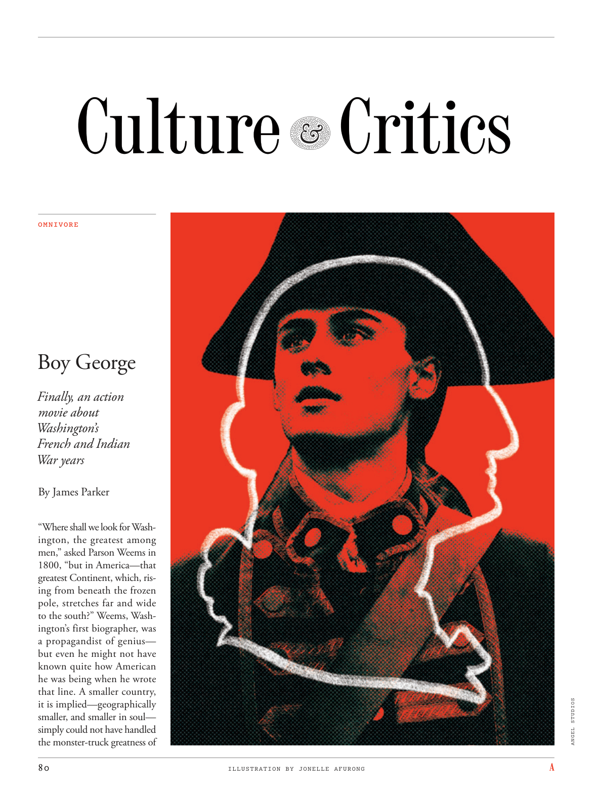

# The Atlantic — July 2026

## Page 82

---

### Boy George

**【标题翻译】** 男孩乔治

Finally, an action movie about Washington’s French and Indian War years By James Parker “Where shall we look for Washington, the greatest among men,” asked Parson Weems in 1800, “but in America—that greatest Continent, which, rising from beneath the frozen pole, stretches far and wide to the south?” Weems, Washington’s first biographer, was a propagandist of genius— but even he might not have known quite how American he was being when he wrote that line. A smaller country, it is implied— geographically smaller, and smaller in soul— simply could not have handled the monster-truck greatness of

**【中文翻译】** 最后一部关于华盛顿的法印战争年代的动作片，作者：詹姆斯·帕克 帕森·威姆斯在 1800 年问道：“我们该去哪里寻找人类中最伟大的华盛顿呢？但是在美国——这片从冰冻极地之下升起，向南延伸很远很远的大陆呢？”威姆斯是华盛顿的第一位传记作家，他是一位天才的宣传家，但即使是他也可能不太清楚，当他写下这句话时，他是多么的美国人。这意味着，一个较小的国家——地理上更小，灵魂上更小——根本无法应对巨大的卡车的伟大。

*ILLUSTRATION BY JONELLE AFURONG*

*【图注与署名】乔内尔·阿芙隆绘制的插图*

ANGEL STUDIOS

**【中文翻译】** 天使工作室
