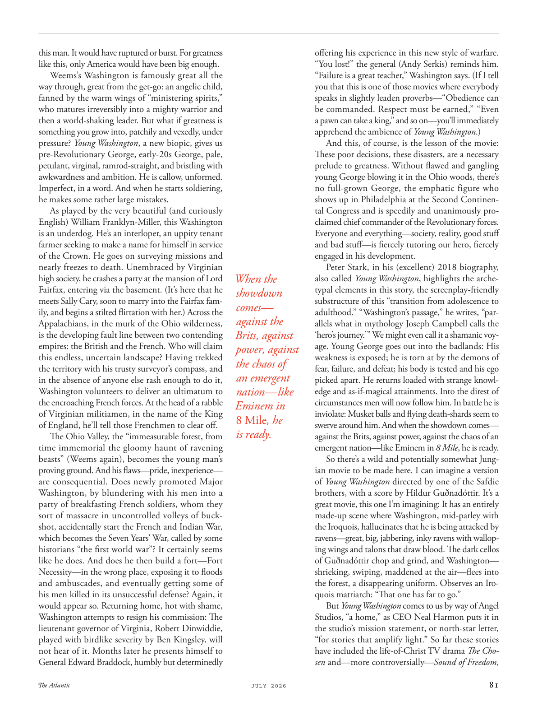

# The Atlantic — July 2026

## Page 83

---

this man. It would have ruptured or burst. For greatness like this, only America would have been big enough. Weems’s Washington is famously great all the way through, great from the get-go: an angelic child, fanned by the warm wings of “ministering spirits,” who matures ir reversibly into a mighty warrior and then a worldshaking leader. But what if greatness is something you grow into, patchily and vexedly, under pressure? Young Washington , a new biopic, gives us preRevolutionary George, early-20s George, pale, petulant, virginal, ramrodstraight, and bristling with awkwardness and ambition. He is callow, unformed.

**【中文翻译】** 这个人。它会破裂或破裂。对于这样的伟大，只有美国才足够大。威姆斯笔下的华盛顿自始至终都是伟大的，从一开始就伟大：一个天使般的孩子，被“施助之灵”温暖的翅膀所扇动，成长为一个强大的战士，然后成为一个惊天动地的领袖。但如果伟大是你在压力下、时断时续、烦恼不断地成长起来的，那又怎样呢？一部新的传记片《年轻的华盛顿》为我们呈现了革命前的乔治、二十岁出头的乔治，苍白、脾气暴躁、纯洁、笔直、充满笨拙和野心。他很稚嫩，未成形。

Imperfect, in a word. And when he starts soldiering, he makes some rather large mistakes. As played by the very beautiful (and curiously English) William Franklyn-Miller, this Washington is an underdog. He’s an interloper, an uppity tenant farmer seeking to make a name for himself in service of the Crown. He goes on surveying missions and nearly freezes to death. Unembraced by Virginian high society, he crashes a party at the mansion of Lord Fairfax, entering via the basement. (It’s here that he meets Sally Cary, soon to marry into the Fairfax family, and begins a stilted flirtation with her.) Across the Appalachians, in the murk of the Ohio wilderness, is the developing fault line between two contending empires: the British and the French. Who will claim this endless, uncertain landscape? Having trekked the territory with his trusty surveyor’s compass, and in the absence of anyone else rash enough to do it, Washington volunteers to deliver an ultimatum to the encroaching French forces. At the head of a rabble of Virginian militiamen, in the name of the King of England, he’ll tell those Frenchmen to clear off.

**【中文翻译】** 一句话，不完美。当他开始当兵时，他犯了一些相当大的错误。正如非常美丽（而且奇怪的英国人）威廉·富兰克林·米勒（William Franklyn-Miller）扮演的那样，这个华盛顿是一个失败者。他是一个闯入者，一个傲慢的佃农，希望通过为王室服务而出名。他继续执行测量任务，差点被冻死。由于不受弗吉尼亚上流社会的欢迎，他从地下室进入了费尔法克斯勋爵宅邸的一场聚会。 （正是在这里，他遇到了即将嫁入费尔法克斯家族的莎莉·卡里，并开始与她进行生硬的调情。） 越过阿巴拉契亚山脉，在俄亥俄州荒野的阴暗处，是两个相互竞争的帝国：英国和法国之间不断发展的断层线。谁将拥有这片无尽、不确定的风景？华盛顿带着他值得信赖的测量员指南针在这片领土上跋涉，在没有其他人敢这么做的情况下，华盛顿自愿向入侵的法国军队发出最后通牒。他将率领一群乌合之众的弗吉尼亚民兵，以英国国王的名义，命令那些法国人离开。

The Ohio Valley, the “immeasurable forest, from time immemorial the gloomy haunt of ravening beasts” (Weems again), becomes the young man’s proving ground. And his flaws—pride, inexperience— are consequential. Does newly promoted Major Washington, by blundering with his men into a party of breakfasting French soldiers, whom they sort of massacre in un controlled volleys of buckshot, accidentally start the French and Indian War, which becomes the Seven Years’ War, called by some historians “the first world war”? It certainly seems like he does. And does he then build a fort—Fort Necessity—in the wrong place, exposing it to floods and ambuscades, and eventually getting some of his men killed in its unsuccessful defense? Again, it would appear so. Returning home, hot with shame, Washington attempts to resign his commission: The lieutenant governor of Virginia, Robert Dinwiddie, played with birdlike severity by Ben Kingsley, will not hear of it. Months later he presents himself to General Edward Braddock, humbly but determinedly offering his experience in this new style of warfare.

**【中文翻译】** 俄亥俄河谷，“无边无际的森林，自古以来就是掠夺野兽的阴暗出没之地”（威姆斯再次如此），成为了年轻人的试验场。他的缺点——骄傲、缺乏经验——也是很严重的。新晋升的华盛顿少校与他的部下误入了一群正在吃早餐的法国士兵中，并用不受控制的铅弹齐射屠杀了他们，是否意外地引发了法国和印度战争，即后来的七年战争，被一些历史学家称为“第一次世界大战”？他看起来确实是这样。然后他是否在错误的地方建造了一座堡垒——必需堡——使其遭受洪水和伏击，并最终导致他的一些人在防御失败中丧生？再次看来，情况确实如此。回到家后，华盛顿羞愧难当，试图辞去他的职务：弗吉尼亚州副州长罗伯特·丁威迪（本·金斯利表现得像鸟一样严厉）不会听到这件事。几个月后，他向爱德华·布拉多克将军进行了自我介绍，谦虚但坚定地提供了他在这种新型战争中的经验。

“You lost!” the general (Andy Serkis) reminds him. “Failure is a great teacher,” Washington says. (If I tell you that this is one of those movies where everybody speaks in slightly leaden proverbs—“Obedience can be commanded. Respect must be earned,” “Even a pawn can take a king,” and so on—you’ll immediately apprehend the ambience of Young Washington .) And this, of course, is the lesson of the movie: These poor decisions, these disasters, are a necessary prelude to greatness. Without flawed and gangling young George blowing it in the Ohio woods, there’s no full-grown George, the emphatic figure who shows up in Philadelphia at the Second Continental Congress and is speedily and unanimously proclaimed chief commander of the Revolutionary forces.

**【中文翻译】** “你输了！”将军（安迪·瑟金斯饰）提醒他。 “失败是一位伟大的老师，”华盛顿说。 （如果我告诉你，在这部电影中，每个人都用略带沉重的谚语说话——“服从是可以命令的。尊重必须赢得尊重”、“即使是棋子也能夺走国王”等等——你会立即理解《少年华盛顿》的氛围。）当然，这就是这部电影的教训：这些糟糕的决定，这些灾难，是伟大的必要前奏。没有有缺陷、身材瘦长的年轻乔治在俄亥俄州的森林里吹牛，就没有成熟的乔治，这个在费城举行的第二次大陆会议上出现的引人注目的人物，并被迅速一致地宣布为革命力量的总司令。

Everyone and everything—society, reality, good stuff and bad stuff—is fiercely tutoring our hero, fiercely engaged in his development. Peter Stark, in his (excellent) 2018 biography, When the also called Young Washington , highlights the archetypal elements in this story, the screenplay-friendly showdown sub structure of this “transition from adolescence to comes— adulthood.” “Washington’s passage,” he writes, “paragainst the allels what in mythology Joseph Campbell calls the Brits, against ‘hero’s journey.’ ” We might even call it a shamanic voyage. Young George goes out into the badlands: His power, against weakness is exposed; he is torn at by the demons of the chaos of fear, failure, and defeat; his body is tested and his ego an emergent picked apart. He returns loaded with strange knowlnation—like edge and as-if-magical attainments. Into the direst of circumstances men will now follow him. In battle he is Eminem in inviolate: Musket balls and flying death-shards seem to 8 Mile , he swerve around him. And when the showdown comes— is ready. against the Brits, against power, against the chaos of an emergent nation— like Eminem in 8 Mile , he is ready.

**【中文翻译】** 每个人、每件事——社会、现实、好东西和坏东西——都在积极地辅导我们的英雄，积极地参与他的发展。彼得·斯塔克（Peter Stark）在他 2018 年的（优秀）传记《当年轻的华盛顿》中强调了这个故事中的原型元素，即这个“从青春期到成年的过渡”的剧本友好的摊牌子结构。 “华盛顿的旅程，”他写道，“反对神话中约瑟夫·坎贝尔所说的英国人，反对‘英雄之旅’。”我们甚至可以称其为萨满之旅。年轻的乔治走进荒原：他对抗弱点的力量暴露无遗；他被恐惧、失败和失败等混乱的恶魔撕扯着。他的身体受到了考验，他的自我也被彻底瓦解。他带着奇怪的知识回来了——比如锋芒和神奇的成就。现在，在最严峻的情况下，人们将追随他。在战斗中，他是不受侵犯的埃米纳姆：火枪子弹和飞行的死亡碎片似乎有 8 英里，他在他周围转弯。当摊牌到来时——已经准备好了。对抗英国人、对抗权力、对抗新兴国家的混乱——就像《八英里》中的阿姆一样，他已经准备好了。

So there’s a wild and potentially somewhat Jungian movie to be made here. I can imagine a version of Young Washington directed by one of the Safdie brothers, with a score by Hildur Guðnadóttir. It’s a great movie, this one I’m imagining: It has an entirely made-up scene where Washington, mid-parley with the Iroquois, hallucinates that he is being attacked by ravens—great, big, jabbering, inky ravens with walloping wings and talons that draw blood. The dark cellos of Guðnadóttir chop and grind, and Washington— shrieking, swiping, maddened at the air— flees into the forest, a disappearing uniform. Observes an Iroquois matriarch: “That one has far to go.”

**【中文翻译】** 所以这里有一部狂野的、可能有点荣格主义的电影要拍。我可以想象由萨夫迪兄弟之一执导、希尔杜尔·居兹纳多蒂尔配乐的《少年华盛顿》的版本。这是一部很棒的电影，我正在想象的这部电影：它有一个完全虚构的场景，华盛顿在与易洛魁人谈判中，幻觉自己正在受到乌鸦的攻击——巨大的、叽叽喳喳的、漆黑的乌鸦，翅膀猛烈地拍打，爪子可以吸血。古兹纳多蒂尔的黑色大提琴劈啪作响，华盛顿尖叫着，挥舞着拳头，对空气感到疯狂，逃进了森林，制服消失了。一位易洛魁女族长观察到：“那个人还有很长的路要走。”

But Young Washington comes to us by way of Angel Studios, “a home,” as CEO Neal Harmon puts it in the studio’s mission statement, or north-star letter, “for stories that amplify light.” So far these stories have included the life-of-Christ TV drama The Chosen and— more controversially— Sound of Freedom ,

**【中文翻译】** 但《年轻的华盛顿》是通过天使工作室来到我们这里的，正如首席执行官尼尔·哈蒙在工作室的使命宣言或北极星信中所说，天使工作室是“一个家”，“为故事增添光彩”。到目前为止，这些故事包括基督生平电视剧《选民》和更具争议性的《自由之声》，
