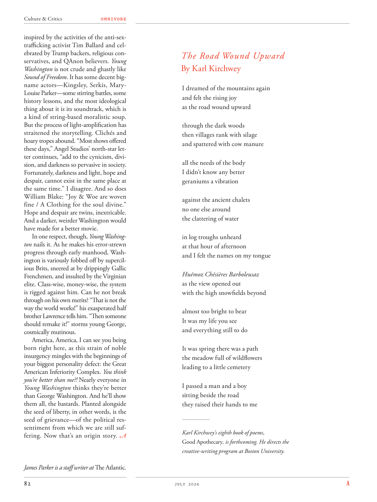

# The Atlantic — July 2026

## Page 84

---

inspired by the activities of the anti-sextrafficking activist Tim Ballard and celebrated by Trump backers, religious conservatives, and QAnon believers. Young Washington is not crude and ghastly like Sound of Freedom . It has some decent bigname actors—Kingsley, Serkis, MaryLouise Parker—some stirring battles, some history lessons, and the most ideological thing about it is its soundtrack, which is a kind of string-based moralistic soup.

**【中文翻译】** 受到反性交易活动家蒂姆·巴拉德 (Tim Ballard) 活动的启发，并受到特朗普支持者、宗教保守派和 QAnon 信徒的庆祝。 《年轻的华盛顿》并不像《自由之声》那样粗俗可怕。它有一些像样的大牌演员——金斯利、瑟金斯、玛丽·路易斯·帕克——一些激动人心的战斗，一些历史教训，而它最具意识形态性的是它的配乐，这是一种以弦乐为基础的道德汤。

But the process of light-amplification has straitened the storytelling. Clichés and hoary tropes abound. “Most shows offered these days,” Angel Studios’ north-star letter continues, “add to the cynicism, division, and darkness so pervasive in society.

**【中文翻译】** 但光放大的过程限制了故事的讲述。陈词滥调和陈旧的比喻比比皆是。 “如今提供的大多数节目，”天使工作室的北极星信继续说道，“加剧了社会普遍存在的愤世嫉俗、分裂和黑暗。

Fortunately, darkness and light, hope and despair, cannot exist in the same place at the same time.” I disagree. And so does William Blake: “Joy & Woe are woven fine / A Clothing for the soul divine.”

**【中文翻译】** 幸运的是，黑暗与光明、希望与绝望，不可能同时存在于同一个地方。”我不同意。威廉·布莱克 (William Blake) 也这么说：“欢乐与悲伤交织得很好/神圣灵魂的衣服。”

Hope and despair are twins, inextricable. And a darker, weirder Washington would have made for a better movie. In one respect, though, Young Washington nails it. As he makes his error-strewn progress through early manhood, Washington is variously fobbed off by supercilious Brits, sneered at by drippingly Gallic Frenchmen, and insulted by the Virginian elite. Class-wise, money-wise, the system is rigged against him. Can he not break through on his own merits? “That is not the way the world works!” his exasperated half brother Lawrence tells him. “Then someone should remake it!” storms young George, cosmically mutinous.

**【中文翻译】** 希望和绝望是一对孪生兄弟，密不可分。一个更黑暗、更怪异的华盛顿会成为一部更好的电影。不过，从一方面来说，《年轻的华盛顿》做到了这一点。当华盛顿在成年初期犯下错误时，他遭到了傲慢的英国人的各种愚弄，受到了高卢法国人的嘲笑，并受到了弗吉尼亚精英的侮辱。从阶级角度、金钱角度来看，这个体系都对他不利。难道他就不能凭借自己的能力突破吗？ “世界不是这样运作的！”他愤怒的同父异母兄弟劳伦斯告诉他。 “那么应该有人重制它！”年轻的乔治遭遇暴风雨，极其叛逆。

America, America, I can see you being born right here, as this strain of noble insurgency mingles with the beginnings of your biggest personality defect: the Great American Inferiority Complex. You think you’re better than me?! Nearly everyone in Young Washington thinks they’re better than George Washington. And he’ll show them all, the bastards. Planted alongside the seed of liberty, in other words, is the seed of grievance—of the political ressentiment from which we are still suffering. Now that’s an origin story.

**【中文翻译】** 美国，美国，我可以看到你出生在这里，因为这种高贵叛逆的压力与你最大的人格缺陷的开始混合在一起：伟大的美国自卑情结。你以为你比我优秀？！几乎每个“年轻华盛顿”的人都认为自己比乔治·华盛顿更好。他会让他们所有人看到，这些混蛋。换句话说，与自由的种子一起种下的是不满的种子——我们仍在遭受政治怨恨的种子。这是一个起源故事。

*— James Parker is a staff writer at The Atlantic .*

*【作者署名】詹姆斯·帕克是《大西洋月刊》的特约撰稿人。*

#### The Road Wound Upward

**【副标题翻译】** 道路蜿蜒向上

By Karl Kirchwey I dreamed of the mountains again and felt the rising joy as the road wound upward through the dark woods then villages rank with silage and spattered with cow manure all the needs of the body I didn’t know any better geraniums a vibration against the ancient chalets no one else around the clattering of water in log troughs unheard at that hour of afternoon and I felt the names on my tongue Huémoz Chésières Barboleusaz as the view opened out with the high snowfields beyond almost too bright to bear It was my life you see and everything still to do It was spring there was a path the meadow full of wildflowers leading to a little cemetery I passed a man and a boy sitting beside the road they raised their hands to me Karl Kirchwey’s eighth book of poems, Good Apothecary , is forthcoming. He directs the creative-writing program at Boston University.

**【中文翻译】** 作者：Karl Kirchwey 我再次梦见了群山，当道路蜿蜒穿过黑暗的树林时，村庄里堆满了青贮饲料，洒满了牛粪，满足了我身体的所有需要，天竺葵在古老的小屋中震动，没有其他人，在下午的那个时刻，木槽里的水哗啦作响，我感觉到我的舌头上的名字Huémoz Chésières Barboleusaz视野开阔，远处是高高的雪原，几乎亮得难以忍受。你看到的是我的生活，一切都还要做。那是春天，有一条小路，开满野花的草地通向一个小墓地。我经过一个男人和一个男孩，坐在路边，他们向我举手。卡尔·基希韦的第八本诗集《好药剂师》即将出版。他负责波士顿大学的创意写作项目。
