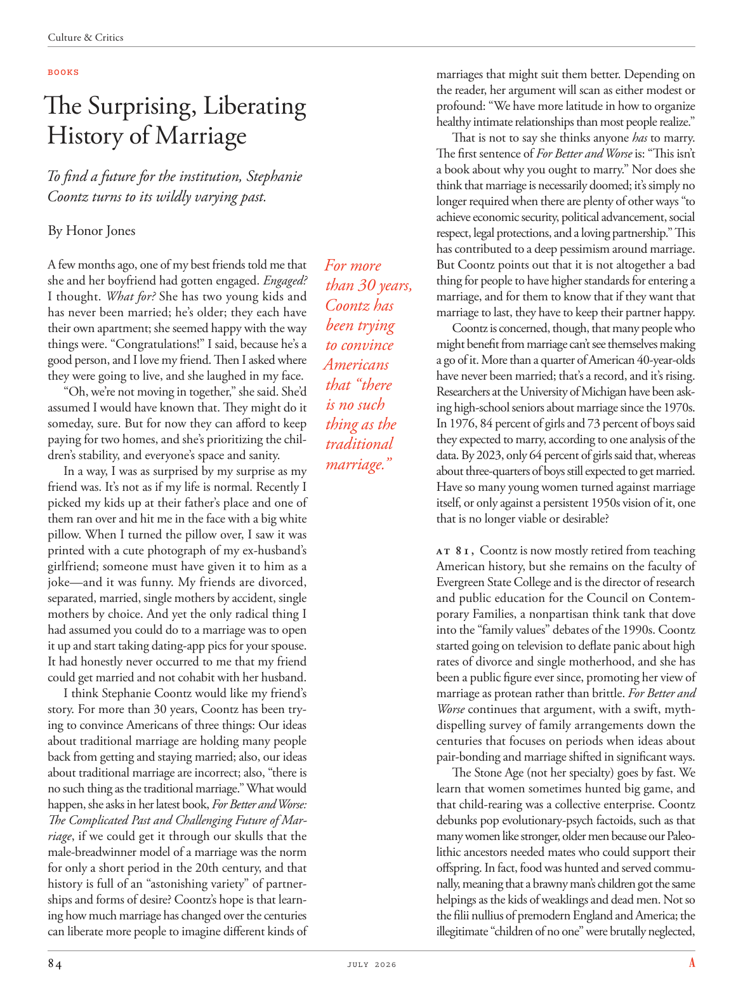

# The Atlantic — July 2026

## Page 86

---

### The Surprising, Liberating

**【标题翻译】** 令人惊奇、解放

### History of Marriage

**【标题翻译】** 婚姻史

To find a future for the institution, Stephanie Coontz turns to its wildly varying past. By Honor Jones A few months ago, one of my best friends told me that she and her boyfriend had gotten engaged. Engaged?

**【中文翻译】** 为了寻找该机构的未来，斯蒂芬妮·孔茨回顾了其千变万化的过去。几个月前，我最好的朋友之一告诉我，她和她的男朋友已经订婚了。已订婚的？

I thought. What for? She has two young kids and has never been married; he’s older; they each have their own apartment; she seemed happy with the way things were. “Congratulations!” I said, because he’s a good person, and I love my friend. Then I asked where they were going to live, and she laughed in my face.

**【中文翻译】** 我想。做什么的？她有两个年幼的孩子，从未结过婚。他年纪大了；他们每个人都有自己的公寓；她似乎对现状感到满意。 “恭喜你！”我说，因为他是个好人，而且我爱我的朋友。然后我问他们要住在哪里，她当着我的面笑了。

“Oh, we’re not moving in together,” she said. She’d assumed I would have known that. They might do it someday, sure. But for now they can afford to keep paying for two homes, and she’s prioritizing the children’s stability, and everyone’s space and sanity.

**【中文翻译】** “哦，我们不会住在一起，”她说。她以为我会知道这一点。当然，他们有一天可能会这么做。但目前他们有能力继续支付两套房子的费用，她优先考虑的是孩子们的稳定以及每个人的空间和理智。

In a way, I was as surprised by my surprise as my friend was. It’s not as if my life is normal. Recently I picked my kids up at their father’s place and one of them ran over and hit me in the face with a big white pillow. When I turned the pillow over, I saw it was printed with a cute photograph of my exhusband’s girlfriend; someone must have given it to him as a joke— and it was funny. My friends are divorced, separated, married, single mothers by accident, single mothers by choice. And yet the only radical thing I had assumed you could do to a marriage was to open it up and start taking dating-app pics for your spouse.

**【中文翻译】** 在某种程度上，我和我的朋友一样对自己的惊讶感到惊讶。我的生活并不正常。最近，我去孩子们父亲家接孩子，其中一个孩子跑过来，用一个白色的大枕头打我的脸。当我把枕头翻过来时，我看到上面印着一张我前夫女朋友的可爱照片；一定是有人把它当作笑话送给他的——而且很有趣。我的朋友们离婚、分居、结婚、偶然成为单身母亲、自愿成为单身母亲。然而，我认为你可以对婚姻做的唯一激进的事情就是打开它并开始为你的配偶拍摄约会应用程序的照片。

It had honestly never occurred to me that my friend could get married and not cohabit with her husband. I think Stephanie Coontz would like my friend’s story. For more than 30 years, Coontz has been trying to convince Americans of three things: Our ideas about traditional marriage are holding many people back from getting and staying married; also, our ideas about traditional marriage are incorrect; also, “there is no such thing as the traditional marriage.” What would happen, she asks in her latest book, For Better and Worse: The Complicated Past and Challenging Future of Marriage , if we could get it through our skulls that the malebreadwinner model of a marriage was the norm for only a short period in the 20th century, and that history is full of an “astonishing variety” of partnerships and forms of desire? Coontz’s hope is that learning how much marriage has changed over the centuries can liberate more people to imagine different kinds of marriages that might suit them better. Depending on the reader, her argument will scan as either modest or profound: “We have more latitude in how to organize healthy intimate relationships than most people realize.”

**【中文翻译】** 老实说，我从来没有想过我的朋友可以结婚而不与她的丈夫同居。我想斯蒂芬妮·孔茨会喜欢我朋友的故事。 30多年来，孔茨一直试图让美国人相信三件事：我们对传统婚姻的看法阻碍了许多人结婚和维持婚姻；而且，我们对传统婚姻的观念是不正确的；此外，“不存在所谓传统婚姻”。她在她的最新著作《无论好坏：婚姻的复杂过去与充满挑战的未来》中问道，如果我们能够深入了解，男性养家糊口的婚姻模式只在20世纪的短时间内成为常态，而且历史上充满了“令人惊讶的多样化”的伙伴关系和欲望形式，那么会发生什么？孔茨希望，了解几个世纪以来婚姻发生了多大变化，可以让更多的人想象出更适合自己的不同类型的婚姻。根据读者的不同，她的论点可能是温和的，也可能是深刻的：“我们在如何组织健康的亲密关系方面拥有比大多数人意识到的更大的自由度。”

That is not to say she thinks anyone has to marry. The first sentence of For Better and Worse is: “This isn’t a book about why you ought to marry.” Nor does she think that marriage is necessarily doomed; it’s simply no longer required when there are plenty of other ways “to achieve economic security, political advancement, social respect, legal protections, and a loving partnership.” This has contributed to a deep pessimism around marriage.

**【中文翻译】** 这并不是说她认为任何人都必须结婚。 《更好或更糟》的第一句话是：“这不是一本关于为什么你应该结婚的书。”她也不认为婚姻一定是注定要失败的。当有很多其他方法“实现经济安全、政治进步、社会尊重、法律保护和充满爱心的伙伴关系”时，它就不再需要了。这导致人们对婚姻抱有深深的悲观情绪。

For more But Coontz points out that it is not altogether a bad thing for people to have higher standards for entering a than 30 years, marriage, and for them to know that if they want that Coontz has marriage to last, they have to keep their partner happy. been trying Coontz is concerned, though, that many people who to convince might benefit from marriage can’t see themselves making a go of it. More than a quarter of American 40-year-olds Americans have never been married; that’s a record, and it’s rising. that “there Researchers at the University of Michigan have been askis no such ing high-school seniors about marriage since the 1970s. thing as the In 1976, 84 percent of girls and 73 percent of boys said they expected to marry, according to one analy sis of the traditional data. By 2023, only 64 percent of girls said that, whereas marriage.” about three-quarters of boys still expected to get married.

**【中文翻译】** 但 Coontz 指出，对于人们来说，进入 30 年以上的婚姻有更高的标准并不完全是一件坏事，而且让他们知道，如果他们想让 Coontz 的婚姻长久，他们就必须让他们的伴侣幸福。不过，一直在尝试的孔茨担心，许多相信可能会从婚姻中受益的人却看不到自己能够成功。超过四分之一的 40 岁美国人从未结过婚；这是一个记录，而且还在上升。 “自 20 世纪 70 年代以来，密歇根大学的研究人员一直没有向高中生询问有关婚姻的问题。根据对传统数据的一项分析，1976 年，84% 的女孩和 73% 的男孩表示他们希望结婚。到 2023 年，只有 64% 的女孩表示希望结婚。”大约四分之三的男孩仍然希望结婚。

Have so many young women turned against marriage itself, or only against a persistent 1950s vision of it, one that is no longer viable or desirable?

**【中文翻译】** 是否有如此多的年轻女性反对婚姻本身，或者只是反对 20 世纪 50 年代对婚姻的执着愿景，一种不再可行或不再令人向往的愿景？

At 81, Coontz is now mostly retired from teaching American history, but she remains on the faculty of Evergreen State College and is the director of research and public education for the Council on Contemporary Families, a nonpartisan think tank that dove into the “family values” debates of the 1990s. Coontz started going on television to deflate panic about high rates of divorce and single motherhood, and she has been a public figure ever since, promoting her view of marriage as protean rather than brittle. For Better and Worse continues that argument, with a swift, mythdispelling survey of family arrangements down the centuries that focuses on periods when ideas about pair-bonding and marriage shifted in significant ways.

**【中文翻译】** 81 岁的孔茨现在已经从教授美国历史的岗位上退休了，但她仍然在长青州立学院任教，并且是当代家庭委员会的研究和公共教育主任，该委员会是一个无党派智库，致力于 20 世纪 90 年代的“家庭价值观”辩论。孔茨开始上电视，以平息人们对高离婚率和单身母亲的恐慌，从那时起，她就成了公众人物，宣传她的婚姻观是多变的，而不是脆弱的。 《无论好坏》继续了这一论点，对几个世纪以来的家庭安排进行了快速、消除神话的调查，重点关注了有关夫妻关系和婚姻的观念发生重大转变的时期。

The Stone Age (not her specialty) goes by fast. We learn that women sometimes hunted big game, and that child-rearing was a collective enterprise. Coontz debunks pop evolutionary-psych factoids, such as that many women like stronger, older men because our Paleolithic ancestors needed mates who could support their offspring. In fact, food was hunted and served communally, meaning that a brawny man’s children got the same helpings as the kids of weaklings and dead men. Not so the filii nullius of premodern England and America; the illegitimate “children of no one” were brutally neglected,

**【中文翻译】** 石器时代（不是她的专长）过得很快。我们了解到，女性有时会狩猎大型猎物，而抚养孩子是一项集体事业。孔茨揭穿了流行的进化心理学事实，例如许多女性喜欢更强壮、年长的男性，因为我们的旧石器时代祖先需要能够养育后代的伴侣。事实上，食物是集体狩猎和提供的，这意味着壮汉的孩子和弱者和死人的孩子得到同样的帮助。前现代英国和美国的“无主之事”则不然。私生子“无人的孩子”被残酷地忽视，
