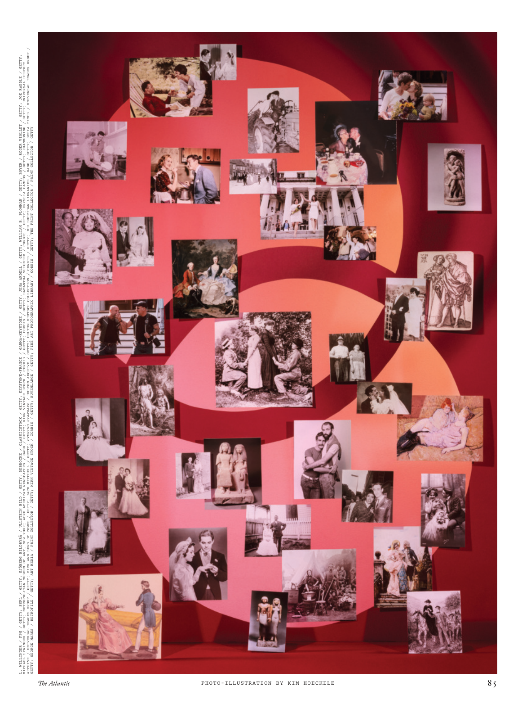

# The Atlantic — July 2026

## Page 87

---

ARCHIVE / UNIVERSAL IMAGES GROUP / GETTY; KIRK AND SONS OF COWES / GETTY; JACK MITCHELL / GETTY; EVENING STANDARD / HULTON ARCHIVE / GETTY; HULTON-DEUTSCH COLLECTION / CORBIS / GETTY; JHU SHERIDAN LIBRARIES / GADO / GETTY; SEPIA TIMES / UNIVERSAL IMAGES GROUP / L. WILLINGER / FPG / GETTY; SSPL / GETTY; SJÖBERG BILDBYRÅ / ULLSTEIN BILD / GETTY; DEBROCKE / CLASSICSTOCK / GETTY; KEYSTONE-FRANCE / GAMMA-KEYSTONE / GETTY; JENA ARDELL / GETTY; WILLIAM B. PLOWMAN / GETTY; BOYER / ROGER VIOLLET / GETTY; JOE RAEDLE / GETTY; MICHAEL SPRINGER / GETTY; METROPOLITAN MUSEUM OF ART, NEW YORK; AFRO AMERICAN NEWSPAPERS / GADO / GETTY; KIRN VINTAGE STOCK / CORBIS / GETTY; CORBIS / GETTY; SAMANTHA VUIGNIER / CORBIS / GETTY; KRYSSIA CAMPOS / GETTY; JUANMONINO / GETTY; UNIVERSAL HISTORY GETTY; GEORGE MARKS / RETROFILE / GETTY; ART MEDIA / PRINT COLLECTOR / GETTY; KIRN VINTAGE STOCK / CORBIS / GETTY; BUYENLARGE / GETTY; FINE ART PHOTOGRAPHIC LIBRARY / CORBIS / GETTY; THE PRINT COLLECTOR / PRINT COLLECTOR / GETTY

**【中文翻译】** 档案/环球图像集团/盖蒂图片社；柯克和考斯之子/盖蒂图片社；杰克·米切尔/盖蒂图片社； 《标准晚报》/HULTON ARCHIVE/GETTY； HULTON-DEUTSCH COLLECTION / CORBIS / GETTY； JHU 谢里丹图书馆 / GADO / GETTY； SEPIA TIMES / 环球影像集团 / L. WILLINGER / FPG / GETTY； SSPL/盖蒂图片社； SJÖBERG BILDBYRÅ / ULLSTEIN BILD / GETTY；德布罗克/CLASSICSTOCK/GETTY； KEYSTONE-法国 / GAMMA-KEYSTONE / GETTY；耶娜·阿德尔/盖蒂图片社；威廉·B·农夫/盖蒂图片社；博耶/罗杰·维奥莱特/盖蒂图片社；乔·雷德尔/盖蒂图片社；迈克尔·斯普林格/盖蒂图片社；纽约大都会艺术博物馆；非裔美国报纸 / GADO / GETTY； KIRN 复古库存 / CORBIS / GETTY；科比斯/盖蒂图片社；萨曼莎·维尼耶/科比斯/盖蒂图片社；克丽西娅·坎波斯/盖蒂图片社；胡安莫尼​​诺/盖蒂图片社；环球历史盖蒂图片社；乔治·马克斯 / RETROFILE / GETTY；艺术媒体/印刷品收藏家/盖蒂图片社； KIRN 复古库存 / CORBIS / GETTY； BUYENLARGE/盖蒂图片社；美术摄影图书馆 / CORBIS / GETTY；印刷品收藏家/印刷品收藏家/盖蒂图片社

*PHOTO-ILLUSTRATION BY KIM HOECKELE*

*【图注与署名】照片插图：KIM HOECKELE*
