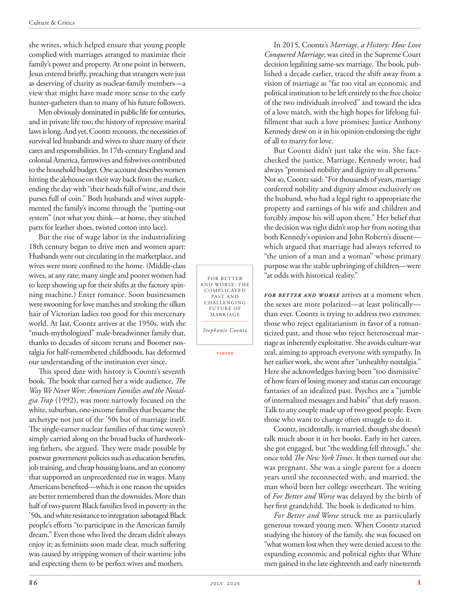

# The Atlantic — July 2026

## Page 88

---

she writes, which helped ensure that young people complied with marriages arranged to maximize their family’s power and property. At one point in between, Jesus entered briefly, preaching that strangers were just as deserving of charity as nuclear-family members— a view that might have made more sense to the early hunter-gatherers than to many of his future followers.

**【中文翻译】** 她写道，这有助于确保年轻人遵守安排的婚姻，以最大限度地提高家庭的权力和财产。在这期间，耶稣短暂地介入，宣扬陌生人和核心家庭成员一样值得施舍——这种观点对于早期的狩猎采集者来说可能比他的许多未来的追随者更有意义。

Men obviously dominated in public life for centuries, and in private life too; the history of repressive marital laws is long. And yet, Coontz recounts, the necessities of survival led husbands and wives to share many of their cares and responsibilities. In 17th-century England and colonial America, farmwives and fishwives contributed to the household budget. One account describes women hitting the alehouse on their way back from the market, ending the day with “their heads full of wine, and their purses full of coin.” Both husbands and wives supplemented the family’s income through the “putting-out system” (not what you think—at home, they stitched parts for leather shoes, twisted cotton into lace).

**【中文翻译】** 几个世纪以来，男性显然在公共生活中占据主导地位，在私人生活中也是如此。压制性婚姻法的历史由来已久。然而，孔茨回忆道，生存的必要性导致丈夫和妻子分担许多关心和责任。在 17 世纪的英国和美国殖民地，农妇和渔妇为家庭预算做出了贡献。一篇报道描述了女人们从市场回来的路上去啤酒馆，以“她们的脑袋里装满了酒，她们的钱包里装满了硬币”结束了这一天。丈夫和妻子都通过“出产制”补充家庭收入（不是你想象的那样，他们在家里缝制皮鞋零件，把棉布捻成花边）。

But the rise of wage labor in the industrializing 18th century began to drive men and women apart: Husbands were out circulating in the marketplace, and wives were more confined to the home. (Middle-class wives, at any rate; many single and poorer women had to keep showing up for their shifts at the factory spinning machine.) Enter romance. Soon businessmen were swooning for love matches and stroking the silken hair of Victorian ladies too good for this mercenary world. At last, Coontz arrives at the 1950s, with the “much-mythologized” male-breadwinner family that, thanks to decades of sitcom reruns and Boomer nostalgia for halfremembered childhoods, has deformed our understanding of the institution ever since.

**【中文翻译】** 但十八世纪工业化时期雇佣劳动的兴起开始将男性和女性分开：丈夫在市场上流通，而妻子则更多地被限制在家里。 （无论如何，中产阶级的妻子；许多单身和贫穷的妇女不得不不断地在工厂纺纱机前轮班。）进入浪漫。很快，商人们就为爱情而着迷，抚摸着维多利亚时代女士的丝质头发，她们对这个唯利是图的世界来说太优秀了。最后，孔茨来到了 20 世纪 50 年代，这个“高度神话化”的男性养家糊口的家庭，由于几十年来情景喜剧的重播和婴儿潮一代对记忆犹新的童年的怀念，从那时起就扭曲了我们对这个机构的理解。

This speed date with history is Coontz’s seventh book. The book that earned her a wide audience, The Way We Never Were: American Families and the Nostalgia Trap (1992), was more narrowly focused on the white, suburban, one-income families that became the archetype not just of the ’50s but of marriage itself.

**【中文翻译】** 这本与历史的快速约会是孔茨的第七本书。这本书为她赢得了广泛的读者，《我们从未有过的方式：美国家庭和怀旧陷阱》（1992）更狭隘地关注白人、郊区、单收入家庭，这些家庭不仅成为 50 年代的原型，而且成为婚姻本身的原型。

The single-earner nuclear families of that time weren’t simply carried along on the broad backs of hardworking fathers, she argued. They were made possible by postwar government policies such as education benefits, job training, and cheap housing loans, and an economy that supported an unprecedented rise in wages. Many Americans benefited— which is one reason the upsides are better remembered than the downsides. More than half of two-parent Black families lived in poverty in the ’50s, and white resistance to integration sabotaged Black people’s efforts “to participate in the American family dream.” Even those who lived the dream didn’t always enjoy it; as feminists soon made clear, much suffering was caused by stripping women of their wartime jobs and expecting them to be perfect wives and mothers.

**【中文翻译】** 她认为，当时的单职工核心家庭并不是简单地依靠辛勤工作的父亲的宽阔背影来生活的。战后政府的教育福利、就业培训和廉价住房贷款等政策以及支持工资空前上涨的经济使它们成为可能。许多美国人从中受益——这就是人们更容易记住好处而不是坏处的原因之一。 50 年代，超过一半的双亲黑人家庭生活在贫困之中，白人对融合的抵制破坏了黑人“参与美国家庭梦想”的努力。即使那些实现了梦想的人也并不总是享受它。正如女权主义者很快表明的那样，剥夺妇女的战时工作并期望她们成为完美的妻子和母亲造成了许多痛苦。

In 2015, Coontz’s Marriage, a History: How Love Conquered Marriage , was cited in the Supreme Court decision legalizing same-sex marriage. The book, published a decade earlier, traced the shift away from a vision of marriage as “far too vital an economic and political institution to be left entirely to the free choice of the two individuals involved” and toward the idea of a love match, with the high hopes for lifelong fulfillment that such a love promises; Justice Anthony Kennedy drew on it in his opinion endorsing the right of all to marry for love.

**【中文翻译】** 2015年，最高法院同性婚姻合法化的判决中引用了《孔茨的婚姻，一部历史：爱情如何征服婚姻》。这本书于十年前出版，追溯了婚姻观的转变，婚姻观是“一种至关重要的经济和政治制度，不能完全由两个人自由选择”，而转向爱情匹配的理念，人们对这种爱情所承诺的终生实现抱有很高的期望；安东尼·肯尼迪大法官在他的意见中引用了这一点，支持所有人为爱情而结婚的权利。

But Coontz didn’t just take the win. She factchecked the justice. Marriage, Kennedy wrote, had always “promised nobility and dignity to all persons.”

**【中文翻译】** 但孔茨不仅仅获得了胜利。她对正义进行了事实核查。肯尼迪写道，婚姻总是“向所有人承诺高贵和尊严”。

Not so, Coontz said: “For thousands of years, marriage conferred nobility and dignity almost exclusively on the husband, who had a legal right to appropriate the property and earnings of his wife and children and forcibly impose his will upon them.” Her belief that the decision was right didn’t stop her from noting that both Kennedy’s opinion and John Roberts’s dissent— which argued that marriage had always referred to “the union of a man and a woman” whose primary purpose was the stable upbringing of children— were “at odds with historical reality.”

**【中文翻译】** 孔茨说，事实并非如此：“几千年来，婚姻几乎完全赋予了丈夫高贵和尊严，丈夫有合法权利侵占妻子和孩子的财产和收入，并将自己的意志强加于他们。”她相信这个决定是正确的，但这并没有阻止她注意到肯尼迪的观点和约翰·罗伯茨的反对意见——后者认为婚姻总是指“一男一女的结合”，其主要目的是稳定地抚养孩子——“与历史现实不一致”。

FOR BET TER AND WORSE: THE COMPLICATED F O R B E T T E R A N D W O R S E arrives at a moment when F O R B E T T E R A N D W O R S E PAST AND CHALLENGING the sexes are more polarized— at least politically— FUTURE OF than ever. Coontz is trying to address two extremes: MARRIAGE those who reject egalitarianism in favor of a romanStephanie Coontz ticized past, and those who reject heterosexual marriage as inherently exploitative. She avoids culture-war zeal, aiming to approach everyone with sympathy. In VIKING her earlier work, she went after “unhealthy nostalgia.”

**【中文翻译】** 无论是好还是坏：复杂的“更好”和“更坏”问题出现之际，“更好”和“更坏”的过去以及对性别的挑战比以往任何时候都更加两极分化（至少在政治上如此）。孔茨试图解决两个极端：与那些拒绝平等主义而支持斯蒂芬妮·孔茨所描述的浪漫主义过去的人结婚，以及那些拒绝异性婚姻本质上是剥削的人。她避免文化战争的热情，旨在以同情的态度接近每个人。在她早期的作品《VIKING》中，她追求的是“不健康的怀旧”。

Here she acknowledges having been “too dismissive” of how fears of losing money and status can encourage fantasies of an idealized past. Psyches are a “jumble of internalized messages and habits” that defy reason.

**【中文翻译】** 在这里，她承认自己对失去金钱和地位的恐惧“过于轻视”，这会鼓励人们对理想化的过去进行幻想。心理是一种违背理性的“内化信息和习惯的混乱”。

Talk to any couple made up of two good people. Even those who want to change often struggle to do it. Coontz, incidentally, is married, though she doesn’t talk much about it in her books. Early in her career, she got engaged, but “the wedding fell through,” she once told The New York Times . It then turned out she was pregnant. She was a single parent for a dozen years until she reconnected with, and married, the man who’d been her college sweetheart. The writing of For Better and Worse was delayed by the birth of her first grandchild. The book is dedicated to him.

**【中文翻译】** 与任何由两个好人组成的夫妇交谈。即使那些想要改变的人也常常很难做到。顺便说一句，孔茨已经结婚了，尽管她在书中没有过多谈论这一点。在她职业生涯的早期，她订婚了，但“婚礼失败了”，她曾告诉《纽约时报》。后来发现她怀孕了。她做了十几年的单亲妈妈，直到与她大学时的恋人重新联系并结婚。由于她第一个孙子的出生，《更好或更糟》的写作被推迟了。这本书是献给他的。

For Better and Worse struck me as particularly generous toward young men. When Coontz started studying the history of the family, she was focused on “what women lost when they were denied access to the expanding economic and political rights that White men gained in the late eighteenth and early nineteenth

**【中文翻译】** 《无论好坏》给我的印象是对年轻人特别慷慨。当孔茨开始研究家族历史时，她关注的是“当妇女被剥夺获得白人男性在十八世纪末和十九世纪初获得的不断扩大的经济和政治权利时所失去的东西”
