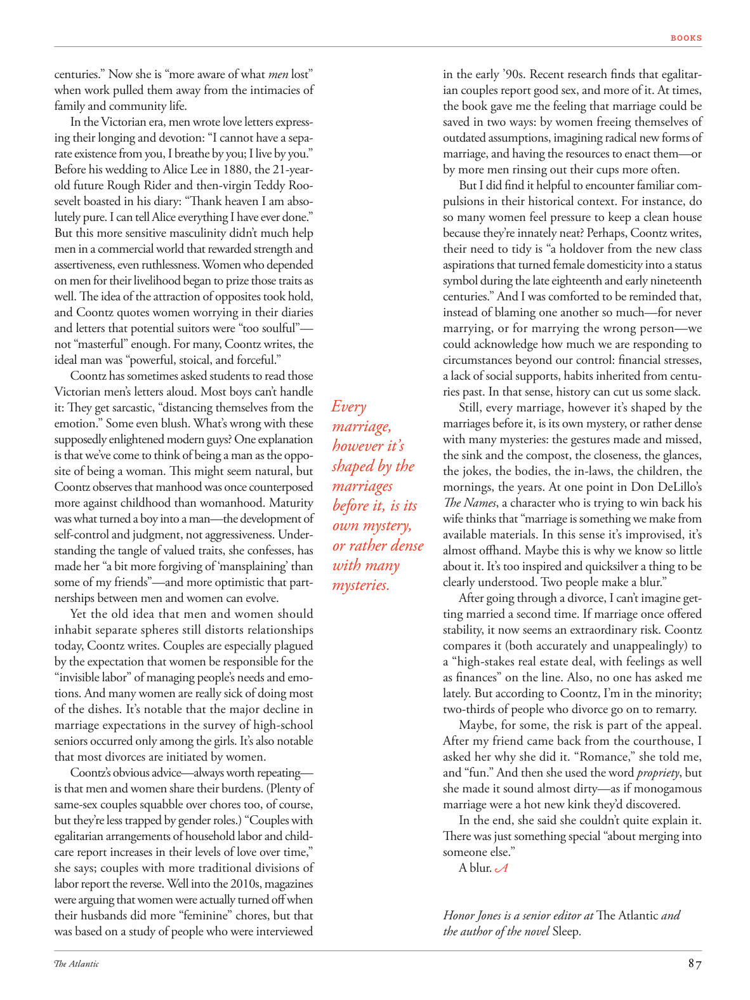

# The Atlantic — July 2026

## Page 89

---

centuries.” Now she is “more aware of what men lost” when work pulled them away from the intimacies of family and community life. In the Victorian era, men wrote love letters expressing their longing and devotion: “I cannot have a separate existence from you, I breathe by you; I live by you.”

**【中文翻译】** 几个世纪。”现在，当工作让男人远离亲密的家庭和社区生活时，她“更加意识到男人失去了什么”。在维多利亚时代，男人们写情书表达自己的渴望和忠诚：“我无法与你分离存在，我靠你呼吸；我靠你而活。”

Before his wedding to Alice Lee in 1880, the 21-yearold future Rough Rider and then-virgin Teddy Roosevelt boasted in his diary: “Thank heaven I am absolutely pure. I can tell Alice everything I have ever done.”

**【中文翻译】** 1880 年，在与爱丽丝·李 (Alice Lee) 结婚之前，这位 21 岁的未来粗暴骑士、当时还是处男的泰迪·罗斯福 (Teddy Roosevelt) 在日记中夸口道：“谢天谢地，我绝对纯洁。我可以告诉爱丽丝我做过的一切。”

But this more sensitive masculinity didn’t much help men in a commercial world that rewarded strength and assertiveness, even ruthlessness. Women who depended on men for their livelihood began to prize those traits as well. The idea of the attraction of opposites took hold, and Coontz quotes women worrying in their diaries and letters that potential suitors were “too soulful”— not “masterful” enough. For many, Coontz writes, the ideal man was “powerful, stoical, and forceful.”

**【中文翻译】** 但这种更敏感的男性气质对生活在崇尚力量、自信甚至冷酷的商业世界中的男性并没有多大帮助。依赖男性谋生的女性也开始珍视这些品质。异性相吸的想法深入人心，孔茨在日记和信件中引用了女性的担忧，称潜在的追求者“太深情”——不够“专横”。孔茨写道，对许多人来说，理想的男人是“强大、坚忍、有力量”。

Coontz has sometimes asked students to read those Victorian men’s letters aloud. Most boys can’t handle it: They get sarcastic, “distancing themselves from the emotion.” Some even blush. What’s wrong with these supposedly enlightened modern guys? One explanation is that we’ve come to think of being a man as the opposite of being a woman. This might seem natural, but Coontz observes that manhood was once counter posed more against childhood than woman hood. Maturity was what turned a boy into a man—the development of self-control and judgment, not aggressiveness. Understanding the tangle of valued traits, she confesses, has made her “a bit more forgiving of ‘mansplaining’ than some of my friends”—and more optimistic that partnerships between men and women can evolve.

**【中文翻译】** 孔茨有时会要求学生大声朗读维多利亚时代男人的信件。大多数男孩都无法应对：他们变得讽刺，“远离情感”。有的甚至脸红。这些被认为是开明的现代人到底出了什么问题？一种解释是，我们开始认为男人是女人的对立面。这似乎很自然，但孔茨观察到，男性气概曾经比女性气概更反对童年。成熟是男孩变成男人的关键——自我控制和判断力的发展，而不是攻击性。她承认，了解这些宝贵特质的复杂性，让她“比我的一些朋友对‘男性说教’更加宽容”，并且对男女之间的伙伴关系能够发展更加乐观。

Yet the old idea that men and women should inhabit separate spheres still distorts relationships today, Coontz writes. Couples are especially plagued by the expectation that women be responsible for the “invisible labor” of managing people’s needs and emotions. And many women are really sick of doing most of the dishes. It’s notable that the major decline in marriage expectations in the survey of high-school seniors occurred only among the girls. It’s also notable that most divorces are initiated by women.

**【中文翻译】** 然而，孔茨写道，男人和女人应该生活在不同领域的旧观念今天仍然扭曲着关系。人们尤其担心女性要负责管理人们的需求和情绪的“无形劳动”。许多女人真的厌倦了做大部分的洗碗工作。值得注意的是，在对高中生的调查中，婚姻期望的大幅下降仅发生在女孩身上。还值得注意的是，大多数离婚是由女性发起的。

Coontz’s obvious advice— always worth repeating— is that men and women share their burdens. (Plenty of same-sex couples squabble over chores too, of course, but they’re less trapped by gender roles.) “Couples with egalitarian arrangements of household labor and childcare report increases in their levels of love over time,” she says; couples with more traditional divisions of labor report the reverse. Well into the 2010s, magazines were arguing that women were actually turned off when their husbands did more “feminine” chores, but that was based on a study of people who were interviewed in the early ’90s. Recent research finds that egalitarian couples report good sex, and more of it. At times, the book gave me the feeling that marriage could be saved in two ways: by women freeing themselves of outdated assumptions, imagining radical new forms of marriage, and having the resources to enact them— or by more men rinsing out their cups more often.

**【中文翻译】** 孔茨的显而易见的建议——总是值得重复——是男人和女人分担他们的负担。 （当然，很多同性伴侣也会因为家务事而争吵，但他们较少受性别角色的束缚。）“在家务劳动和育儿方面有平等安排的夫妇报告说，随着时间的推移，他们的爱情水平会提高，”她说；分工较为传统的夫妇则报告相反的情况。进入 2010 年代，杂志一直认为，当丈夫做更多“女性化”家务时，女性实际上会感到厌烦，但这是基于对 90 年代初受访者的一项研究。最近的研究发现，主张平等的夫妻拥有美好的性生活，甚至更多。有时，这本书给我一种感觉，婚姻可以通过两种方式来拯救：女性摆脱过时的假设，想象激进的新婚姻形式，并拥有资源来实现它们，或者更多的男性更频繁地冲洗杯子。

But I did find it helpful to encounter familiar compulsions in their historical context. For instance, do so many women feel pressure to keep a clean house because they’re innately neat? Perhaps, Coontz writes, their need to tidy is “a holdover from the new class aspirations that turned female domesticity into a status symbol during the late eighteenth and early nineteenth centuries.” And I was comforted to be reminded that, instead of blaming one another so much— for never marrying, or for marrying the wrong person— we could acknowledge how much we are responding to circumstances beyond our control: financial stresses, a lack of social supports, habits inherited from centuries past. In that sense, history can cut us some slack.

**【中文翻译】** 但我确实发现在历史背景下遇到熟悉的强迫症是有帮助的。例如，很多女性是否因为天生爱整洁而感到保持房间干净的压力？孔茨写道，也许她们对整洁的需求是“新阶级愿望的延续，在十八世纪末和十九世纪初，这种愿望将女性的家庭生活变成了地位的象征。”让我感到欣慰的是，我们不必互相指责——不结婚，或者嫁给了错误的人——我们可以承认，我们对无法控制的情况做出了多少反应：经济压力、缺乏社会支持、几个世纪以来继承的习惯。从这个意义上说，历史可以让我们有所松懈。

Every Still, every marriage, however it’s shaped by the marriages before it, is its own mystery, or rather dense marriage, with many mysteries: the gestures made and missed, however it’s the sink and the compost, the closeness, the glances, shaped by the the jokes, the bodies, the in-laws, the children, the marriages mornings, the years. At one point in Don DeLillo’s The Names , a character who is trying to win back his before it, is its wife thinks that “marriage is something we make from own mystery, available materials. In this sense it’s improvised, it’s or rather dense almost offhand. Maybe this is why we know so little with many about it. It’s too inspired and quicksilver a thing to be clearly understood. Two people make a blur.” mysteries.

**【中文翻译】** 每一次静默，每一段婚姻，无论它是由之前的婚姻塑造的，都是它自己的神秘，或者说是密集的婚姻，有许多神秘：作出和错过的手势，无论它是水槽和堆肥，亲密，眼神，由笑话，身体，姻亲，孩子，婚姻的早晨，岁月塑造。在唐·德里罗的《名字》中，一个角色试图赢回自己的妻子，他认为“婚姻是我们用自己神秘的、可用的材料创造出来的东西。从这个意义上说，它是即兴的，或者说是密集的，几乎是即兴的。也许这就是为什么我们对它知之甚少。它太有灵感，太容易被人清楚地理解。两个人的关系变得模糊。”谜团。

After going through a divorce, I can’t imagine getting married a second time. If marriage once offered stability, it now seems an extraordinary risk. Coontz compares it (both accurately and unappealingly) to a “high-stakes real estate deal, with feelings as well as finances” on the line. Also, no one has asked me lately. But according to Coontz, I’m in the minority; two-thirds of people who divorce go on to remarry.

**【中文翻译】** 离婚后，我无法想象第二次结婚。如果婚姻曾经带来稳定，那么现在它似乎面临着巨大的风险。孔茨将其（既准确又不吸引人）比作“高风险的房地产交易，感情和财务都岌岌可危”。而且最近也没人问我。但根据孔茨的说法，我属于少数派；三分之二的离婚者继续再婚。

Maybe, for some, the risk is part of the appeal. After my friend came back from the courthouse, I asked her why she did it. “Romance,” she told me, and “fun.” And then she used the word propriety , but she made it sound almost dirty—as if monogamous marriage were a hot new kink they’d discovered.

**【中文翻译】** 也许对某些人来说，风险也是吸引力的一部分。我的朋友从法院回来后，我问她为什么这么做。 “浪漫，”她告诉我，而且“有趣。”然后她用了“礼节”这个词，但她让它听起来几乎肮脏——好像一夫一妻制婚姻是他们发现的一个热门的新怪癖。

In the end, she said she couldn’t quite explain it. There was just something special “about merging into someone else.” A blur. Honor Jones is a senior editor at The Atlantic and the author of the novel Sleep .

**【中文翻译】** 最后，她说她无法解释清楚。 “融入他人”是一种特别的感觉。一片模糊。奥诺·琼斯是《大西洋月刊》的高级编辑，也是小说《睡眠》的作者。
