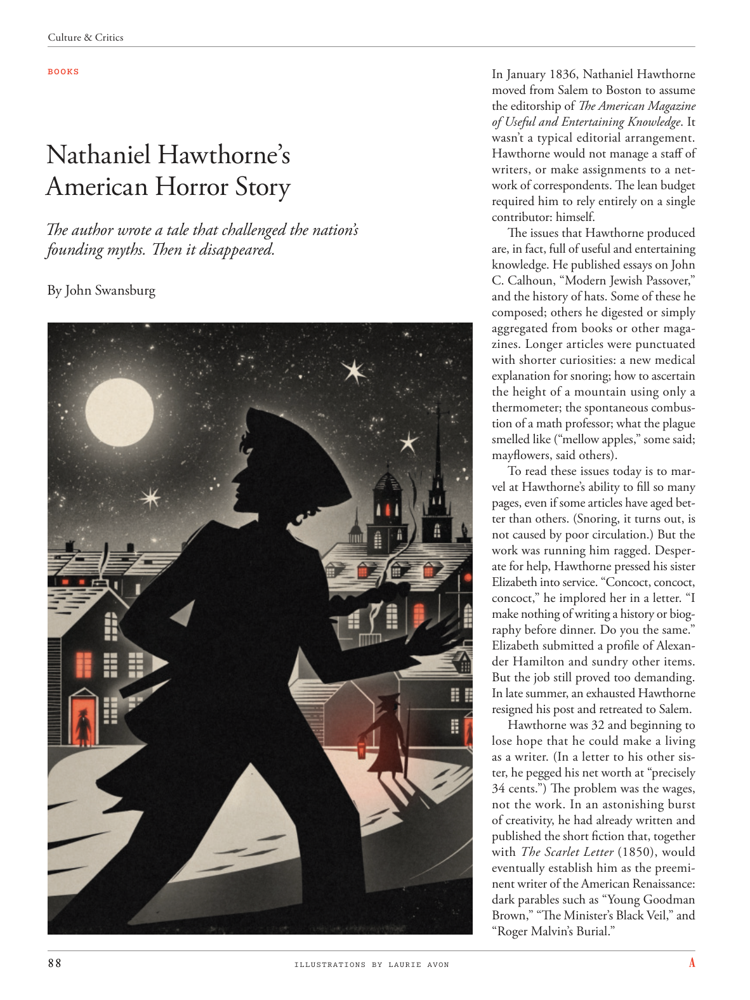

# The Atlantic — July 2026

## Page 90

---

### Nathaniel Hawthorne’s

**【标题翻译】** 纳撒尼尔霍桑的

### American Horror Story

**【标题翻译】** 美国恐怖故事

The author wrote a tale that challenged the nation’s founding myths. Then it disappeared. By John Swansburg

**【中文翻译】** 作者写了一个挑战建国神话的故事。然后它就消失了。约翰·斯旺斯堡

*ILLUSTRATIONS BY LAURIE AVON*

*【图注与署名】劳里·埃文绘制的插图*

In January 1836, Nathaniel Hawthorne moved from Salem to Boston to assume the editorship of The American Magazine of Useful and Entertaining Knowledge . It wasn’t a typical editorial arrangement.

**【中文翻译】** 1836 年 1 月，纳撒尼尔·霍桑从塞勒姆搬到波士顿，担任《美国实用知识杂志》的编辑。这不是典型的编辑安排。

Hawthorne would not manage a staff of writers, or make assignments to a network of correspondents. The lean budget required him to rely entirely on a single contributor: himself.

**【中文翻译】** 霍桑不会管理一支作家队伍，也不会向记者网络分配任务。精益的预算要求他完全依赖一个贡献者：他自己。

The issues that Hawthorne produced are, in fact, full of useful and entertaining knowledge. He published essays on John C. Calhoun, “Modern Jewish Passover,” and the history of hats. Some of these he composed; others he digested or simply aggregated from books or other magazines. Longer articles were punctuated with shorter curiosities: a new medical explanation for snoring; how to ascertain the height of a mountain using only a thermometer; the spontaneous combustion of a math professor; what the plague smelled like (“mellow apples,” some said; mayflowers, said others).

**【中文翻译】** 事实上，霍桑制作的期刊充满了有用且有趣的知识。他发表了有关约翰·卡尔霍恩 (John C. Calhoun) 的文章《现代犹太逾越节》和帽子的历史。其中一些是他创作的；其他的则是他从书籍或其他杂志中消化或简单汇总的。较长的文章被较短的好奇心所打断：对打鼾的新医学解释；如何仅使用温度计确定山的高度；数学教授的自燃；瘟疫闻起来像什么（有人说是“醇厚的苹果”；有人说是五月花）。

To read these issues today is to marvel at Hawthorne’s ability to fill so many pages, even if some articles have aged better than others. (Snoring, it turns out, is not caused by poor circulation.) But the work was running him ragged. Desperate for help, Hawthorne pressed his sister Elizabeth into service. “Concoct, concoct, concoct,” he implored her in a letter. “I make nothing of writing a history or biography before dinner. Do you the same.”

**【中文翻译】** 今天阅读这些期刊，会惊叹霍桑能够写满这么多页，即使有些文章比其他文章更古老。 （事实证明，打鼾并不是由于血液循环不良引起的。）但是工作让他疲惫不堪。霍桑迫切需要帮助，迫使他的妹妹伊丽莎白服役。 “混合，混合，混合，”他在一封信中恳求她。 “我并不介意在晚餐前写历史或传记。你也一样吗？”

Elizabeth submitted a profile of Alexander Hamilton and sundry other items. But the job still proved too demanding. In late summer, an exhausted Hawthorne resigned his post and retreated to Salem.

**【中文翻译】** 伊丽莎白提交了亚历山大·汉密尔顿的简介和其他各种物品。但事实证明这项工作的要求仍然太高。夏末，筋疲力尽的霍桑辞去职务，撤退到塞勒姆。

Hawthorne was 32 and beginning to lose hope that he could make a living as a writer. (In a letter to his other sister, he pegged his net worth at “precisely 34 cents.”) The problem was the wages, not the work. In an astonishing burst of creativity, he had already written and published the short fiction that, together with The Scarlet Letter (1850), would eventually establish him as the preeminent writer of the American Renaissance: dark parables such as “Young Goodman Brown,” “The Minister’s Black Veil,” and “Roger Malvin’s Burial.”

**【中文翻译】** 霍桑 32 岁，开始对自己以作家谋生失去希望。 （在给他另一个妹妹的一封信中，他将自己的净资产定为“正好 34 美分”。）问题在于工资，而不是工作。在惊人的创造力爆发中，他创作并出版了短篇小说，与《红字》（1850）一起，最终使他成为美国文艺复兴时期的杰出作家：《年轻的古德曼·布朗》、《部长的黑面纱》和《罗杰·马尔文的葬礼》等黑暗寓言。
