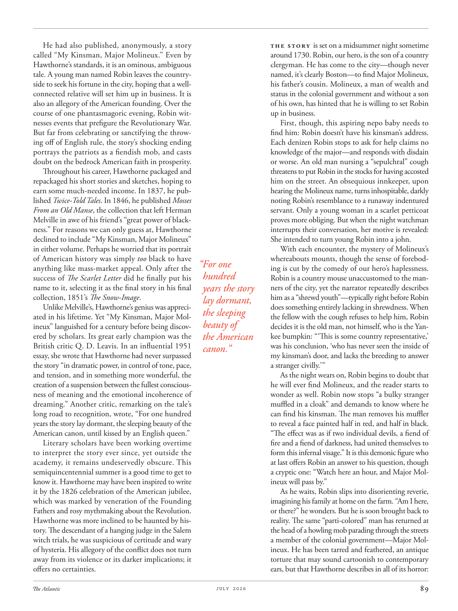

# The Atlantic — July 2026

## Page 91

---

He had also published, anonymously, a story called “My Kinsman, Major Molineux.” Even by Hawthorne’s standards, it is an ominous, ambiguous tale. A young man named Robin leaves the countryside to seek his fortune in the city, hoping that a wellconnected relative will set him up in business. It is also an allegory of the American founding. Over the course of one phantasmagoric evening, Robin witnesses events that prefigure the Revolutionary War.

**【中文翻译】** 他还匿名发表了一篇名为《我的亲戚，莫利纽克斯少校》的故事。即使按照霍桑的标准，这也是一个不祥、模棱两可的故事。一个名叫罗宾的年轻人离开乡村到城里寻找财富，希望有一个人脉广泛的亲戚能够帮助他经商。这也是美国建国的寓言。在一个梦幻般的夜晚，罗宾目睹了预示独立战争的事件。

But far from celebrating or sanctifying the throwing off of English rule, the story’s shocking ending portrays the patriots as a fiendish mob, and casts doubt on the bedrock American faith in prosperity.

**【中文翻译】** 但这个故事的令人震惊的结局并没有庆祝或圣化英国统治的推翻，而是将爱国者描绘成一群邪恶的暴民，并对美国繁荣的基本信念产生了怀疑。

Throughout his career, Hawthorne packaged and repackaged his short stories and sketches, hoping to earn some much-needed income. In 1837, he published Twice-Told Tales . In 1846, he published Mosses From an Old Manse , the collection that left Herman Melville in awe of his friend’s “great power of blackness.” For reasons we can only guess at, Hawthorne declined to include “My Kinsman, Major Molineux” in either volume. Perhaps he worried that its portrait of American history was simply too black to have anything like mass-market appeal. Only after the success of The Scarlet Letter did he finally put his name to it, selecting it as the final story in his final collection, 1851’s The Snow-Image .

**【中文翻译】** 在他的整个职业生涯中，霍​​桑对他的短篇小说和素描进行了包装和重新包装，希望能够获得一些急需的收入。 1837年，他出版了《重述的故事》。 1846 年，他出版了《老宅里的苔藓》，这本合集让赫尔曼·梅尔维尔对他朋友的“黑色的巨大力量”感到敬畏。由于我们只能猜测的原因，霍桑拒绝将“我的亲戚，莫利纽克斯少校”纳入这两卷中。也许他担心它对美国历史的描绘太过黑暗，无法吸引大众市场。直到《红字》获得成功后，他才最终以自己的名字命名，并将其选为他最后的小说集《雪像》中的最后一个故事。

Unlike Melville’s, Hawthorne’s genius was appreciated in his lifetime. Yet “My Kinsman, Major Molineux” languished for a century before being discovered by scholars. Its great early champion was the British critic Q. D. Leavis. In an influential 1951 essay, she wrote that Hawthorne had never surpassed the story “in dramatic power, in control of tone, pace, and tension, and in something more wonderful, the creation of a suspension between the fullest consciousness of meaning and the emotional incoherence of dreaming.” Another critic, remarking on the tale’s long road to recognition, wrote, “For one hundred years the story lay dormant, the sleeping beauty of the American canon, until kissed by an English queen.”

**【中文翻译】** 与梅尔维尔不同的是，霍桑的天才在他生前就得到了赏识。然而，《我的亲戚，莫利纽克斯少校》在被学者们发现之前却沉寂了一个世纪。它早期伟大的拥护者是英国评论家 Q. D. Leavis。在 1951 年一篇颇具影响力的文章中，她写道，霍桑从未超越过这个故事，“在戏剧力量、对基调、节奏和张力的控制，以及在更精彩的方面，在最充分的意义意识和梦的情感不连贯之间创造了一种悬置”。另一位评论家在评论这个故事获得认可的漫长道路时写道：“这个故事沉睡了一百年，成为美国经典的睡美人，直到被英国女王亲吻。”

Literary scholars have been working overtime to interpret the story ever since, yet outside the academy, it remains undeservedly obscure. This semiquincentennial summer is a good time to get to know it. Hawthorne may have been inspired to write it by the 1826 celebration of the American jubilee, which was marked by veneration of the Founding Fathers and rosy myth making about the Revolution.

**【中文翻译】** 从那时起，文学学者们一直在加班加点地解读这个故事，但在学术之外，它仍然是不值得的晦涩难懂。这个五十周年纪念的夏天是了解它的好时机。霍桑写这本书的灵感可能是受到 1826 年美国建国五十周年庆祝活动的启发，当时的庆祝活动以对开国元勋的崇敬和有关革命的美好神话为标志。

Hawthorne was more inclined to be haunted by history. The descendant of a hanging judge in the Salem witch trials, he was suspicious of certitude and wary of hysteria. His allegory of the conflict does not turn away from its violence or its darker implications; it offers no certainties.

**【中文翻译】** 霍桑更倾向于被历史所困扰。作为塞勒姆女巫审判中一名绞刑法官的后裔，他对确定性持怀疑态度，对歇斯底里保持警惕。他对冲突的寓言并没有回避其暴力或其更黑暗的含义；它没有提供任何确定性。

The story is set on a midsummer night sometime around 1730. Robin, our hero, is the son of a country clergyman. He has come to the city—though never named, it’s clearly Boston— to find Major Molineux, his father’s cousin. Molineux, a man of wealth and status in the colonial government and without a son of his own, has hinted that he is willing to set Robin up in business.

**【中文翻译】** 故事发生在 1730 年左右的一个仲夏夜。我们的英雄罗宾是一位乡村牧师的儿子。他来到这座城市——虽然没有名字，但显然是波士顿——是为了寻找他父亲的表弟莫利纽克斯少校。莫利纽克斯在殖民地政府中拥有丰富的财富和地位，但自己没有儿子，他曾暗示愿意帮助罗宾经商。

First, though, this aspiring nepo baby needs to find him: Robin doesn’t have his kinsman’s address. Each denizen Robin stops to ask for help claims no knowledge of the major— and responds with disdain or worse. An old man nursing a “sepulchral” cough threatens to put Robin in the stocks for having accosted him on the street. An obsequious innkeeper, upon hearing the Molineux name, turns inhospitable, darkly noting Robin’s resemblance to a runaway indentured servant. Only a young woman in a scarlet petticoat proves more obliging. But when the night watchman interrupts their conversation, her motive is revealed: She intended to turn young Robin into a john.

**【中文翻译】** 不过，首先，这个有抱负的尼波宝宝需要找到他：罗宾没有他亲戚的地址。每个罗宾停下来寻求帮助的居民都声称自己对专业一无所知，并以蔑视或更糟糕的方式回应。一名患有“坟墓”咳嗽的老人威胁要因罗宾在街上与他搭讪而将他关进监狱。一位谄媚的旅店老板听到莫利纽克斯的名字后，变得冷漠起来，阴暗地注意到罗宾就像一个逃跑的契约仆人。只有穿着猩红色衬裙的年轻女子更乐于助人。但当守夜人打断他们的谈话时，她的动机就暴露了：她打算把年轻的罗宾变成约翰。

With each encounter, the mystery of Molineux’s whereabouts mounts, though the sense of forebod- “For one ing is cut by the comedy of our hero’s haplessness. hundred Robin is a country mouse unaccustomed to the manyears the story ners of the city, yet the narrator repeatedly describes him as a “shrewd youth”— typically right before Robin lay dormant, does something entirely lacking in shrewdness. When the sleeping the fellow with the cough refuses to help him, Robin beauty of decides it is the old man, not himself, who is the Yanthe American kee bumpkin: “ ‘This is some country representative,’ was his conclusion, ‘who has never seen the inside of canon.” my kinsman’s door, and lacks the breeding to answer a stranger civilly.’ ” As the night wears on, Robin begins to doubt that he will ever find Molineux, and the reader starts to wonder as well. Robin now stops “a bulky stranger muffled in a cloak” and demands to know where he can find his kinsman. The man removes his muffler to reveal a face painted half in red, and half in black.

**【中文翻译】** 每次遭遇，莫利纽克斯的下落之谜都会增加，尽管有一种不祥的预感——“我们的英雄不幸的喜剧削弱了这一点。百罗宾是一只乡下老鼠，不习惯城市里的故事阅读者多年，但叙述者反复将他描述为一个“精明的年轻人”——通常在罗宾休眠之前，他会做一些完全不精明的事情。当正在睡觉的咳嗽的家伙拒绝帮助他的是，罗宾美认定是老人，而不是他自己，他是美国佬：“‘这是某个国家的代表，’他的结论是，‘他从未见过佳能的内部。” ’”随着夜幕降临，罗宾开始怀疑自己是否能找到莫利纽克斯，读者也开始怀疑。罗宾现在拦住了“一个裹着斗篷的大块头陌生人”，并要求知道在哪里可以找到他的亲戚。男人摘下围巾，露出一张半红半黑的脸。

“The effect was as if two individual devils, a fiend of fire and a fiend of darkness, had united themselves to form this infernal visage.” It is this demonic figure who at last offers Robin an answer to his question, though a cryptic one: “Watch here an hour, and Major Molineux will pass by.”

**【中文翻译】** “效果就好像两个单独的魔鬼，一个火魔和一个黑暗魔，联合起来形成了这个地狱般的面容。”正是这个恶魔般的人物最终为罗宾提供了他的问题的答案，尽管是一个神秘的答案：“在这里观看一个小时，莫利纽克斯少校就会经过。”

As he waits, Robin slips into disorienting reverie, imagining his family at home on the farm. “Am I here, or there?” he wonders. But he is soon brought back to reality. The same “parti-colored” man has returned at the head of a howling mob parading through the streets a member of the colonial government— Major Molineux. He has been tarred and feathered, an antique torture that may sound cartoonish to contemporary ears, but that Hawthorne describes in all of its horror:

**【中文翻译】** 在等待的过程中，罗宾陷入了迷失方向的沉思，想象着他的家人在农场的家里。 “我是在这里，还是那里？”他想知道。但很快他就被拉回现实。同样的“杂色”男子又回来了，他是殖民政府成员莫利内克斯少校，带领着一群嚎叫的暴民在街上游行。他身上涂满了柏油，身上长满了羽毛，这是一种古老的酷刑，在当代人看来可能有点卡通化，但霍桑却用恐怖的方式描述了这一点：
