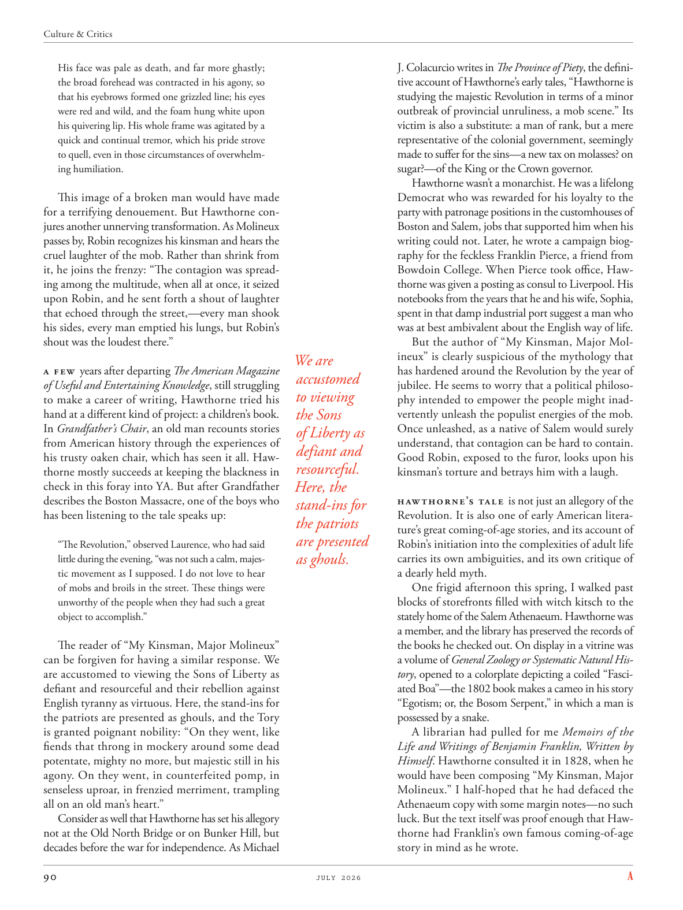

# The Atlantic — July 2026

## Page 92

---

His face was pale as death, and far more ghastly; the broad forehead was contracted in his agony, so that his eyebrows formed one grizzled line; his eyes were red and wild, and the foam hung white upon his quivering lip. His whole frame was agitated by a quick and continual tremor, which his pride strove to quell, even in those circumstances of overwhelming humiliation.

**【中文翻译】** 他的脸色苍白得像死人一样，而且更加可怕。宽阔的额头因痛苦而收缩，眉毛变成一条灰白色的线。他的眼睛又红又狂野，颤抖的嘴唇上挂着白色的泡沫。他的整个身体因一种快速而持续的颤抖而激动不已，即使在那种压倒性的屈辱的情况下，他的骄傲也努力平息着这种颤抖。

This image of a broken man would have made for a terrifying denouement. But Hawthorne conjures another unnerving transformation. As Molineux passes by, Robin recognizes his kinsman and hears the cruel laughter of the mob. Rather than shrink from it, he joins the frenzy: “The contagion was spreading among the multitude, when all at once, it seized upon Robin, and he sent forth a shout of laughter that echoed through the street,—every man shook his sides, every man emptied his lungs, but Robin’s shout was the loudest there.”

**【中文翻译】** 这个破碎的人的形象本来会造成一个可怕的结局。但霍桑带来了另一种令人不安的转变。当莫利纽克斯经过时，罗宾认出了他的亲戚，并听到了暴民残忍的笑声。他没有退缩，而是加入了这场疯狂：“传染病在人群中蔓延，突然，它抓住了罗宾，他发出一阵笑声，在街上回荡——每个人都摇晃着身体，每个人都倒空了肺部，但罗宾的喊声是那里最响亮的。”

A few years after departing The American Magazine of Useful and Entertaining Knowledge , still struggling to make a career of writing, Hawthorne tried his hand at a different kind of project: a children’s book.

**【中文翻译】** 离开《美国有用和娱乐知识杂志》几年后，霍桑仍在努力从事写作事业，他尝试了一种不同的项目：一本儿童读物。

In Grandfather’s Chair , an old man recounts stories from American history through the experiences of his trusty oaken chair, which has seen it all. Hawthorne mostly succeeds at keeping the blackness in check in this foray into YA. But after Grandfather describes the Boston Massacre, one of the boys who has been listening to the tale speaks up: “The Revolution,” observed Laurence, who had said little during the evening, “was not such a calm, majestic movement as I supposed. I do not love to hear of mobs and broils in the street. These things were unworthy of the people when they had such a great object to accomplish.”

**【中文翻译】** 在《祖父的椅子》中，一位老人通过他那张见证了这一切的值得信赖的橡木椅的经历，讲述了美国历史的故事。霍桑在这次对青少年的尝试中基本上成功地控制了黑色。但在祖父描述完波士顿大屠杀之后，一个一直在听这个故事的男孩开口说道：“革命，”那天晚上几乎没说什么的劳伦斯说，“并不是像我想象的那样平静、雄伟的运动。我不喜欢听到街上的暴民和骚乱。当人们有如此伟大的目标要实现时，这些事情对他们来说是不值得的。”

The reader of “My Kinsman, Major Molineux” can be forgiven for having a similar response. We are accustomed to viewing the Sons of Liberty as defiant and resourceful and their rebellion against English tyranny as virtuous. Here, the stand-ins for the patriots are presented as ghouls, and the Tory is granted poignant nobility: “On they went, like fiends that throng in mockery around some dead potentate, mighty no more, but majestic still in his agony. On they went, in counterfeited pomp, in senseless uproar, in frenzied merriment, trampling all on an old man’s heart.”

**【中文翻译】** 《我的亲戚，莫利纽克斯少校》的读者有类似的反应也是情有可原的。我们习惯于将自由之子视为目中无人且足智多谋的人，并将他们对英国暴政的反抗视为高尚的。在这里，爱国者的替身被描绘成食尸鬼，而托利党被赋予了令人心酸的高贵：“他们走了，就像一群恶魔，嘲笑着死去的君主，不再强大，但在他的痛苦中仍然雄伟。他们继续前进，在虚假的盛况中，在毫无意义的喧闹中，在疯狂的欢乐中，践踏着一个老人的心。”

Consider as well that Hawthorne has set his allegory not at the Old North Bridge or on Bunker Hill, but decades before the war for independence. As Michael J. Colacurcio writes in The Province of Piety , the definitive account of Hawthorne’s early tales, “Hawthorne is studying the majestic Revolution in terms of a minor outbreak of provincial unruliness, a mob scene.” Its victim is also a substitute: a man of rank, but a mere representative of the colonial government, seemingly made to suffer for the sins— a new tax on molasses? on sugar?— of the King or the Crown governor.

**【中文翻译】** 还请考虑一下，霍桑的寓言不是以老北桥或邦克山为背景，而是在独立战争之前的几十年。正如迈克尔·J·科拉库西奥 (Michael J. Colacurcio) 在霍桑早期故事的权威著作《虔诚省》中所写，“霍桑正在从省级不法行为的小规模爆发和暴民场景来研究这场伟大的革命。”它的受害者也是一个替代品：一个有地位的人，但仅仅是殖民政府的代表，似乎被迫为罪恶而受苦——对糖蜜征收新税？糖？——国王或总督的。

Hawthorne wasn’t a monarchist. He was a lifelong Democrat who was rewarded for his loyalty to the party with patronage positions in the custom houses of Boston and Salem, jobs that supported him when his writing could not. Later, he wrote a campaign biography for the feckless Franklin Pierce, a friend from Bowdoin College. When Pierce took office, Hawthorne was given a posting as consul to Liverpool. His notebooks from the years that he and his wife, Sophia, spent in that damp industrial port suggest a man who was at best ambivalent about the English way of life.

**【中文翻译】** 霍桑不是君主主义者。他是一位终生的民主党人，由于对党的忠诚而获得奖励，在波士顿和塞勒姆的海关获得了赞助职位，这些工作在他的写作无法支持他时为他提供了支持。后来，他为鲍登学院的朋友、不负责任的富兰克林·皮尔斯写了一本竞选传记。皮尔斯上任后，霍桑被任命为利物浦领事。他和妻子索菲亚在那个潮湿的工业港口度过的那些年里的笔记本表明，他对英国的生活方式充其量是矛盾的。

But the author of “My Kinsman, Major Molineux” is clearly suspicious of the mythology that We are has hardened around the Revolution by the year of accustomed jubilee. He seems to worry that a political philosoto viewing phy intended to empower the people might inadthe Sons vertently unleash the populist energies of the mob.

**【中文翻译】** 但《我的亲戚，莫利纽克斯少校》的作者显然对“我们是谁”的神话持怀疑态度，这种神话在传统的禧年之年已经围绕革命变得更加坚定。他似乎担心，一位以赋予人民权力为目的的政治哲学家可能会公然释放暴民的民粹主义能量。

Once unleashed, as a native of Salem would surely of Liberty as understand, that contagion can be hard to contain. defiant and Good Robin, exposed to the furor, looks upon his resourceful. kinsman’s torture and betrays him with a laugh.

**【中文翻译】** 正如塞勒姆本地人肯定会理解的那样，一旦被释放，这种传染就很难遏制。目中无人的好罗宾在愤怒之下显得足智多谋。亲人的折磨，笑着背叛他。

Here, the Hawthorne’s tale is not just an allegory of the stand-ins for Revolution. It is also one of early American literathe patriots ture’s great coming-of-age stories, and its account of are presented Robin’s initiation into the complexities of adult life as ghouls. carries its own ambiguities, and its own critique of a dearly held myth.

**【中文翻译】** 在这里，霍桑的故事不仅仅是革命替身的寓言。这也是美国早期文学爱国者们最伟大的成长故事之一，它讲述了罗宾作为食尸鬼进入复杂的成年生活的故事。它有自己的含糊之处，也有它自己对一个备受珍视的神话的批评。

One frigid afternoon this spring, I walked past blocks of storefronts filled with witch kitsch to the stately home of the Salem Athenaeum. Hawthorne was a member, and the library has preserved the records of the books he checked out. On display in a vitrine was a volume of General Zoology or Systematic Natural History , opened to a colorplate depicting a coiled “Fasciated Boa”—the 1802 book makes a cameo in his story “Egotism; or, the Bosom Serpent,” in which a man is possessed by a snake.

**【中文翻译】** 今年春天的一个寒冷的下午，我走过一片片充满巫术媚俗的店面，来到塞勒姆雅典娜神庙的宏伟宅邸。霍桑是会员，图书馆保存了他借书的记录。玻璃柜里陈列着一本《普通动物学》或《系统自然史》，打开时彩板上描绘了一条盘绕的“着迷的蟒蛇”——这本 1802 年的书在他的故事《利己主义；或胸蛇》中客串，故事中一个人被蛇附身。

A librarian had pulled for me Memoirs of the Life and Writings of Benjamin Franklin, Written by Himself . Hawthorne consulted it in 1828, when he would have been composing “My Kinsman, Major Molineux.” I half-hoped that he had defaced the Athenaeum copy with some margin notes— no such luck. But the text itself was proof enough that Hawthorne had Franklin’s own famous coming-of-age story in mind as he wrote.

**【中文翻译】** 一位图书管理员为我找到了本杰明·富兰克林的生平回忆录和他自己写的著作。霍桑在 1828 年查阅了这本书，当时他正在创作《我的亲戚，莫利纽克斯少校》。我半希望他在雅典娜神庙的副本上涂了一些页边注释——但没那么幸运。但文字本身就足以证明，霍桑在写作时脑子里想到的是富兰克林自己著名的成长故事。
