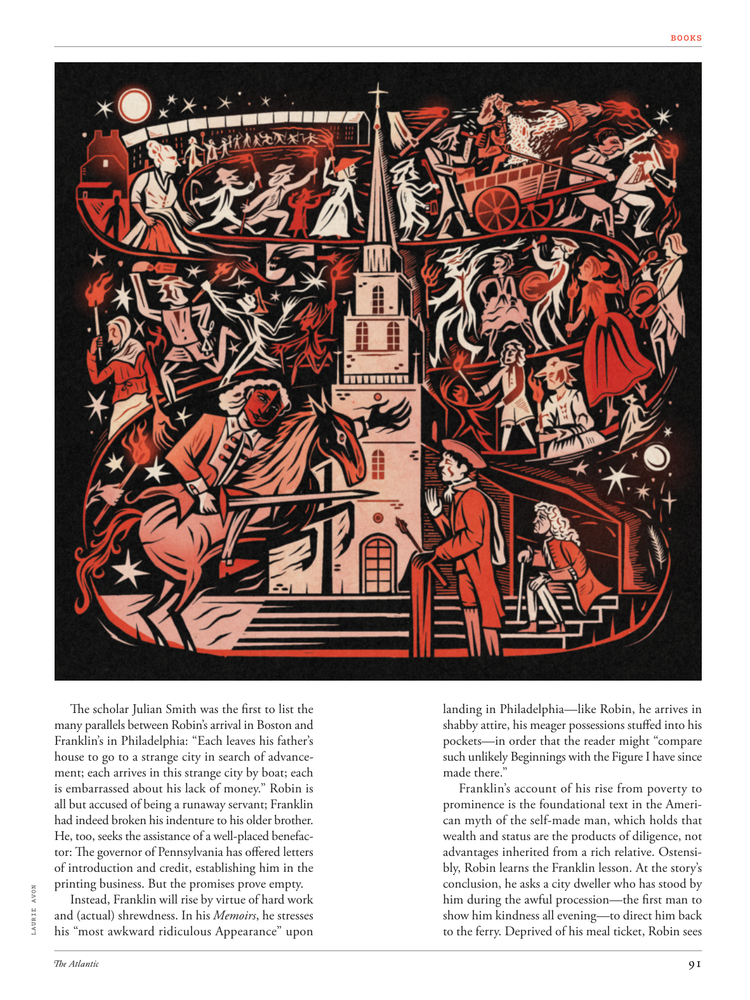

# The Atlantic — July 2026

## Page 93

---

The scholar Julian Smith was the first to list the many parallels between Robin’s arrival in Boston and Franklin’s in Philadelphia: “Each leaves his father’s house to go to a strange city in search of advancement; each arrives in this strange city by boat; each is embarrassed about his lack of money.” Robin is all but accused of being a runaway servant; Franklin had indeed broken his indenture to his older brother.

**【中文翻译】** 学者朱利安·史密斯第一个列出了罗宾到达波士顿和富兰克林到达费城之间的许多相似之处：“每个人都离开父亲的家，前往一个陌生的城市寻求发展；每个人都是乘船到达这个陌生的城市；每个人都为自己缺钱而感到尴尬。”罗宾几乎被指控为一名离家出走的仆人；富兰克林确实打破了与他哥哥的契约。

He, too, seeks the assistance of a well-placed benefactor: The governor of Pennsylvania has offered letters of introduction and credit, establishing him in the printing business. But the promises prove empty.

**【中文翻译】** 他也寻求一位地位显赫的捐助者的帮助：宾夕法尼亚州州长提供了介绍信和信用证，使他在印刷业中崭露头角。但事实证明这些承诺都是空的。

LAURIE AVON Instead, Franklin will rise by virtue of hard work and (actual) shrewdness. In his Memoirs , he stresses his “most awkward ridiculous Appearance” upon landing in Philadelphia— like Robin, he arrives in shabby attire, his meager possessions stuffed into his pockets— in order that the reader might “compare such unlikely Beginnings with the Figure I have since made there.”

**【中文翻译】** 劳里·埃文 相反，富兰克林将凭借努力工作和（实际的）精明而崛起。在他的回忆录中，他强调了自己在抵达费城时“最尴尬可笑的外表”——就像罗宾一样，他穿着破旧的衣服，微薄的财产塞在口袋里——以便读者可以“将这种不太可能的开始与我在那里创造的形象进行比较”。

Franklin’s account of his rise from poverty to prominence is the foundational text in the American myth of the self-made man, which holds that wealth and status are the products of diligence, not advantages inherited from a rich relative. Ostensibly, Robin learns the Franklin lesson. At the story’s conclusion, he asks a city dweller who has stood by him during the awful procession— the first man to show him kindness all evening— to direct him back to the ferry. Deprived of his meal ticket, Robin sees

**【中文翻译】** 富兰克林对自己从贫困走向显赫的描述是美国白手起家神话的基础文本，该神话认为财富和地位是勤奋的产物，而不是从富有亲戚那里继承的优势。表面上，罗宾吸取了富兰克林的教训。在故事的结尾，他请求一位在可怕的游行过程中站在他身边的城市居民——第一个整个晚上对他表示善意的人——引导他返回渡口。罗宾发现他的餐券被剥夺了
