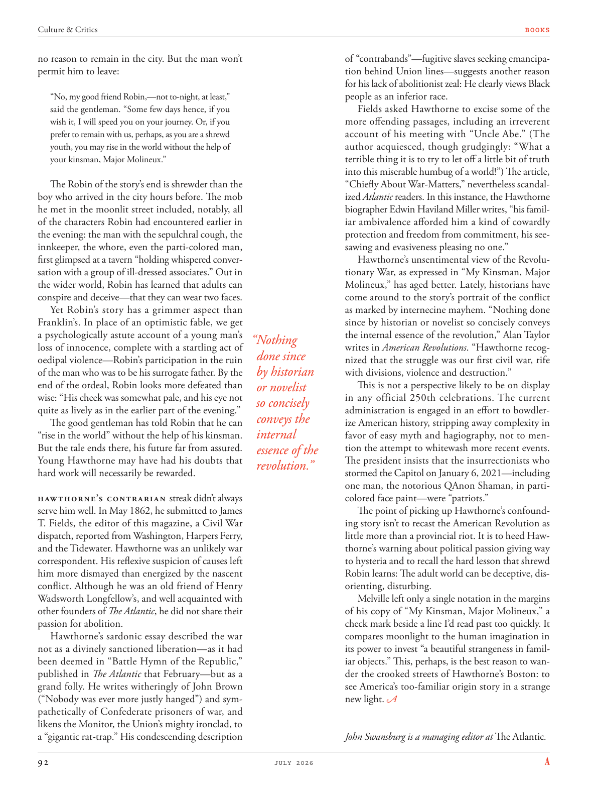

# The Atlantic — July 2026

## Page 94

---

no reason to remain in the city. But the man won’t permit him to leave: “No, my good friend Robin,—not to-night, at least,” said the gentleman. “Some few days hence, if you wish it, I will speed you on your journey. Or, if you prefer to remain with us, perhaps, as you are a shrewd youth, you may rise in the world without the help of your kinsman, Major Molineux.”

**【中文翻译】** 没有理由留在城市。但那人不允许他离开：“不，我的好朋友罗宾，至少今晚不行，”这位绅士说。 “几天后，如果你愿意，我会加速你的旅程。或者，如果你愿意留在我们身边，也许，因为你是一个精明的年轻人，你可以在没有你的亲戚莫利内克斯少校帮助的情况下崛起。”

The Robin of the story’s end is shrewder than the boy who arrived in the city hours before. The mob he met in the moonlit street included, notably, all of the characters Robin had encountered earlier in the evening: the man with the sepulchral cough, the innkeeper, the whore, even the parti-colored man, first glimpsed at a tavern “holding whispered conversation with a group of ill-dressed associates.” Out in the wider world, Robin has learned that adults can conspire and deceive— that they can wear two faces.

**【中文翻译】** 故事结尾的罗宾比几个小时前到达城市的男孩更精明。值得注意的是，他在月光下的街道上遇到的暴徒包括罗宾在当晚早些时候遇到的所有人物：咳嗽的男人、旅馆老板、妓女，甚至是杂色男人，他第一次看到一家酒馆时“正在与一群衣衫褴褛的同事低声交谈”。在更广阔的世界里，罗宾了解到成年人可以密谋和欺骗——他们可以戴着两张面孔。

Yet Robin’s story has a grimmer aspect than Franklin’s. In place of an optimistic fable, we get a psychologically astute account of a young man’s loss of innocence, complete with a startling act of oedipal violence— Robin’s participation in the ruin of the man who was to be his surrogate father. By the end of the ordeal, Robin looks more defeated than wise: “His cheek was somewhat pale, and his eye not quite as lively as in the earlier part of the evening.”

**【中文翻译】** 然而，罗宾的故事比富兰克林的故事更严峻。我们看到的不是一个乐观的寓言，而是一个在心理上敏锐的故事，讲述了一个年轻人失去纯真的故事，并伴随着令人震惊的俄狄浦斯暴力行为——罗宾参与了他的代理父亲的毁灭。在这场磨难结束时，罗宾看起来更多的是失败而不是明智：“他的脸颊有些苍白，他的眼睛不像晚上早些时候那么活跃。”

The good gentleman has told Robin that he can “rise in the world” without the help of his kinsman. But the tale ends there, his future far from assured.

**【中文翻译】** 这位善良的绅士告诉罗宾，他可以在没有亲戚帮助的情况下“在世界上崛起”。但故事到此结束，他的未来还远未确定。

Young Hawthorne may have had his doubts that hard work will necessarily be rewarded. Hawthorne’s contrarian streak didn’t always serve him well. In May 1862, he submitted to James T. Fields, the editor of this magazine, a Civil War dispatch, reported from Washington, Harpers Ferry, and the Tidewater. Hawthorne was an unlikely war correspondent. His reflexive suspicion of causes left him more dismayed than energized by the nascent conflict. Although he was an old friend of Henry Wadsworth Longfellow’s, and well acquainted with other founders of The Atlantic , he did not share their passion for abolition.

**【中文翻译】** 年轻的霍桑可能怀疑努力工作是否一定会得到回报。霍桑的逆向性格并不总是对他有利。 1862 年 5 月，他向本杂志的编辑詹姆斯·T·菲尔兹 (James T. Fields) 提交了一份内战快讯，内容来自华盛顿、哈珀斯费里 (Harpers Ferry) 和潮水报 (Tidewater) 的报道。霍桑不太可能是一位战地记者。他本能地对起因产生怀疑，这让他对这场新生的冲突感到更加沮丧，而不是兴奋。尽管他是亨利·沃兹沃斯·朗费罗的老朋友，并且与《大西洋月刊》的其他创始人也很熟悉，但他并不认同他们对废除死刑的热情。

Hawthorne’s sardonic essay described the war not as a divinely sanctioned liberation— as it had been deemed in “Battle Hymn of the Republic,” published in The Atlantic that February—but as a grand folly. He writes witheringly of John Brown (“Nobody was ever more justly hanged”) and sympathetically of Confederate prisoners of war, and likens the Monitor, the Union’s mighty ironclad, to a “gigantic rat-trap.” His condescending description of “contra bands”— fugitive slaves seeking emancipation behind Union lines— suggests another reason for his lack of abolitionist zeal: He clearly views Black people as an inferior race.

**【中文翻译】** 霍桑讽刺性的文章将这场战争描述为一场巨大的愚蠢行为，而不是像当年二月发表在《大西洋月刊》上的《共和国战歌》所认为的那样，是一次神圣许可的解放。他严厉地描写了约翰·布朗（“没有人比他更公正地被绞死”），对南方邦联的战俘表示同情，并将联邦的强大铁甲监察员比作“巨大的捕鼠器”。他对“反派”——在联邦线后方寻求解放的逃亡奴隶——的居高临下的描述表明了他缺乏废奴主义热情的另一个原因：他显然将黑人视为劣等种族。

Fields asked Hawthorne to excise some of the more offending passages, including an irreverent account of his meeting with “Uncle Abe.” (The author acquiesced, though grudgingly: “What a terrible thing it is to try to let off a little bit of truth into this miserable humbug of a world!”) The article, “Chiefly About War-Matters,” nevertheless scandalized Atlantic readers. In this instance, the Hawthorne biographer Edwin Haviland Miller writes, “his familiar ambivalence afforded him a kind of cowardly protection and freedom from commitment, his seesawing and evasiveness pleasing no one.”

**【中文翻译】** 菲尔兹要求霍桑删除一些比较令人反感的段落，包括对他与“安倍叔叔”会面的不敬描述。 （作者虽然不情愿地默许了：“试图向这个可悲的骗局世界透露一点点真相是多么可怕的事情啊！”）尽管如此，这篇题为“主要是关于战争问题”的文章还是让《大西洋月刊》的读者感到愤慨。在这种情况下，霍桑传记作者埃德温·哈维兰·米勒写道，“他熟悉的矛盾心理给了他一种懦弱的保护和不承担承诺的自由，他的拉锯和回避让任何人都不满意。”

Hawthorne’s unsentimental view of the Revolutionary War, as expressed in “My Kinsman, Major Molineux,” has aged better. Lately, historians have come around to the story’s portrait of the conflict as marked by internecine mayhem. “Nothing done since by historian or novelist so concisely conveys the internal essence of the revolution,” Alan Taylor “Nothing writes in American Revolutions . “Hawthorne recogdone since nized that the struggle was our first civil war, rife by historian with divisions, violence and destruction.”

**【中文翻译】** 正如《我的亲戚，莫利纽克斯少校》中所表达的那样，霍桑对独立战争的冷静看法已经过时了。最近，历史学家开始接受这个故事对这场冲突的描述，其特点是自相残杀。 “自那以后，历史学家或小说家的所作所为都没有如此简洁地传达了革命的内在本质，”艾伦·泰勒“没有在《美国革命》中写过任何东西。“霍桑认识到这场斗争是我们的第一次内战，历史学家们充满了分裂、暴力和破坏。

This is not a perspective likely to be on display or novelist in any official 250th celebrations. The current so concisely administration is engaged in an effort to bowdlerconveys the ize American history, stripping away complexity in internal favor of easy myth and hagiography, not to mention the attempt to whitewash more recent events. essence of the The president insists that the insurrectionists who revolution.” stormed the Capitol on January 6, 2021— including one man, the notorious QAnon Shaman, in particolored face paint— were “patriots.”

**【中文翻译】** 这不是任何官方 250 周年庆祝活动中可能会展示或小说的观点。现任政府如此简明扼要地致力于鲍德勒传达美国历史，剥离复杂性，转而采用简单的神话和传记，更不用说试图粉饰最近发生的事件了。总统的本质是坚持革命的起义者。” 2021 年 1 月 6 日袭击国会大厦的人——其中包括一名男子，即臭名昭著的 QAnon 萨满，脸上涂着杂色——都是“爱国者”。

The point of picking up Hawthorne’s confounding story isn’t to recast the American Revolution as little more than a provincial riot. It is to heed Hawthorne’s warning about political passion giving way to hysteria and to recall the hard lesson that shrewd Robin learns: The adult world can be deceptive, disorienting, disturbing.

**【中文翻译】** 回顾霍桑令人困惑的故事的目的并不是要把美国革命重新描绘成一场省级骚乱。这是要留意霍桑关于政治激情让位于歇斯底里的警告，并回顾精明的罗宾学到的惨痛教训：成人世界可能具有欺骗性、迷失方向、令人不安。

Melville left only a single notation in the margins of his copy of “My Kinsman, Major Molineux,” a check mark beside a line I’d read past too quickly. It compares moonlight to the human imagination in its power to invest “a beautiful strangeness in familiar objects.” This, perhaps, is the best reason to wander the crooked streets of Hawthorne’s Boston: to see America’s too-familiar origin story in a strange new light. John Swansburg is a managing editor at The Atlantic .

**【中文翻译】** 梅尔维尔在他那本《我的亲戚，莫利纽克斯少校》的页边空白处只留下了一个注释，是我读得太快的一行旁边的复选标记。它将月光与人类的想象力进行了比较，因为它具有“为熟悉的物体注入美丽的陌生感”的能力。这也许是在霍桑波士顿的弯曲街道上漫步的最佳理由：以一种陌生的新视角来看待美国过于熟悉的起源故事。约翰·斯旺斯堡 (John Swansburg) 是《大西洋月刊》的执行编辑。
