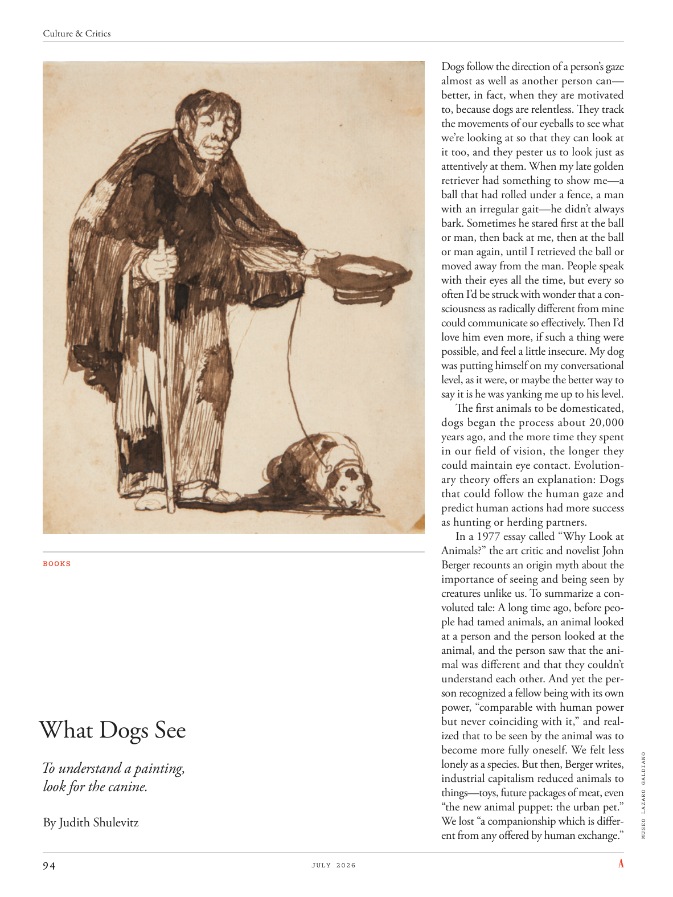

# The Atlantic — July 2026

## Page 96

---

### What Dogs See

**【标题翻译】** 狗看到什么

To understand a painting, look for the canine. By Judith Shulevitz Dogs follow the direction of a person’s gaze almost as well as another person can— better, in fact, when they are motivated to, because dogs are relentless. They track the movements of our eyeballs to see what we’re looking at so that they can look at it too, and they pester us to look just as attentively at them. When my late golden retriever had something to show me— a ball that had rolled under a fence, a man with an irregular gait— he didn’t always bark. Sometimes he stared first at the ball or man, then back at me, then at the ball or man again, until I retrieved the ball or moved away from the man. People speak with their eyes all the time, but every so often I’d be struck with wonder that a consciousness as radically different from mine could communicate so effectively. Then I’d love him even more, if such a thing were possible, and feel a little insecure. My dog was putting himself on my conversational level, as it were, or maybe the better way to say it is he was yanking me up to his level.

**【中文翻译】** 要理解一幅画，就要寻找狗。作者：Judith Shulevitz 狗几乎和另一个人一样跟随人的目光方向——事实上，当它们受到激励时更好，因为狗是无情的。它们跟踪我们眼球的运动，以了解我们在看什么，以便它们也能看，并且它们缠着我们同样专心地看着它们。当我已故的金毛猎犬向我展示一些东西时——一个滚到栅栏下的球，一个步态不规则的人——他并不总是吠叫。有时他先盯着球或人，然后又看向我，然后再次盯着球或人，直到我收回球或远离那个人。人们总是用眼睛说话，但时不时地，我会惊讶于与我截然不同的意识竟然能如此有效地交流。如果可能的话，我会更加爱他，但会感到有点不安全。我的狗将自己置于我的对话水平上，或者也许更好的说法是他正在把我拉到他的水平。

The first animals to be domesticated, dogs began the process about 20,000 years ago, and the more time they spent in our field of vision, the longer they could maintain eye contact. Evolutionary theory offers an explanation: Dogs that could follow the human gaze and predict human actions had more success as hunting or herding partners.

**【中文翻译】** 狗是第一批被驯化的动物，大约在 2 万年前就开始了这一过程，它们在我们视野中停留的时间越长，保持目光接触的时间就越长。进化论提供了一个解释：能够跟随人类目光并预测人类行为的狗作为狩猎或放牧伙伴更成功。

In a 1977 essay called “Why Look at Animals?” the art critic and novelist John Berger recounts an origin myth about the importance of seeing and being seen by creatures unlike us. To summarize a convoluted tale: A long time ago, before people had tamed animals, an animal looked at a person and the person looked at the animal, and the person saw that the animal was different and that they couldn’t understand each other. And yet the person recognized a fellow being with its own power, “comparable with human power but never coinciding with it,” and realized that to be seen by the animal was to become more fully oneself. We felt less MUSEO LAZARO GALDIANO lonely as a species. But then, Berger writes, industrial capitalism reduced animals to things— toys, future packages of meat, even “the new animal puppet: the urban pet.” We lost “a companionship which is different from any offered by human exchange.”

**【中文翻译】** 在 1977 年一篇名为“为什么要观察动物？”的文章中艺术评论家兼小说家约翰·伯杰讲述了一个起源神话，讲述了与我们不同的生物看到和被看到的重要性。总结一个令人费解的故事：很久以前，在人们驯服动物之前，动物看人，人看动物，人看到动物不同，彼此无法理解。然而，这个人认识到一个拥有自己力量的人，“与人类的力量相媲美，但绝不与之相符”，并意识到被动物看到就意味着更加完整地成为自己。作为一个物种，我们不再感到孤独。但随后，伯杰写道，工业资本主义将动物简化为玩具、未来的肉类包装，甚至是“新的动物木偶：城市宠物”。我们失去了“一种不同于人类交流所提供的友谊”。
