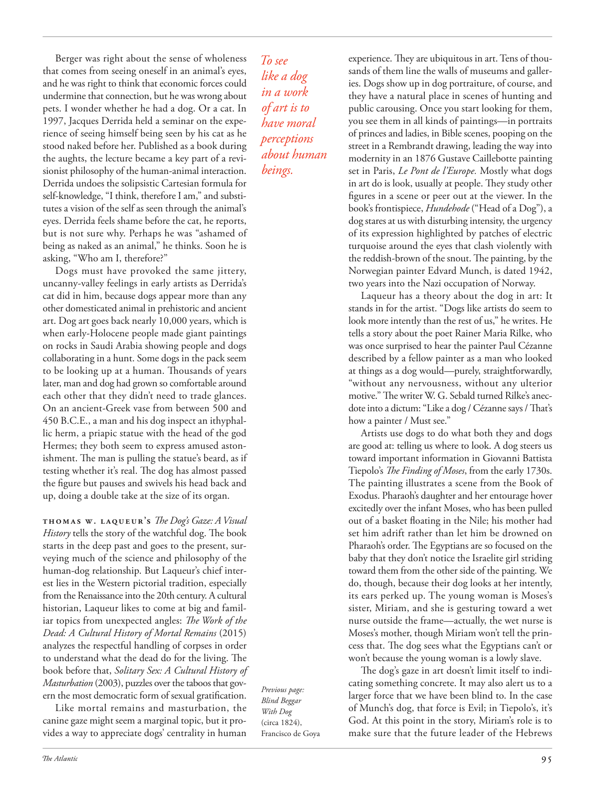

# The Atlantic — July 2026

## Page 97

---

Berger was right about the sense of wholeness that comes from seeing oneself in an animal’s eyes, and he was right to think that economic forces could undermine that connection, but he was wrong about pets. I wonder whether he had a dog. Or a cat. In 1997, Jacques Derrida held a seminar on the experience of seeing himself being seen by his cat as he stood naked before her. Published as a book during the aughts, the lecture became a key part of a revisionist philosophy of the human-animal interaction.

**【中文翻译】** 伯杰关于通过动物的眼睛看到自己而产生的完整感是正确的，他认为经济力量可能会破坏这种联系是正确的，但他对宠物的看法是错误的。我想知道他是否养过狗。或者一只猫。 1997年，雅克·德里达（Jacques Derrida）举办了一场研讨会，讲述自己赤身裸体站在猫面前时被猫看到的经历。该讲座在十世纪期间以书的形式出版，成为人类与动物互动的修正主义哲学的关键部分。

Derrida undoes the solipsistic Cartesian formula for self-knowledge, “I think, therefore I am,” and substitutes a vision of the self as seen through the animal’s eyes. Derrida feels shame before the cat, he reports, but is not sure why. Perhaps he was “ashamed of being as naked as an animal,” he thinks. Soon he is asking, “Who am I, therefore?”

**【中文翻译】** 德里达废除了唯我论的笛卡尔自我认识公式“我思故我在”，并代之以通过动物眼睛看到的自我愿景。德里达报告说，他在猫面前感到羞耻，但不确定为什么。他想，也许他“因为像动物一样赤身裸体而感到羞耻”。很快他就问：“那么我是谁？”

Dogs must have provoked the same jittery, uncanny-valley feelings in early artists as Derrida’s cat did in him, because dogs appear more than any other domesticated animal in prehistoric and ancient art. Dog art goes back nearly 10,000 years, which is when early-Holocene people made giant paintings on rocks in Saudi Arabia showing people and dogs collaborating in a hunt. Some dogs in the pack seem to be looking up at a human. Thousands of years later, man and dog had grown so comfortable around each other that they didn’t need to trade glances.

**【中文翻译】** 狗肯定在早期艺术家中激起了同样的紧张、恐怖的感觉，就像德里达的猫在他身上激起的一样，因为在史前和古代艺术中，狗比任何其他家养动物都出现得更多。狗艺术可以追溯到近一万年前，当时全新世早期的人们在沙特阿拉伯的岩石上创作了巨幅绘画，展示了人和狗合作狩猎的情景。狗群中的一些狗似乎正在抬头看着人类。几千年后，人和狗相处得如此自在，以至于不需要交换眼神。

On an ancient-Greek vase from between 500 and 450 B.C.E., a man and his dog inspect an ithyphallic herm, a priapic statue with the head of the god Hermes; they both seem to express amused astonishment. The man is pulling the statue’s beard, as if testing whether it’s real. The dog has almost passed the figure but pauses and swivels his head back and up, doing a double take at the size of its organ.

**【中文翻译】** 在一个公元前 500 年至 450 年的古希腊花瓶上，一名男子和他的狗正在检查一尊阴茎雕像，上面有赫尔墨斯神的头像；他们俩似乎都表现出了有趣的惊讶。男人拉着雕像的胡须，似乎在测试它是否真实。狗几乎已经超过了这个人影，但它停了下来，前后旋转着头，仔细观察了它器官的大小。

Thomas W. Laqueur’s The Dog’s Gaze: A Visual History tells the story of the watchful dog. The book starts in the deep past and goes to the present, surveying much of the science and philosophy of the human-dog relationship. But Laqueur’s chief interest lies in the Western pictorial tradition, especially from the Renaissance into the 20th century. A cultural historian, Laqueur likes to come at big and familiar topics from unexpected angles: The Work of the Dead: A Cultural History of Mortal Remains (2015) analyzes the respectful handling of corpses in order to understand what the dead do for the living. The book before that, Solitary Sex: A Cultural History of Masturbation (2003), puzzles over the taboos that govern the most democratic form of sexual gratification.

**【中文翻译】** 托马斯·W·拉克尔 (Thomas W. Laqueur) 的《狗的凝视：视觉历史》讲述了一只警惕的狗的故事。这本书从遥远的过去开始，一直到现在，调查了人与狗关系的大部分科学和哲学。但拉克尔的主要兴趣在于西方绘画传统，尤其是从文艺复兴时期到 20 世纪。作为一名文化历史学家，拉克尔喜欢从意想不到的角度探讨重大而熟悉的话题：《死者的工作：凡人遗骸的文化史》（2015）分析了对尸体的尊重处理，以了解死者为生者所做的事情。在此之前的书《孤独的性：手淫的文化史》（2003），对统治最民主的性满足形式的禁忌感到困惑。

Like mortal remains and masturbation, the canine gaze might seem a marginal topic, but it provides a way to appreciate dogs’ centrality in human experience. They are ubiquitous in art. Tens of thouTo see sands of them line the walls of museums and gallerlike a dog ies. Dogs show up in dog portraiture, of course, and in a work they have a natural place in scenes of hunting and of art is to public carousing. Once you start looking for them, you see them in all kinds of paintings— in portraits have moral of princes and ladies, in Bible scenes, pooping on the perceptions street in a Rembrandt drawing, leading the way into about human modernity in an 1876 Gustave Caillebotte painting beings. set in Paris, Le Pont de l’Europe. Mostly what dogs in art do is look, usually at people. They study other figures in a scene or peer out at the viewer. In the book’s frontispiece, Hundehode (“Head of a Dog”), a dog stares at us with disturbing intensity, the urgency of its expression highlighted by patches of electric turquoise around the eyes that clash violently with the reddish-brown of the snout. The painting, by the Norwegian painter Edvard Munch, is dated 1942, two years into the Nazi occupation of Norway.

**【中文翻译】** 就像遗骸和自慰一样，狗的凝视似乎是一个边缘话题，但它提供了一种方式来欣赏狗在人类经验中的中心地位。它们在艺术中无处不在。成千上万的人会看到它们的沙子像小狗一样排列在博物馆和画廊的墙壁上。当然，狗出现在狗的肖像画中，在狩猎和公共狂欢的艺术场景中，它们自然占有一席之地。一旦你开始寻找它们，你就会在各种画作中看到它们——在具有王子和淑女寓意的肖像画中，在圣经场景中，在伦勃朗画作中在感知街道上大便，在1876年古斯塔夫·卡耶博特的画作《生物》中引领人类现代性。以巴黎欧洲桥为背景。艺术中的狗主要做的就是看，通常是看人。他们研究场景中的其他人物或凝视观众。在这本书的卷首插画《Hundehode》（“狗头”）中，一只狗以令人不安的强度盯着我们，眼睛周围的电绿松石色斑块与红棕色的鼻子形成了强烈的冲突，凸显了它表情的紧迫性。这幅画由挪威画家爱德华·蒙克 (Edvard Munch) 创作，创作日期为 1942 年，即纳粹占领挪威两年后。

Laqueur has a theory about the dog in art: It stands in for the artist. “Dogs like artists do seem to look more intently than the rest of us,” he writes. He tells a story about the poet Rainer Maria Rilke, who was once surprised to hear the painter Paul Cézanne described by a fellow painter as a man who looked at things as a dog would—purely, straight forwardly, “without any nervousness, without any ulterior motive.” The writer W. G. Sebald turned Rilke’s anecdote into a dictum: “Like a dog / Cézanne says / That’s how a painter / Must see.”

**【中文翻译】** 拉克尔对艺术中的狗有一个理论：它代表艺术家。 “像艺术家一样的狗看起来确实比我们其他人更专注，”他写道。他讲述了诗人赖纳·玛丽亚·里尔克的故事，有一次，诗人惊讶地听到画家保罗·塞尚被一位画家同行描述为一个像狗一样看待事物的人——纯粹、直接，“没有任何紧张，没有任何别有用心”。作家 W. G. Sebald 将里尔克的轶事变成了一句格言：“像狗一样/塞尚说/这就是画家的样子/必须看到。”

Artists use dogs to do what both they and dogs are good at: telling us where to look. A dog steers us toward important information in Giovanni Battista Tiepolo’s The Finding of Moses , from the early 1730s.

**【中文翻译】** 艺术家利用狗来做他们和狗都擅长的事情：告诉我们该看哪里。乔瓦尼·巴蒂斯塔·提埃波罗 (Giovanni Battista Tiepolo) 于 1730 年代初所著的《寻找摩西》中，一只狗引导我们了解重要信息。

The painting illustrates a scene from the Book of Exodus. Pharaoh’s daughter and her entourage hover excitedly over the infant Moses, who has been pulled out of a basket floating in the Nile; his mother had set him adrift rather than let him be drowned on Pharaoh’s order. The Egyptians are so focused on the baby that they don’t notice the Israelite girl striding toward them from the other side of the painting. We do, though, because their dog looks at her intently, its ears perked up. The young woman is Moses’s sister, Miriam, and she is gesturing toward a wet nurse outside the frame— actually, the wet nurse is Moses’s mother, though Miriam won’t tell the princess that. The dog sees what the Egyptians can’t or won’t because the young woman is a lowly slave.

**【中文翻译】** 这幅画描绘了出埃及记中的一个场景。法老的女儿和她的随从兴奋地在婴儿摩西身边盘旋，他被从漂浮在尼罗河上的篮子里拉出来；按照法老的命令，他的母亲宁愿让他随波逐流，也不愿让他被淹死。埃及人如此专注于婴儿，以至于没有注意到以色列女孩从画的另一边大步向他们走来。不过我们还是这么做了，因为他们的狗专注地看着她，耳朵竖了起来。这位年轻女子是摩西的妹妹米里亚姆，她指着画面外的一位奶妈——实际上，奶妈是摩西的母亲，尽管米里亚姆不会告诉公主这一点。狗看到了埃及人看不到或不愿看到的东西，因为年轻的女人是一个卑微的奴隶。

The dog’s gaze in art doesn’t limit itself to indicating something concrete. It may also alert us to a Previous page: larger force that we have been blind to. In the case Blind Beggar of Munch’s dog, that force is Evil; in Tiepolo’s, it’s With Dog God. At this point in the story, Miriam’s role is to (circa 1824), make sure that the future leader of the Hebrews Francisco de Goya

**【中文翻译】** 艺术中狗的凝视并不局限于指示具体的事物。它还可能提醒我们上一页：我们一直忽视的更大的力量。在蒙克狗的盲乞丐的例子中，这种力量就是邪恶；在提埃坡罗的作品中，是《与狗神》。在故事的这一点上，米里亚姆的角色是（大约 1824 年）确保希伯来人未来的领袖弗朗西斯科·德·戈雅
