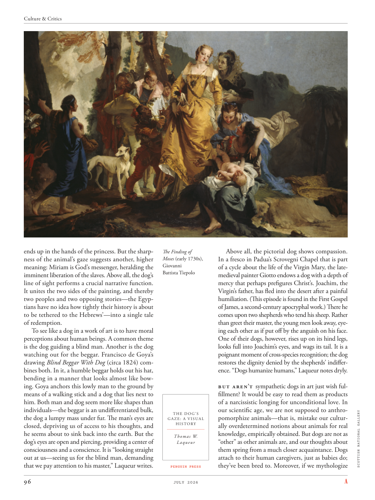

# The Atlantic — July 2026

## Page 98

---

ends up in the hands of the princess. But the sharpness of the animal’s gaze suggests another, higher meaning: Miriam is God’s messenger, heralding the imminent liberation of the slaves. Above all, the dog’s line of sight performs a crucial narrative function.

**【中文翻译】** 最终落入公主手中。但动物目光的锐利暗示着另一个更高的含义：米里亚姆是上帝的使者，预示着奴隶即将获得解放。最重要的是，狗的视线发挥着至关重要的叙事功能。

It unites the two sides of the painting, and thereby two peoples and two opposing stories— the Egyptians have no idea how tightly their history is about to be tethered to the Hebrews’— into a single tale of redemption.

**【中文翻译】** 它将画作的两侧，从而两个民族和两个对立的故事——埃及人不知道他们的历史将与希伯来人的历史有多么紧密地联系在一起——结合成一个救赎的故事。

To see like a dog in a work of art is to have moral perceptions about human beings. A common theme is the dog guiding a blind man. Another is the dog watching out for the beggar. Francisco de Goya’s drawing Blind Beggar With Dog (circa 1824) combines both. In it, a humble beggar holds out his hat, bending in a manner that looks almost like bowing. Goya anchors this lowly man to the ground by means of a walking stick and a dog that lies next to him. Both man and dog seem more like shapes than individuals— the beggar is an undifferentiated bulk, the dog a lumpy mass under fur. The man’s eyes are closed, depriving us of access to his thoughts, and he seems about to sink back into the earth. But the dog’s eyes are open and piercing, providing a center of consciousness and a conscience. It is “looking straight out at us— seeing us for the blind man, demanding that we pay attention to his master,” Laqueur writes.

**【中文翻译】** 在艺术作品中像狗一样看待就是对人类有道德认知。一个常见的主题是狗引导盲人。另一个是看守乞丐的狗。弗朗西斯科·德·戈雅 (Francisco de Goya) 的画作《盲人乞丐与狗》（约 1824 年）将两者结合在一起。画中，一个卑微的乞丐伸出帽子，弯腰的样子几乎就像在鞠躬。戈雅用一根手杖和一条躺在他旁边的狗将这个卑微的人固定在地上。人和狗看起来更像是形状而不是个体——乞丐是一个没有分化的块体，狗是毛皮下的一块块状物体。这个人的眼睛紧闭着，我们无法了解他的想法，他似乎即将沉入地下。但狗的眼睛是睁开的、锐利的，提供了意识和良知的中心。拉克尔写道，它“直视我们——将我们视为盲人，要求我们关注他的主人”。

Above all, the pictorial dog shows compassion. The Finding of Moses (early 1730s), In a fresco in Padua’s Scrovegni Chapel that is part Giovanni of a cycle about the life of the Virgin Mary, the lateBattista Tiepolo medieval painter Giotto endows a dog with a depth of mercy that perhaps prefigures Christ’s. Joachim, the Virgin’s father, has fled into the desert after a painful humiliation. (This episode is found in the First Gospel of James, a second-century apocryphal work.) There he comes upon two shepherds who tend his sheep. Rather than greet their master, the young men look away, eyeing each other as if put off by the anguish on his face.

**【中文翻译】** 最重要的是，图中的狗表现出了同情心。 《发现摩西》（1730 年代初），在帕多瓦斯克罗维尼礼拜堂的一幅壁画中，这是乔瓦尼有关圣母玛利亚生平的一幅壁画的一部分，已故的巴蒂斯塔·提埃波罗中世纪画家乔托赋予了一只狗一种深度的怜悯，这或许预示着基督的怜悯。圣母玛利亚的父亲约阿希姆在遭受痛苦的羞辱后逃入沙漠。 （这段情节出现在《雅各第一福音》中，这是一部二世纪的伪经作品。）在那里，他遇到了两个正在看管他的羊的牧羊人。年轻人没有向他们的主人打招呼，而是把目光移开，互相对视着，仿佛被他脸上的痛苦所打动。

One of their dogs, however, rises up on its hind legs, looks full into Joachim’s eyes, and wags its tail. It is a poignant moment of cross-species recognition; the dog restores the dignity denied by the shepherds’ indifference. “Dogs humanize humans,” Laqueur notes dryly.

**【中文翻译】** 然而，他们的一只狗却用后腿站了起来，直视约阿希姆的眼睛，并摇着尾巴。这是跨物种认识的一个令人心酸的时刻；狗恢复了牧羊人的冷漠所剥夺的尊严。 “狗使人类变得人性化，”拉克尔冷冷地说道。

But aren’t sympathetic dogs in art just wish fulfillment? It would be easy to read them as products of a narcissistic longing for unconditional love. In our scientific age, we are not supposed to anthroTHE DOG’S pomorphize animals—that is, mistake our culturGAZE: A VISUAL HISTORY ally overdetermined notions about animals for real knowledge, empirically obtained. But dogs are not as Thomas W.

**【中文翻译】** 但艺术中富有同情心的狗不正是愿望的实现吗？人们很容易将它们解读为对无条件爱的自恋渴望的产物。在我们的科学时代，我们不应该将动物拟态化——也就是说，我们的文化视角：视觉历史将关于动物的过度决定的概念误认为是经验获得的真实知识。但狗并不像托马斯·W.

“other” as other animals are, and our thoughts about Laqueur them spring from a much closer acquaintance. Dogs attach to their human caregivers, just as babies do; they’ve been bred to. Moreover, if we mythologize PENGUIN PRESS SCOTTISH NATIONAL GALLERY

**【中文翻译】** 与其他动物一样，我们对拉克尔的想法源于对它们的更亲密的了解。狗会依附于人类的照顾者，就像婴儿一样。他们被培育成。此外，如果我们神话企鹅出版社苏格兰国家美术馆
