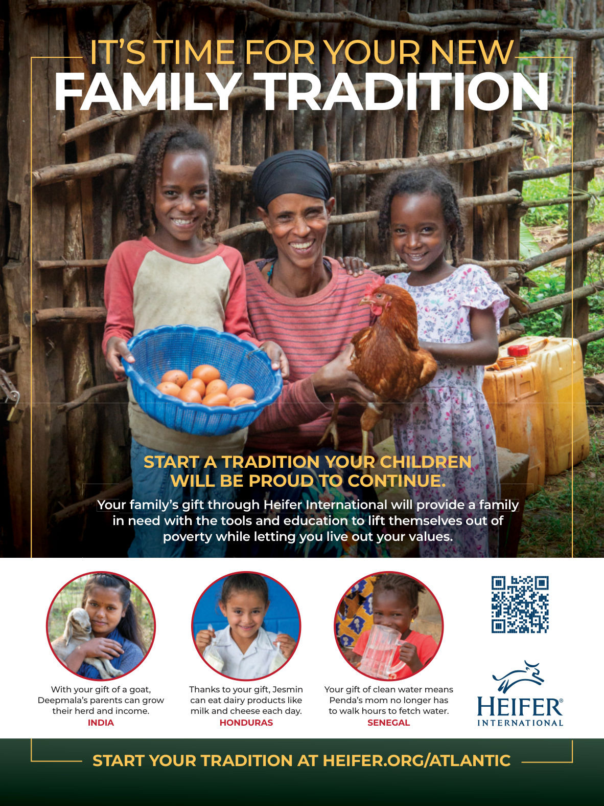

# The Atlantic — July 2026

## Page 99

---

### FAMILY TRADITION

**【标题翻译】** 家庭传统

#### START A TRADITION YOUR CHILDREN

**【副标题翻译】** 为您的孩子养成传统

#### WILL BE PROUD TO CONTINUE.

**【副标题翻译】** 我们将很自豪地继续下去。

Your family’s gift through Heifer International will provide a family in need with the tools and education to lift themselves out of poverty while letting you live out your values.

**【中文翻译】** 您的家人通过小母牛国际组织捐赠的礼物将为有需要的家庭提供工具和教育，帮助他们摆脱贫困，同时让您践行自己的价值观。

Thanks to your gift, Jesmin With your gift of a goat, can eat dairy products like Deepmala’s parents can grow milk and cheese each day. their herd and income.

**【中文翻译】** 感谢你的礼物，Jesmin 有了你的山羊礼物，可以像 Deepmala 的父母一样吃奶制品，每天都可以种植牛奶和奶酪。他们的畜群和收入。

INDIA

**【中文翻译】** 印度

#### START YOUR TRADITION AT HEIFER.ORG/ATLANTIC

**【副标题翻译】** 在 HEIFER.ORG/ATLANTIC 开始您的传统

Your gift of clean water means Penda’s mom no longer has to walk hours to fetch water. HONDURAS SENEGAL

**【中文翻译】** 您赠送的干净水意味着彭达的妈妈不再需要步行几个小时去取水。洪都拉斯 塞内加尔
