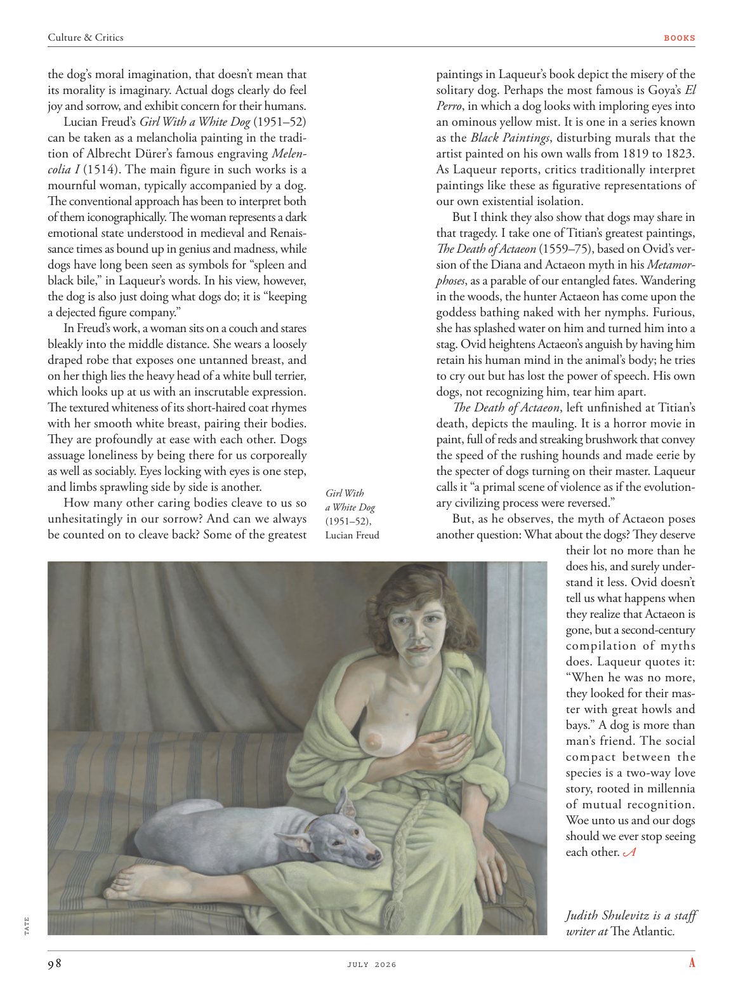

# The Atlantic — July 2026

## Page 100

---

the dog’s moral imagination, that doesn’t mean that its morality is imaginary. Actual dogs clearly do feel joy and sorrow, and exhibit concern for their humans.

**【中文翻译】** 狗的道德想象，并不意味着它的道德是想象的。真正的狗显然确实会感到快乐和悲伤，并表现出对人类的关心。

Lucian Freud’s Girl With a White Dog (1951–52) can be taken as a melancholia painting in the tradition of Albrecht Dürer’s famous engraving Melencolia I (1514). The main figure in such works is a mournful woman, typically accompanied by a dog.

**【中文翻译】** 卢西安·弗洛伊德的《带着白狗的女孩》（1951-52）可以被视为阿尔布雷希特·丢勒著名版画《忧郁一号》（Melencolia I，1514）传统中的忧郁绘画。此类作品的主要人物是一位悲伤的妇女，通常有一只狗陪伴。

The conventional approach has been to interpret both of them iconographically. The woman represents a dark emotional state understood in medieval and Renaissance times as bound up in genius and madness, while dogs have long been seen as symbols for “spleen and black bile,” in Laqueur’s words. In his view, however, the dog is also just doing what dogs do; it is “keeping a dejected figure company.”

**【中文翻译】** 传统的方法是从图像上解释它们。用拉克尔的话说，女人代表了一种黑暗的情感状态，在中世纪和文艺复兴时期被理解为与天才和疯狂密切相关，而狗长期以来被视为“脾脏和黑胆汁”的象征。然而，在他看来，狗也只是在做狗该做的事，狗所做的事。这是“与一个沮丧的人物作伴”。

In Freud’s work, a woman sits on a couch and stares bleakly into the middle distance. She wears a loosely draped robe that exposes one untanned breast, and on her thigh lies the heavy head of a white bull terrier, which looks up at us with an inscrutable expression.

**【中文翻译】** 在弗洛伊德的作品中，一个女人坐在沙发上，眼神凄凉地凝视着中距离。她穿着一件宽松的长袍，露出了未晒黑的乳房，大腿上躺着一只白色斗牛梗的沉重的头，它抬头看着我们，表情神秘莫测。

The textured whiteness of its short-haired coat rhymes with her smooth white breast, pairing their bodies. They are profoundly at ease with each other. Dogs assuage loneliness by being there for us corporeally as well as sociably. Eyes locking with eyes is one step, and limbs sprawling side by side is another.

**【中文翻译】** 其短毛皮毛的纹理白色与她光滑的白色乳房押韵，将它们的身体配对。他们彼此相处得非常融洽。狗通过在身体上和社交上陪伴我们来缓解孤独感。目光对视是第一步，四肢并排伸展是另一步。

How many other caring bodies cleave to us so unhesitatingly in our sorrow? And can we always be counted on to cleave back? Some of the greatest TATE paintings in Laqueur’s book depict the misery of the solitary dog. Perhaps the most famous is Goya’s El Perro , in which a dog looks with imploring eyes into an ominous yellow mist. It is one in a series known as the Black Paintings , disturbing murals that the artist painted on his own walls from 1819 to 1823.

**【中文翻译】** 还有多少其他爱心机构在我们的悲伤中如此毫不犹豫地依附于我们？我们总能指望他们反击吗？拉克尔书中的一些最伟大的泰特美术馆画作描绘了孤独的狗的痛苦。也许最著名的是戈雅的《El Perro》，画中一只狗用恳求的眼神看着不祥的黄色雾气。这是艺术家于 1819 年至 1823 年间在自己的墙壁上绘制的一系列令人不安的壁画“黑色绘画”中的一幅。

As Laqueur reports, critics traditionally interpret paintings like these as figurative representations of our own existential isolation. But I think they also show that dogs may share in that tragedy. I take one of Titian’s greatest paintings, The Death of Actaeon (1559–75), based on Ovid’s version of the Diana and Actaeon myth in his Metamorphoses , as a parable of our entangled fates. Wandering in the woods, the hunter Actaeon has come upon the goddess bathing naked with her nymphs. Furious, she has splashed water on him and turned him into a stag. Ovid heightens Actaeon’s anguish by having him retain his human mind in the animal’s body; he tries to cry out but has lost the power of speech. His own dogs, not recognizing him, tear him apart.

**【中文翻译】** 据拉克尔报道，批评家传统上将此类画作解释为我们自身存在孤立的象征性表现。但我认为它们也表明狗可能也参与了这场悲剧。我将提香最伟大的画作之一《阿克泰翁之死》（1559-75）视为我们纠缠命运的寓言，该作品以奥维德版本的《变形记》中的戴安娜和阿克泰翁神话为基础。猎人阿克泰翁在树林里徘徊，遇见了正在裸体沐浴的女神和她的仙女们。她愤怒地向他泼水，把他变成了一头雄鹿。奥维德让阿克泰翁将人类的思想保留在动物的身体里，从而加剧了阿克泰翁的痛苦。他试图喊叫，但已经失去了说话的能力。他自己的狗不认识他，把他撕碎。

The Death of Actaeon , left unfinished at Titian’s death, depicts the mauling. It is a horror movie in paint, full of reds and streaking brushwork that convey the speed of the rushing hounds and made eerie by the specter of dogs turning on their master. Laqueur calls it “a primal scene of violence as if the evolutionGirl With ary civilizing process were reversed.” a White Dog But, as he observes, the myth of Actaeon poses (1951–52), another question: What about the dogs? They deserve Lucian Freud their lot no more than he does his, and surely understand it less. Ovid doesn’t tell us what happens when they realize that Actaeon is gone, but a secondcentury compilation of myths does. Laqueur quotes it: “When he was no more, they looked for their master with great howls and bays.” A dog is more than man’s friend. The social compact between the species is a two-way love story, rooted in millennia of mutual recognition. Woe unto us and our dogs should we ever stop seeing each other. Judith Shulevitz is a staff writer at The Atlantic .

**【中文翻译】** 提香死后未完成的《阿克泰翁之死》描绘了殴打事件。这是一部恐怖的油漆电影，充满了红色和条纹笔触，传达了猎犬奔跑的速度，并因狗的幽灵转向主人而变得令人毛骨悚然。拉克尔称其为“原始的暴力场景，仿佛进化的文明进程被逆转了”。白狗 但是，正如他所观察到的，阿克泰翁神话（1951-52）提出了另一个问题：狗呢？他们不应该像卢西恩·弗洛伊德那样享有同样的命运，而且他们对这一点的理解肯定更少。奥维德没有告诉我们当他们意识到阿克泰翁消失后会发生什么，但二世纪的神话汇编却告诉了我们。拉克尔引用了这段话：“当他不再存在时，他们用巨大的嚎叫声寻找他们的主人。”狗不仅仅是人类的朋友。物种之间的社会契约是一个双向的爱情故事，植根于数千年的相互认可。如果我们不再见面，我们和我们的狗就会有祸了。朱迪思·舒莱维茨 (Judith Shulevitz) 是《大西洋月刊》的特约撰稿人。
