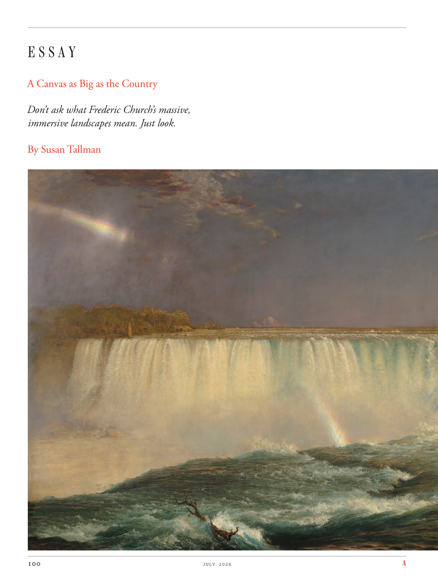

# The Atlantic — July 2026

## Page 102

---

### E S S A Y

**【标题翻译】** 散文

#### A Canvas as Big as the Country

**【副标题翻译】** 像国家一样大的画布

#### Don’t ask what Frederic Church’s massive,

**【副标题翻译】** 不要问弗雷德里克教堂有多大，

#### immersive landscapes mean. Just look.

**【副标题翻译】** 沉浸式风景的意思。看看吧。

#### By Susan Tallman

**【副标题翻译】** 苏珊·托尔曼
