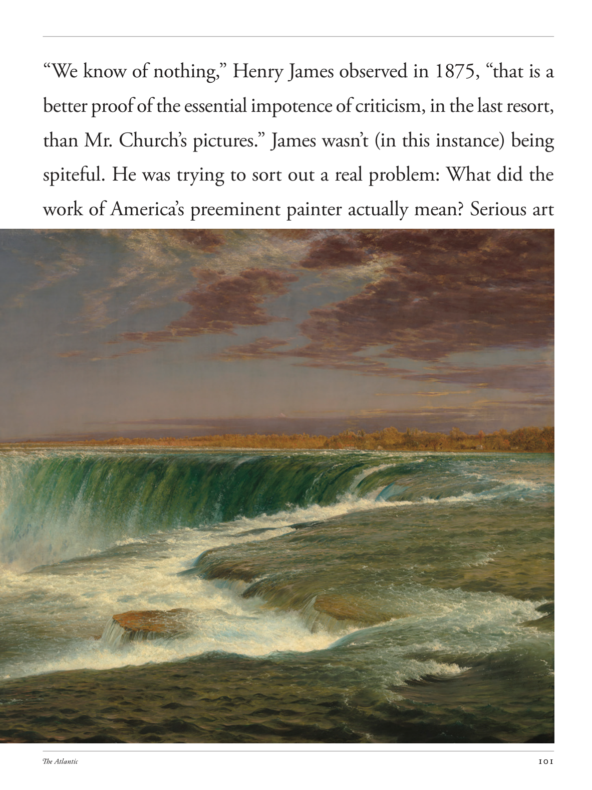

# The Atlantic — July 2026

## Page 103

---

### “We know of nothing,” Henry James observed in 1875, “that is a

**【标题翻译】** 亨利·詹姆斯 (Henry James) 在 1875 年评论道：“我们一无所知，这是一个

### better proof of the essential impotence of criticism, in the last resort,

**【标题翻译】** 更好地证明批评在本质上是无能为力的，归根结底，

### than Mr. Church’s pictures.” James wasn’t (in this instance) being

**【标题翻译】** 比丘奇先生的照片更重要。”詹姆斯（在这种情况下）并不是

### spiteful. He was trying to sort out a real problem: What did the

**【标题翻译】** 恶意的。他试图解决一个真正的问题：

### work of America’s preeminent painter actually mean? Serious art

**【标题翻译】** 美国杰出画家的作品究竟意味着什么？严肃的艺术
