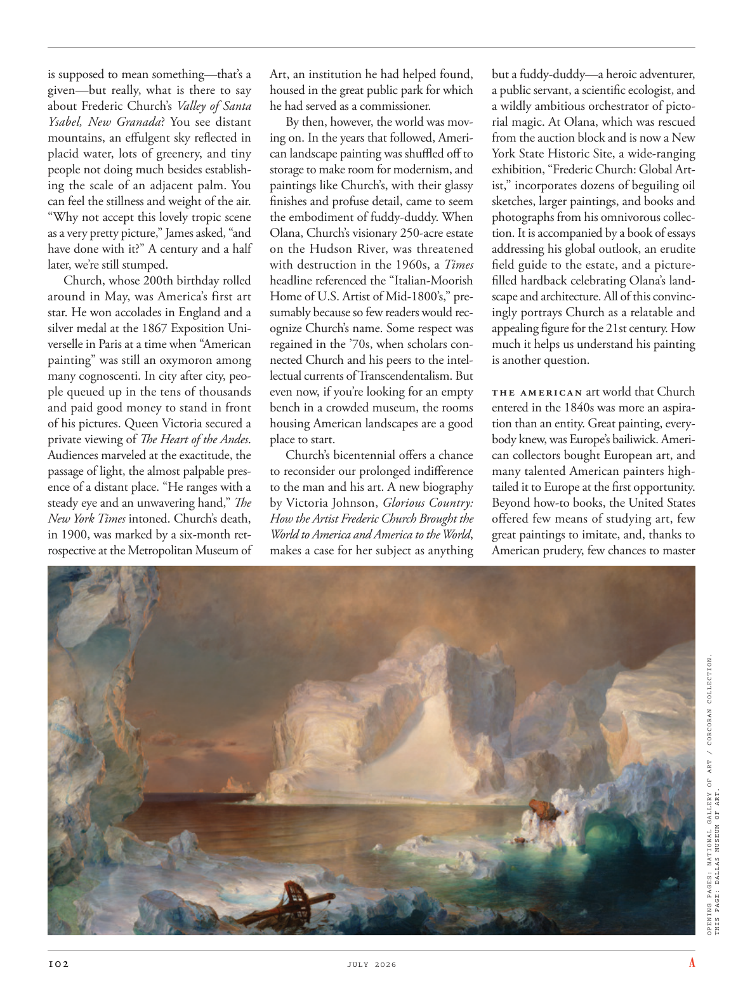

# The Atlantic — July 2026

## Page 104

---

is supposed to mean something— that’s a given— but really, what is there to say about Frederic Church’s Valley of Santa Ysabel, New Granada ? You see distant mountains, an effulgent sky reflected in placid water, lots of greenery, and tiny people not doing much besides establishing the scale of an adjacent palm. You can feel the stillness and weight of the air.

**【中文翻译】** 应该有某种意义——这是既定的——但实际上，关于新格拉纳达弗雷德里克教堂的圣伊莎贝尔谷有什么可说的呢？你会看到远处的山脉、波光粼粼的天空倒映在平静的水面上、大量的绿色植物，以及除了建立邻近棕榈树的规模之外没有做任何事情的小人物。你可以感受到空气的寂静和沉重。

“Why not accept this lovely tropic scene as a very pretty picture,” James asked, “and have done with it?” A century and a half later, we’re still stumped.

**【中文翻译】** “为什么不把这可爱的热带风光当作一幅非常美丽的图画来接受，”詹姆斯问道，“然后就结束了呢？”一个半世纪过去了，我们仍然感到困惑。

Church, whose 200th birthday rolled around in May, was America’s first art star. He won accolades in England and a silver medal at the 1867 Exposition Universelle in Paris at a time when “American painting” was still an oxymoron among many cognoscenti. In city after city, people queued up in the tens of thousands and paid good money to stand in front of his pictures. Queen Victoria secured a private viewing of The Heart of the Andes .

**【中文翻译】** 丘奇五月迎来了 200 岁生日，他是美国第一位艺术明星。他在英国赢得了赞誉，并在 1867 年巴黎世界博览会上获得银牌，当时“美国绘画”在许多行家中仍然是一个矛盾的说法。在一个又一个的城市里，成千上万的人们排着长队，花大价钱站在他的画前。维多利亚女王获得了对安第斯山脉之心的私人参观。

Audiences marveled at the exactitude, the passage of light, the almost palpable presence of a distant place. “He ranges with a steady eye and an unwavering hand,” The New York Times intoned. Church’s death, in 1900, was marked by a six-month retrospective at the Metropolitan Museum of Art, an institution he had helped found, housed in the great public park for which he had served as a commissioner.

**【中文翻译】** 观众惊叹于它的精确性、光线的传递以及遥远地方的几乎明显的存在。 “他目光坚定，手坚定不移，”《纽约时报》吟诵道。 1900 年，丘奇去世，大都会艺术博物馆为他举办了为期六个月的回顾展，这是他帮助创建的一个机构，坐落在他曾担任专员的大公园里。

By then, however, the world was moving on. In the years that followed, American landscape painting was shuffled off to storage to make room for modernism, and paintings like Church’s, with their glassy finishes and profuse detail, came to seem the embodiment of fuddyduddy. When Olana, Church’s visionary 250-acre estate on the Hudson River, was threatened with destruction in the 1960s, a Times headline referenced the “Italian‐Moorish Home of U.S. Artist of Mid‐1800’s,” presumably because so few readers would recognize Church’s name. Some respect was regained in the ’70s, when scholars connected Church and his peers to the intellectual currents of Transcendentalism. But even now, if you’re looking for an empty bench in a crowded museum, the rooms housing American landscapes are a good place to start.

**【中文翻译】** 然而，到那时，世界正在继续前进。在接下来的几年里，美国风景画被转移到储藏室，为现代主义腾出空间，而像丘奇这样的画作，以其玻璃般的表面和丰富的细节，似乎是古板的化身。 20 世纪 60 年代，当丘奇在哈德逊河上拥有 250 英亩的富有远见的庄园奥拉纳 (Olana) 受到破坏的威胁时，《泰晤士报》的一个标题提到了“1800 年代中期美国艺术家的意大利摩尔人之家”，大概是因为很少有读者会认出丘奇的名字。 20世纪70年代，当学者们将丘奇和他的同辈人与超验主义的思想潮流联系起来时，人们重新获得了一些尊重。但即使是现在，如果您想在拥挤的博物馆中寻找一张空长凳，展示美国风景的房间也是一个不错的起点。

Church’s bicentennial offers a chance to reconsider our prolonged indifference to the man and his art. A new biography by Victoria Johnson, Glorious Country: How the Artist Frederic Church Brought the World to America and America to the World , makes a case for her subject as anything but a fuddy-duddy—a heroic adventurer, a public servant, a scientific ecologist, and a wildly ambitious orchestrator of pictorial magic. At Olana, which was rescued from the auction block and is now a New York State Historic Site, a wide-ranging exhibition, “Frederic Church: Global Artist,” incorporates dozens of beguiling oil sketches, larger paintings, and books and photographs from his omnivorous collection. It is accompanied by a book of essays addressing his global outlook, an erudite field guide to the estate, and a picturefilled hardback celebrating Olana’s landscape and architecture. All of this convincingly portrays Church as a relatable and appealing figure for the 21st century. How much it helps us understand his painting is another question.

**【中文翻译】** 教堂二百周年纪念提供了一个机会，让我们重新思考我们长期以来对这个人和他的艺术的漠不关心。维多利亚·约翰逊 (Victoria Johnson) 的新传记《光荣的国度：艺术家弗雷德里克·丘奇 (Frederic Church) 如何将世界带入美国，将美国带向世界》(Glorious Country: How the Artist Frederic Church 如何将世界带入美国，将美国带入世界)，书中阐述了她的主题绝非古板的人物——英雄的冒险家、公务员、科学生态学家和野心勃勃的图画魔术策划者。奥拉纳 (Olana) 从拍卖区被抢救出来，现已成为纽约州历史遗址，在这里，一场内容广泛的展览“弗雷德里克·丘奇：全球艺术家”(Frederic Church: Global Artist) 展出了数十幅令人着迷的油画素描、大型画作以及来自他杂货收藏的书籍和照片。本书还附有一本阐述他的全球视野的论文集、一本博学的庄园实地指南，以及一本赞美奥拉纳景观和建筑的图画精装本。所有这一切都令人信服地将丘奇描绘成21世纪一个令人产生共鸣且有吸引力的人物。它对我们理解他的画有多大帮助是另一个问题。

The American art world that Church entered in the 1840s was more an aspiration than an entity. Great painting, everybody knew, was Europe’s bailiwick. American collectors bought European art, and many talented American painters hightailed it to Europe at the first opportunity.

**【中文翻译】** 丘奇在 1840 年代进入的美国艺术界与其说是一个实体，不如说是一种愿望。众所周知，伟大的绘画是欧洲的管辖区。美国收藏家购买欧洲艺术品，许多才华横溢的美国画家一有机会就将其带到了欧洲。

Beyond how-to books, the United States offered few means of studying art, few great paintings to imitate, and, thanks to American prudery, few chances to master OPENING PAGES: NATIONAL GALLERY OF ART / CORCORAN COLLECTION. THIS PAGE: DALLAS MUSEUM OF ART.

**【中文翻译】** 除了指导书籍之外，美国几乎没有提供学习艺术的手段，也没有什么伟大的画作可以模仿，而且，由于美国人的拘谨，几乎没有机会掌握《国家美术馆/科克伦收藏》的开篇。本页：达拉斯艺术博物馆。
