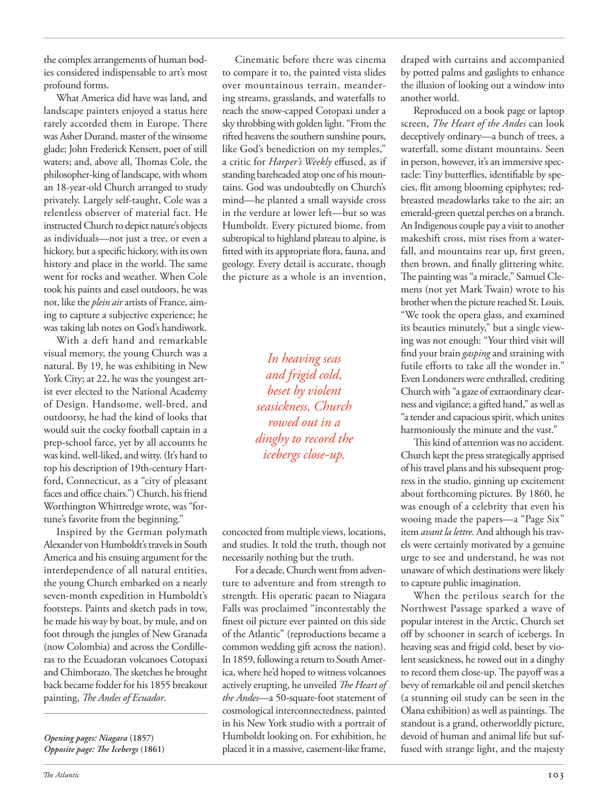

# The Atlantic — July 2026

## Page 105

---

the complex arrangements of human bodies considered indispensable to art’s most profound forms. What America did have was land, and landscape painters enjoyed a status here rarely accorded them in Europe. There was Asher Durand, master of the winsome glade; John Frederick Kensett, poet of still waters; and, above all, Thomas Cole, the philosopher-king of landscape, with whom an 18-year-old Church arranged to study privately. Largely self-taught, Cole was a relentless observer of material fact. He instructed Church to depict nature’s objects as individuals— not just a tree, or even a hickory, but a specific hickory, with its own history and place in the world. The same went for rocks and weather. When Cole took his paints and easel outdoors, he was not, like the plein air artists of France, aiming to capture a subjective experience; he was taking lab notes on God’s handiwork.

**【中文翻译】** 人体的复杂排列被认为是最深刻的艺术形式所不可或缺的。美国所拥有的是土地，风景画家在这里享有欧洲很少有的地位。那里有阿舍尔·杜兰德（Asher Durand），他是迷人林间空地的主人。约翰·弗雷德里克·肯塞特，静水诗人；最重要的是托马斯·科尔（Thomas Cole），他是景观哲学家，一位 18 岁的教会安排他与他私下学习。科尔很大程度上是自学成才，他是物质事实的不懈观察者。他指示丘奇将自然物体描绘成个体——不仅仅是一棵树，甚至不是一棵山核桃，而是一棵特定的山核桃，有它自己的历史和在世界上的地位。岩石和天气也是如此。当科尔把他的颜料和画架带到户外时，他并不像法国的户外艺术家那样，旨在捕捉主观体验；他的目的是捕捉主观体验。他正在记录上帝的杰作的实验室笔记。

With a deft hand and remarkable visual memory, the young Church was a natural. By 19, he was exhibiting in New York City; at 22, he was the youngest artist ever elected to the National Academy of Design. Handsome, well-bred, and outdoorsy, he had the kind of looks that would suit the cocky football captain in a prep-school farce, yet by all accounts he was kind, well-liked, and witty. (It’s hard to top his description of 19th-century Hartford, Connecticut, as a “city of pleasant faces and office chairs.”) Church, his friend Worthington Whittredge wrote, was “fortune’s favorite from the beginning.”

**【中文翻译】** 凭借灵巧的双手和非凡的视觉记忆，这座年轻的教堂是天生的。 19 岁时，他在纽约举办展览； 22 岁时，他成为有史以来入选国家设计学院的最年轻的艺术家。他英俊、有教养、热爱户外活动，他的外貌很适合预科学校闹剧中傲慢的足球队长，但大家都认为他很善良、很受欢迎，而且很机智。 （他对 19 世纪康涅狄格州哈特福德的描述是“一座充满令人愉快的面孔和办公椅的城市”，这是难以言表的。）他的朋友沃辛顿·惠特里奇写道，教堂“从一开始就是财富的宠儿”。

Inspired by the German polymath Alexander von Humboldt’s travels in South America and his ensuing argument for the interdependence of all natural entities, the young Church embarked on a nearly seven-month expedition in Humboldt’s footsteps. Paints and sketch pads in tow, he made his way by boat, by mule, and on foot through the jungles of New Granada (now Colombia) and across the Cordilleras to the Ecuadoran volcanoes Cotopaxi and Chimborazo. The sketches he brought back became fodder for his 1855 breakout painting, The Andes of Ecuador .

**【中文翻译】** 受到德国博学者亚历山大·冯·洪堡的南美洲旅行以及他随后提出的所有自然实体相互依存的论点的启发，年轻的教会追随洪堡的脚步开始了近七个月的探险。他带着颜料和素描本，乘船、骑骡子和步行穿过新格拉纳达（现哥伦比亚）的丛林，穿过科迪勒拉山脉，到达厄瓜多尔的科托帕西火山和钦博拉索火山。他带回的草图成为他 1855 年突破性画作《厄瓜多尔的安第斯山脉》的素材。

Opening pages: Niagara (1857) Opposite page: The Icebergs (1861) Cinematic before there was cinema to compare it to, the painted vista slides over mountainous terrain, meandering streams, grasslands, and waterfalls to reach the snow-capped Cotopaxi under a sky throbbing with golden light. “From the rifted heavens the southern sunshine pours, like God’s benediction on my temples,” a critic for Harper’s Weekly effused, as if standing bareheaded atop one of his mountains. God was undoubtedly on Church’s mind— he planted a small wayside cross in the verdure at lower left—but so was Humboldt. Every pictured biome, from subtropical to highland plateau to alpine, is fitted with its appropriate flora, fauna, and geology. Every detail is accurate, though the picture as a whole is an invention, In heaving seas and frigid cold, beset by violent seasickness, Church rowed out in a dinghy to record the icebergs close-up.

**【中文翻译】** 开页：《尼亚加拉》（1857 年） 对页：《冰山》（1861 年） 电影出现之前，没有电影可以与之比较，画中的远景滑过山区、蜿蜒的溪流、草原和瀑布，到达白雪皑皑的科托帕西，天空闪烁着金色的光芒。 “南方的阳光从裂开的天空倾泻而下，就像上帝对我太阳穴的祝福，”《哈珀周刊》的一位评论家滔滔不绝地说道，仿佛光着头站在他的一座山峰上。毫无疑问，上帝在丘奇的脑海中——他在左下角的绿地里种下了一个路边的小十字架——但洪堡也是如此。图中的每一个生物群落，从亚热带到高原再到高山，都有其适当的植物群、动物群和地质特征。每一个细节都准确无误，尽管整个画面是虚构的。 在汹涌的大海和寒冷的天气里，丘奇被剧烈的晕船困扰，划着小艇去记录冰山的特写。

concocted from multiple views, locations, and studies. It told the truth, though not necessarily nothing but the truth. For a decade, Church went from adventure to adventure and from strength to strength. His operatic paean to Niagara Falls was proclaimed “incontestably the finest oil picture ever painted on this side of the Atlantic” (reproductions became a common wedding gift across the nation).

**【中文翻译】** 根据多种观点、地点和研究炮制而成。它说的是真话，虽然不一定只是真话。十年来，丘奇不断冒险，不断壮大。他对尼亚加拉大瀑布的歌剧赞歌被认为是“毫无争议的大西洋这一岸有史以来最精美的油画”（复制品成为全国各地常见的结婚礼物）。

In 1859, following a return to South America, where he’d hoped to witness volcanoes actively erupting, he unveiled The Heart of the Andes — a 50-square-foot statement of cosmological interconnectedness, painted in his New York studio with a portrait of Humboldt looking on. For exhibition, he placed it in a massive, casement-like frame, draped with curtains and accompanied by potted palms and gaslights to enhance the illusion of looking out a window into another world.

**【中文翻译】** 1859 年，他回到南美，希望在那里亲眼目睹火山的活跃喷发，随后他揭开了《安第斯山脉之心》的面纱——这是一幅 50 平方英尺的宇宙相互关联性声明，在他位于纽约的工作室里画了一幅洪堡的肖像画。为了展览，他将其放置在一个巨大的平开式框架中，挂上窗帘，并配以盆栽棕榈树和煤气灯，以增强从窗外望向另一个世界的错觉。

Reproduced on a book page or laptop screen, The Heart of the Andes can look deceptively ordinary—a bunch of trees, a waterfall, some distant mountains. Seen in person, however, it’s an immersive spectacle: Tiny butterflies, identifiable by species, flit among blooming epiphytes; redbreasted meadowlarks take to the air; an emerald-green quetzal perches on a branch.

**【中文翻译】** 再现在书页或笔记本电脑屏幕上的《安第斯山脉之心》看起来看似平凡——一堆树、一个瀑布、一些遥远的山脉。然而，亲眼所见，这是一个身临其境的奇观：按物种可识别的小蝴蝶在盛开的附生植物中飞舞；红胸草地鹨飞向空中；一只翠绿色的绿咬鹃栖息在树枝上。

An Indigenous couple pay a visit to another makeshift cross, mist rises from a waterfall, and mountains rear up, first green, then brown, and finally glittering white.

**【中文翻译】** 一对土著夫妇参观了另一个临时十字架，薄雾从瀑布升起，山脉拔地而起，先是绿色，然后是棕色，最后是闪闪发光的白色。

The painting was “a miracle,” Samuel Clemens (not yet Mark Twain) wrote to his brother when the picture reached St. Louis. “We took the opera glass, and examined its beauties minutely,” but a single viewing was not enough: “Your third visit will find your brain gasping and straining with futile efforts to take all the wonder in.”

**【中文翻译】** 当这幅画到达圣路易斯时，塞缪尔·克莱门斯（当时还不是马克·吐温）在给他兄弟的信中写道，这幅画是“一个奇迹”。 “我们拿起歌剧镜，仔细地观察了它的美丽，”但单次观看是不够的：“你的第三次访问会发现你的大脑喘不过气来，徒劳地努力吸收所有的奇迹。”

Even Londoners were enthralled, crediting Church with “a gaze of extraordinary clearness and vigilance; a gifted hand,” as well as “a tender and capacious spirit, which unites harmoniously the minute and the vast.”

**【中文翻译】** 就连伦敦人也被迷住了，称赞丘奇拥有“异常清晰和警惕的目光、一双天才的双手”以及“将微小与广阔和谐地结合在一起的温柔而广阔的精神”。

This kind of attention was no accident. Church kept the press strategically apprised of his travel plans and his subsequent progress in the studio, ginning up excitement about forthcoming pictures. By 1860, he was enough of a celebrity that even his wooing made the papers— a “Page Six ” item avant la lettre . And although his travels were certainly motivated by a genuine urge to see and understand, he was not unaware of which destinations were likely to capture public imagination.

**【中文翻译】** 这种关注并非偶然。丘奇有策略地向媒体通报他的旅行计划以及随后在工作室的进展，激起了人们对即将上映的电影的兴奋。到 1860 年，他已经成为名人，甚至他的求爱也上了报纸——“第六页”的前卫文章。尽管他的旅行无疑是出于想要看到和了解的真正渴望，但他并非不知道哪些目的地可能会激发公众的想象力。

When the perilous search for the Northwest Passage sparked a wave of popular interest in the Arctic, Church set off by schooner in search of icebergs. In heaving seas and frigid cold, beset by violent seasickness, he rowed out in a dinghy to record them close-up. The payoff was a bevy of remarkable oil and pencil sketches (a stunning oil study can be seen in the Olana exhibition) as well as paintings. The standout is a grand, otherworldly picture, devoid of human and animal life but suffused with strange light, and the majesty

**【中文翻译】** 当西北航道的危险搜寻引发了人们对北极的兴趣时，丘奇乘纵帆船出发去寻找冰山。在汹涌的海面和严寒的天气里，他被剧烈的晕船困扰，划着小艇去记录他们的特写镜头。回报是一系列出色的油画和铅笔素描（奥拉纳展览中可以看到令人惊叹的油画研究）以及绘画。最引人注目的是一幅宏伟的、超凡脱俗的图画，没有人类和动物的生命，但充满了奇怪的光线，而且威严
