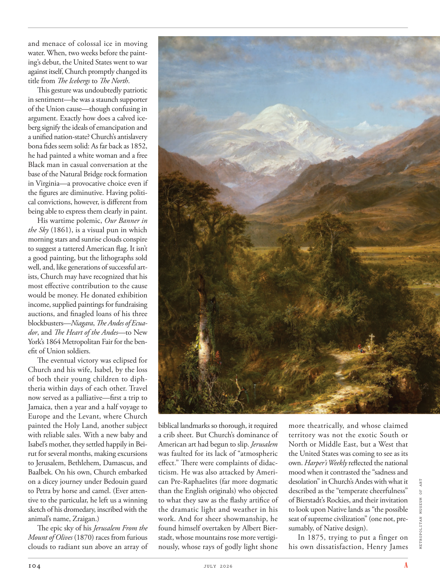

# The Atlantic — July 2026

## Page 106

---

and menace of colossal ice in moving water. When, two weeks before the painting’s debut, the United States went to war against itself, Church promptly changed its title from The Icebergs to The North .

**【中文翻译】** 以及流动水中巨大冰块的威胁。在这幅画首次亮相前两周，美国发动了内战，丘奇立即将其标题从《冰山》改为《北方》。

This gesture was undoubtedly patriotic in sentiment— he was a staunch supporter of the Union cause— though confusing in argument. Exactly how does a calved iceberg signify the ideals of emancipation and a unified nation-state? Church’s anti slavery bona fides seem solid: As far back as 1852, he had painted a white woman and a free Black man in casual conversation at the base of the Natural Bridge rock formation in Virginia— a provocative choice even if the figures are diminutive. Having political convictions, however, is different from being able to express them clearly in paint.

**【中文翻译】** 这一举动在情感上无疑是爱国的——他是联邦事业的坚定支持者——尽管其论点令人困惑。一座冰山的崩解究竟如何象征着解放和统一的民族国家的理想？丘奇的反奴隶制真诚似乎是坚定的：早在 1852 年，他就在弗吉尼亚州天然桥岩层的底部画了一名白人妇女和一名自由黑人男子的随意交谈——尽管人物很小，但这是一个具有挑衅性的选择。然而，拥有政治信念与能够在绘画中清楚地表达它们是不同的。

His wartime polemic, Our Banner in the Sky (1861), is a visual pun in which morning stars and sunrise clouds conspire to suggest a tattered American flag. It isn’t a good painting, but the lithographs sold well, and, like generations of successful artists, Church may have recognized that his most effective contribution to the cause would be money. He donated exhibition income, supplied paintings for fund raising auctions, and finagled loans of his three blockbusters— Niagara , The Andes of Ecuador , and The Heart of the Andes — to New York’s 1864 Metropolitan Fair for the benefit of Union soldiers.

**【中文翻译】** 他的战时论战《天空中的旗帜》（1861）是一个视觉双关语，其中晨星和日出云彩共同暗示着一面破烂的美国国旗。这不是一幅好画，但石版画卖得很好，而且，像几代成功的艺术家一样，丘奇可能已经认识到他对这一事业最有效的贡献就是金钱。他捐赠了展览收入，为筹款拍卖提供画作，并为了联邦士兵的利益，将他的三幅大片——《尼亚加拉》、《厄瓜多尔的安第斯山脉》和《安第斯山脉之心》——骗借给纽约的 1864 年大都会博览会。

The eventual victory was eclipsed for Church and his wife, Isabel, by the loss of both their young children to diphtheria within days of each other. Travel now served as a palliative—first a trip to Jamaica, then a year and a half voyage to Europe and the Levant, where Church painted the Holy Land, another subject with reliable sales. With a new baby and Isabel’s mother, they settled happily in Beirut for several months, making excursions to Jerusalem, Bethlehem, Damascus, and Baalbek. On his own, Church embarked on a dicey journey under Bedouin guard to Petra by horse and camel. (Ever attentive to the particular, he left us a winning sketch of his dromedary, inscribed with the animal’s name, Zraigan.) The epic sky of his Jerusalem From the Mount of Olives (1870) races from furious clouds to radiant sun above an array of biblical landmarks so thorough, it required a crib sheet. But Church’s dominance of American art had begun to slip. Jerusalem was faulted for its lack of “atmospheric effect.” There were complaints of didacticism. He was also attacked by American Pre-Raphaelites (far more dogmatic than the English originals) who objected to what they saw as the flashy artifice of the dramatic light and weather in his work. And for sheer showmanship, he found himself overtaken by Albert Bierstadt, whose mountains rose more vertiginously, whose rays of godly light shone more theatrically, and whose claimed territory was not the exotic South or North or Middle East, but a West that the United States was coming to see as its own. Harper’s Weekly reflected the national mood when it contrasted the “sadness and desolation” in Church’s Andes with what it METROPOLITAN MUSEUM OF ART described as the “temperate cheerfulness” of Bierstadt’s Rockies, and their invitation to look upon Native lands as “the possible seat of supreme civilization” (one not, presumably, of Native design). In 1875, trying to put a finger on his own dissatisfaction, Henry James

**【中文翻译】** 对于丘奇和他的妻子伊莎贝尔来说，最终的胜利黯然失色，因为他们的两个年幼的孩子相继在几天内死于白喉。现在，旅行成了一种缓解措施——首先是去牙买加，然后用一年半的时间前往欧洲和黎凡特，丘奇在那里画了圣地，这是另一个销量可靠的题材。带着新生婴儿和伊莎贝尔的母亲，他们在贝鲁特幸福地定居了几个月，并游览了耶路撒冷、伯利恒、大马士革和巴勒贝克。丘奇独自在贝都因人的看守下骑着马和骆驼踏上了前往佩特拉的危险旅程。 （他对细节十分关注，给我们留下了一幅关于他的单峰骆驼的获奖草图，上面刻有该动物的名字，Zraigan。）他的《从橄榄山上看耶路撒冷》（1870）中史诗般的天空从狂暴的云层到灿烂的阳光，在一系列圣经地标之上，如此彻底，需要一张婴儿床床单。但丘奇在美国艺术中的主导地位已经开始下滑。耶路撒冷因缺乏“大气效应”而受到指责。有人抱怨说教主义。他还受到美国前拉斐尔派（比英国原作更加教条）的攻击，他们反对他的作品中戏剧性的光线和天气的华而不实的技巧。就纯粹的表演技巧而言，他发现自己被阿尔伯特·比尔施塔特超越了，阿尔伯特·比尔施塔特的山脉更加耸立，他的神圣光芒更加戏剧化地闪耀，他所声称的领土不是异国情调的南部、北部或中东，而是美国逐渐将其视为自己的西部。 《哈珀周刊》将丘奇安第斯山脉的“悲伤和荒凉”与大都会艺术博物馆所描述的比尔施塔特落基山脉的“温和愉悦”进行了对比，并邀请他们将原住民土地视为“最高文明的可能所在地”（这可能不是原住民设计的所在地），从而反映了民族情绪。 1875 年，亨利·詹姆斯试图归咎于自己的不满。
