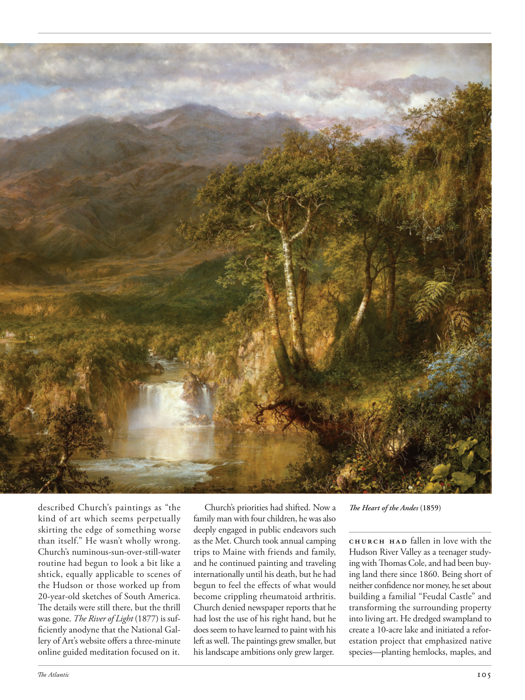

# The Atlantic — July 2026

## Page 107

---

described Church’s paintings as “the kind of art which seems perpetually skirting the edge of something worse than itself.” He wasn’t wholly wrong.

**【中文翻译】** 将丘奇的画作描述为“一种似乎永远在比自身更糟糕的事物边缘徘徊的艺术”。他并非完全错误。

Church’s numinous-sun-over-still-water routine had begun to look a bit like a shtick, equally applicable to scenes of the Hudson or those worked up from 20-year-old sketches of South America.

**【中文翻译】** 丘奇那神秘的太阳照在静水中的惯例开始看起来有点像一种小伎俩，同样适用于哈德逊河的场景或根据 20 年前的南美草图创作的场景。

The details were still there, but the thrill was gone. The River of Light (1877) is sufficiently anodyne that the National Gallery of Art’s website offers a three-minute online guided meditation focused on it.

**【中文翻译】** 细节还在，但兴奋感已经消失了。 《光之河》（1877）足够镇痛，国家美术馆的网站提供了一个三分钟的在线冥想指导。

Church’s priorities had shifted. Now a family man with four children, he was also deeply engaged in public endeavors such as the Met. Church took annual camping trips to Maine with friends and family, and he continued painting and traveling internationally until his death, but he had begun to feel the effects of what would become crippling rheumatoid arthritis.

**【中文翻译】** 教会的优先事项发生了变化。现在，他是一个有四个孩子的家庭男人，同时也积极参与大都会博物馆等公共事业。丘奇每年都会与朋友和家人一起去缅因州露营，他继续绘画和国际旅行，直到去世，但他已经开始感受到严重的类风湿性关节炎的影响。

Church denied newspaper reports that he had lost the use of his right hand, but he does seem to have learned to paint with his left as well. The paintings grew smaller, but his landscape ambitions only grew larger.

**【中文翻译】** 丘奇否认了报纸有关他失去右手的报道，但他似乎也学会了用左手绘画。画作变得越来越小，但他的风景画野心却越来越大。

The Heart of the Andes (1859) Church had fallen in love with the Hudson River Valley as a teenager studying with Thomas Cole, and had been buying land there since 1860. Being short of neither confidence nor money, he set about building a familial “Feudal Castle” and transforming the surrounding property into living art. He dredged swampland to create a 10-acre lake and initiated a reforestation project that emphasized native species—planting hemlocks, maples, and

**【中文翻译】** 《安第斯山脉之心》（1859） 教堂十几岁时跟随托马斯·科尔学习，就爱上了哈得逊河谷，并从 1860 年开始在那里购买土地。既不缺乏信心，也不缺乏资金，他开始建造一座家族的“封建城堡”，并将周围的财产改造成生活艺术。他疏浚了沼泽地，建造了一个 10 英亩的湖泊，并启动了一项强调本土物种的重新造林项目——种植铁杉、枫树和
