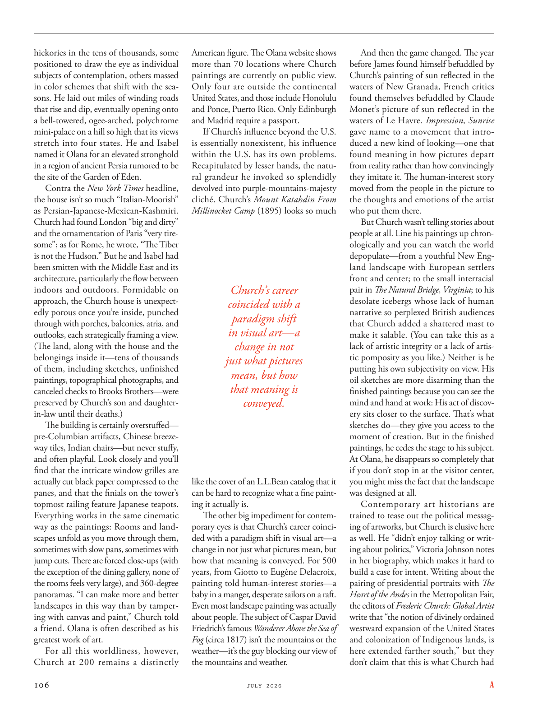

# The Atlantic — July 2026

## Page 108

---

hickories in the tens of thousands, some positioned to draw the eye as individual subjects of contemplation, others massed in color schemes that shift with the seasons. He laid out miles of winding roads that rise and dip, eventually opening onto a bell-towered, ogee-arched, polychrome mini-palace on a hill so high that its views stretch into four states. He and Isabel named it Olana for an elevated stronghold in a region of ancient Persia rumored to be the site of the Garden of Eden.

**【中文翻译】** 数以万计的山核桃树，其中一些作为单独的沉思主题吸引眼球，另一些则聚集在一起，呈现出随季节变化的配色方案。他铺设了绵延数英里的蜿蜒道路，蜿蜒起伏，最终通向一座钟楼、双拱形、彩色迷你宫殿，这座宫殿位于一座如此高的山上，可以看到四个州的景色。他和伊莎贝尔将其命名为“奥拉纳”，因为古波斯地区的一个高地要塞，据传是伊甸园的所在地。

Contra the New York Times headline, the house isn’t so much “ItalianMoorish” as PersianJapanese- MexicanKashmiri. Church had found London “big and dirty” and the ornamentation of Paris “very tiresome”; as for Rome, he wrote, “The Tiber is not the Hudson.” But he and Isabel had been smitten with the Middle East and its architecture, particularly the flow between indoors and outdoors. Formidable on approach, the Church house is unexpectedly porous once you’re inside, punched through with porches, balconies, atria, and outlooks, each strategically framing a view.

**【中文翻译】** 与《纽约时报》的标题相反，这座房子与其说是“意大利摩尔式”，不如说是波斯、日本-墨西哥克什米尔风格。丘奇发现伦敦“又大又脏”，而巴黎的装饰“非常令人厌烦”。至于罗马，他写道：“台伯河不是哈德逊河。”但他和伊莎贝尔对中东及其建筑着迷，尤其是室内和室外之间的流动。教堂的门廊、阳台、中庭和景观贯穿其中，每一个都巧妙地构成了一个景观。

(The land, along with the house and the belongings inside it—tens of thousands of them, including sketches, unfinished paintings, topographical photographs, and canceled checks to Brooks Brothers—were preserved by Church’s son and daughterin-law until their deaths.) The building is certainly overstuffed— pre-Columbian artifacts, Chinese breezeway tiles, Indian chairs— but never stuffy, and often playful. Look closely and you’ll find that the intricate window grilles are actually cut black paper compressed to the panes, and that the finials on the tower’s topmost railing feature Japanese teapots.

**【中文翻译】** （丘奇的儿子和儿媳一直保存着这片土地，连同房子和里面的物品——数以万计的物品，包括草图、未完成的画作、地形照片和布鲁克斯兄弟的取消支票——直到他们去世为止。）这座建筑确实塞满了——前哥伦布时代的文物、中国的走廊瓷砖、印度的椅子——但从不古板，而且常常很有趣。仔细观察，您会发现错综复杂的窗花实际上是用切割的黑纸压缩到玻璃上的，塔楼最顶部栏杆上的顶饰是日本茶壶。

Everything works in the same cinematic way as the paintings: Rooms and landscapes unfold as you move through them, sometimes with slow pans, sometimes with jump cuts. There are forced close-ups (with the exception of the dining gallery, none of the rooms feels very large), and 360degree panoramas. “I can make more and better landscapes in this way than by tampering with canvas and paint,” Church told a friend. Olana is often described as his greatest work of art.

**【中文翻译】** 一切都以与绘画相同的电影方式进行：房间和风景在你穿过它们时展开，有时是缓慢的平移，有时是跳切。有强迫特写（除了餐厅廊外，没有一个房间感觉很大），还有360度全景。 “与篡改画布和颜料相比，我可以通过这种方式制作更多更好的风景画，”丘奇告诉一位朋友。奥拉纳经常被描述为他最伟大的艺术作品。

For all this worldliness, however, Church at 200 remains a distinctly American figure. The Olana website shows more than 70 locations where Church paintings are currently on public view.

**【中文翻译】** 然而，尽管如此世俗，200 岁的丘奇仍然是一个明显的美国人物。 Olana 网站显示了目前公众可以看到的 70 多个教堂绘画地点。

Only four are outside the continental United States, and those include Honolulu and Ponce, Puerto Rico. Only Edinburgh and Madrid require a passport.

**【中文翻译】** 只有四个位于美国大陆之外，其中包括檀香山和波多黎各的庞塞。只有爱丁堡和马德里需要护照。

If Church’s influence beyond the U.S. is essentially nonexistent, his influence within the U.S. has its own problems. Recapitulated by lesser hands, the natural grandeur he invoked so splendidly devolved into purple-mountains-majesty cliché. Church’s Mount Katahdin From Millinocket Camp (1895) looks so much Church’s career coincided with a paradigm shift in visual art—a change in not just what pictures mean, but how that meaning is conveyed.

**【中文翻译】** 如果说丘奇在美国以外的影响力基本上不存在，那么他在美国国内的影响力也有其自身的问题。他如此精彩地描绘的自然雄伟，在少数人的再现下，却变成了紫山雄伟的陈词滥调。丘奇的《来自米利诺基特营地的卡塔丁山》（1895）看起来很像丘奇的职业生涯恰逢视觉艺术范式的转变——不仅改变了图片的含义，而且改变了这种意义的传达方式。

like the cover of an L.L.Bean catalog that it can be hard to recognize what a fine painting it actually is. The other big impediment for contemporary eyes is that Church’s career coincided with a paradigm shift in visual art—a change in not just what pictures mean, but how that meaning is conveyed. For 500 years, from Giotto to Eugène Delacroix, painting told human-interest stories— a baby in a manger, desperate sailors on a raft.

**【中文翻译】** 就像 L.L.Bean 目录的封面一样，很难认出它实际上是一幅多么精美的画作。现代人眼中的另一个大障碍是，丘奇的职业生涯恰逢视觉艺术范式的转变——不仅改变了图片的含义，而且改变了这种意义的传达方式。 500 年来，从乔托到欧仁·德拉克洛瓦，绘画一直在讲述充满人文关怀的故事——马槽里的婴儿、木筏上绝望的水手。

Even most landscape painting was actually about people. The subject of Caspar David Friedrich’s famous Wanderer Above the Sea of Fog (circa 1817) isn’t the mountains or the weather—it’s the guy blocking our view of the mountains and weather.

**【中文翻译】** 甚至大多数山水画实际上都是关于人的。卡斯帕·大卫·弗里德里希 (Caspar David Friedrich) 著名的《雾海之上的流浪者》（约 1817 年）的主题不是山脉或天气，而是挡住我们视线的山脉和天气的人。

And then the game changed. The year before James found himself befuddled by Church’s painting of sun reflected in the waters of New Granada, French critics found themselves befuddled by Claude Monet’s picture of sun reflected in the waters of Le Havre. Impression, Sunrise gave name to a movement that introduced a new kind of looking— one that found meaning in how pictures depart from reality rather than how convincingly they imitate it. The human-interest story moved from the people in the picture to the thoughts and emotions of the artist who put them there.

**【中文翻译】** 然后游戏发生了变化。在詹姆斯发现自己对丘奇的新格拉纳达水中倒映的太阳画感到困惑的前一年，法国评论家发现自己对克劳德·莫奈的勒阿弗尔水中倒映的太阳画感到困惑。 《印象》、《日出》为一场引入了一种新的观看方式的运动命名，这种观看方式的意义在于图片如何脱离现实，而不是它们如何令人信服地模仿现实。人性化的故事从画面中的人转移到了将他们放在那里的艺术家的思想和情感。

But Church wasn’t telling stories about people at all. Line his paintings up chronologically and you can watch the world depopulate— from a youthful New England landscape with European settlers front and center; to the small interracial pair in The Natural Bridge, Virginia ; to his desolate icebergs whose lack of human narrative so perplexed British audiences that Church added a shattered mast to make it salable. (You can take this as a lack of artistic integrity or a lack of artistic pomposity as you like.) Neither is he putting his own subjectivity on view. His oil sketches are more disarming than the finished paintings because you can see the mind and hand at work: His act of discovery sits closer to the surface. That’s what sketches do— they give you access to the moment of creation. But in the finished paintings, he cedes the stage to his subject.

**【中文翻译】** 但丘奇根本没有讲关于人的故事。按时间顺序排列他的画作，你可以看到世界人口的减少——从年轻的新英格兰风景到欧洲定居者的前线和中心；从年轻的新英格兰风景到欧洲定居者的前线和中心；弗吉尼亚州天然桥的一对跨种族小情侣；荒凉的冰山缺乏人性化的叙述，这让英国观众感到困惑，以至于丘奇添加了一根破碎的桅杆以使其畅销。 （你可以认为这是缺乏艺术完整性或缺乏艺术浮夸。）他也没有表现出自己的主观性。他的油画素描比成品画更让人放心，因为你可以看到工作中的思想和双手：他的发现行为更接近表面。这就是草图的作用——它们让你进入创作的时刻。但在完成的画作中，他将舞台让给了他的主题。

At Olana, he disappears so completely that if you don’t stop in at the visitor center, you might miss the fact that the landscape was designed at all.

**【中文翻译】** 在奥拉纳，他完全消失了，如果你不在游客中心停留，你可能会错过景观设计的事实。

Contemporary art historians are trained to tease out the political messaging of artworks, but Church is elusive here as well. He “didn’t enjoy talking or writing about politics,” Victoria Johnson notes in her biography, which makes it hard to build a case for intent. Writing about the pairing of presidential portraits with The Heart of the Andes in the Metropolitan Fair, the editors of Frederic Church: Global Artist write that “the notion of divinely ordained westward expansion of the United States and colonization of Indigenous lands, is here extended farther south,” but they don’t claim that this is what Church had

**【中文翻译】** 当代艺术史学家受过训练，能够梳理艺术品的政治信息，但丘奇在这里也难以捉摸。维多利亚·约翰逊在她的传记中指出，他“不喜欢谈论或撰写政治”，这使得很难证明其意图。 《弗雷德里克·丘奇：全球艺术家》的编辑在写关于大都会博览会上总统肖像与安第斯山脉之心的配对时写道，“神圣命定的美国向西扩张和土著土地殖民化的概念在这里延伸到了更南边”，但他们并没有声称这就是丘奇所拥有的
