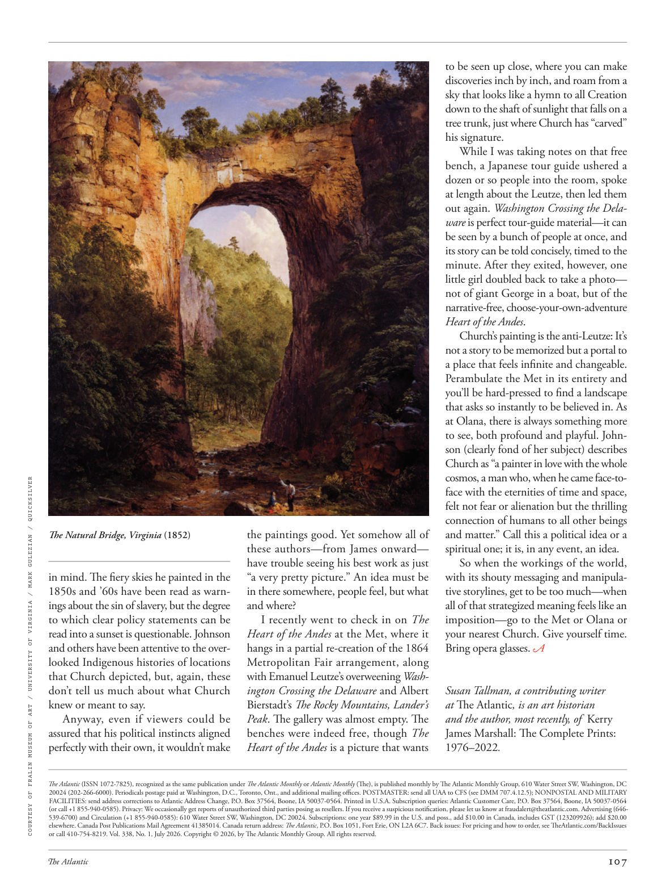

# The Atlantic — July 2026

## Page 109

---

*COURTESY OF FRALIN MUSEUM OF ART / UNIVERSITY OF VIRGINIA / MARK GULEZIAN / QUICKSILVER*

*【图注与署名】由弗拉林艺术博物馆 / 弗吉尼亚大学 / MARK GULEZIAN / QUICKSILVER 提供*

The Natural Bridge, Virginia (1852) in mind. The fiery skies he painted in the 1850s and ’60s have been read as warnings about the sin of slavery, but the degree to which clear policy statements can be read into a sunset is questionable. Johnson and others have been attentive to the overlooked Indigenous histories of locations that Church depicted, but, again, these don’t tell us much about what Church knew or meant to say.

**【中文翻译】** 弗吉尼亚州天然桥（1852 年）。他在 1850 年代和 60 年代描绘的火热天空被解读为对奴隶制罪恶的警告，但清晰的政策声明在多大程度上可以被解读为日落是值得怀疑的。约翰逊和其他人一直关注丘奇所描绘的被忽视的地点的土著历史，但是，这些并没有告诉我们太多关于丘奇所知道或想说的话。

Anyway, even if viewers could be assured that his political instincts aligned perfectly with their own, it wouldn’t make The Atlantic (ISSN 1072-7825), recognized as the same publication under The Atlantic Monthly or Atlantic Monthly (The), is published monthly by The Atlantic Monthly Group, 610 Water Street SW, Washington, DC 20024 (202-266-6000). Periodicals postage paid at Washington, D.C., Toronto, Ont., and additional mailing offices. POSTMASTER: send all UAA to CFS (see DMM 707.4.12.5); NONPOSTAL AND MILITARY FACILITIES: send address corrections to Atlantic Address Change, P.O. Box 37564, Boone, IA 50037-0564. Printed in U.S.A. Subscription queries: Atlantic Customer Care, P.O. Box 37564, Boone, IA 50037-0564 (or call +1 855-940-0585). Privacy: We occasionally get reports of unauthorized third parties posing as resellers. If you receive a suspicious notification, please let us know at fraudalert@theatlantic.com. Advertising (646539-6700) and Circulation (+1 855-940-0585): 610 Water Street SW, Washington, DC 20024. Subscriptions: one year $89.99 in the U.S. and poss., add $10.00 in Canada, includes GST (123209926); add $20.00 elsewhere. Canada Post Publications Mail Agreement 41385014. Canada return address: The Atlantic , P.O. Box 1051, Fort Erie, ON L2A 6C7. Back issues: For pricing and how to order, see TheAtlantic.com/BackIssues or call 410-754-8219. Vol. 338, No. 1, July 2026. Copyright © 2026, by The Atlantic Monthly Group. All rights reserved. the paintings good. Yet somehow all of these authors— from James onward— have trouble seeing his best work as just “a very pretty picture.” An idea must be in there somewhere, people feel, but what and where?

**【中文翻译】** 无论如何，即使观众确信他的政治本能与他们自己的政治本能完全一致，也不会让《大西洋月刊》（ISSN 1072-7825）（被认为是《大西洋月刊》或《大西洋月刊》（The）下的同一出版物）每月由《大西洋月刊集团》出版，地址：610 Water Street SW, Washington, DC 20024 (202-266-6000)。期刊邮资在华盛顿特区、安大略省多伦多和其他邮局支付。 POSTMASTER：将所有UAA发送至CFS（参见DMM 707.4.12.5）；非邮政和军事设施：将地址更正发送至 Atlantic Address Change, P.O.信箱 37564，布恩，IA 50037-0564。美国印刷 订阅查询：Atlantic Customer Care，P.O. Box 37564, Boone, IA 50037-0564（或致电 +1 855-940-0585）。隐私：我们偶尔会收到未经授权的第三方冒充经销商的报告。如果您收到可疑通知，请通过fraudalert@theatlantic.com告知我们。广告 (646539-6700) 和流通 (+1 855-940-0585)：610 Water Street SW, Washington, DC 20024。订阅：美国一年 89.99 美元，加拿大另加 10.00 美元，包括商品及服务税 (123209926)；其他地方加 20.00 美元。加拿大邮政出版物邮寄协议 41385014。加拿大回邮地址：The Atlantic , P.O.信箱 1051，伊利堡，ON L2A 6C7。过刊：有关定价和订购方式，请访问 TheAtlantic.com/BackIssues 或致电 410-754-8219。卷。 338，第 1 期，2026 年 7 月。版权所有 © 2026，大西洋月刊集团。版权所有。画不错。然而不知何故，所有这些作者——从詹姆斯开始——都很难将他最好的作品仅仅视为“一幅非常漂亮的图画”。人们觉得，一个想法一定存在于某个地方，但是什么、在哪里呢？

I recently went to check in on The Heart of the Andes at the Met, where it hangs in a partial re-creation of the 1864 Metropolitan Fair arrangement, along with Emanuel Leutze’s overweening Washington Crossing the Delaware and Albert Bierstadt’s The Rocky Mountains, Lander’s Peak . The gallery was almost empty. The benches were indeed free, though The Heart of the Andes is a picture that wants to be seen up close, where you can make discoveries inch by inch, and roam from a sky that looks like a hymn to all Creation down to the shaft of sunlight that falls on a tree trunk, just where Church has “carved” his signature.

**【中文翻译】** 我最近去大都会艺术博物馆参观了《安第斯山脉的心脏》，那里悬挂着对 1864 年大都会博览会布置的部分再现，还有伊曼纽尔·洛伊茨 (Emanuel Leutze) 傲慢的《华盛顿穿越特拉华》和阿尔伯特·比尔施塔特 (Albert Bierstadt) 的《落基山脉，兰德峰》。画廊几乎空无一人。长椅确实是免费的，尽管《安第斯山脉的心脏》是一幅需要近距离观看的画作，在那里你可以一寸一寸地发现，从看起来像是一首对所有造物的赞美诗的天空漫游到落在树干上的阳光，就在丘奇“刻下”他的签名的地方。

While I was taking notes on that free bench, a Japanese tour guide ushered a dozen or so people into the room, spoke at length about the Leutze, then led them out again. Washington Crossing the Delaware is perfect tour-guide material— it can be seen by a bunch of people at once, and its story can be told concisely, timed to the minute. After they exited, however, one little girl doubled back to take a photo— not of giant George in a boat, but of the narrative-free, choose-your-own-adventure Heart of the Andes .

**【中文翻译】** 当我在那条空闲的长凳上做笔记时，一位日本导游带着十几个人走进房间，详细地谈论了洛伊茨，然后又把他们带了出去。 《华盛顿横渡特拉华河》是完美的导游材料——它可以同时被一群人看到，它的故事可以简洁地讲述，而且时间精确。然而，在他们离开后，一个小女孩回头拍了一张照片——不是在船上的巨人乔治，而是在安第斯山脉的中心，不讲故事、选择你自己的冒险。

Church’s painting is the anti-Leutze: It’s not a story to be memorized but a portal to a place that feels infinite and changeable. Perambulate the Met in its entirety and you’ll be hard-pressed to find a landscape that asks so instantly to be believed in. As at Olana, there is always something more to see, both profound and playful. Johnson (clearly fond of her subject) describes Church as “a painter in love with the whole cosmos, a man who, when he came face-toface with the eternities of time and space, felt not fear or alienation but the thrilling connection of humans to all other beings and matter.” Call this a political idea or a spiritual one; it is, in any event, an idea.

**【中文翻译】** 丘奇的画作是反洛伊茨的：它不是一个需要记住的故事，而是通往一个感觉无限和多变的地方的门户。全面巡视大都会博物馆，您将很难找到一处如此令人立即相信的景观。就像在奥拉纳一样，总有更多东西值得一看，既深刻又有趣。约翰逊（显然喜欢她的主题）将丘奇描述为“一位热爱整个宇宙的画家，当他面对永恒的时间和空间时，他感到的不是恐惧或疏远，而是人类与所有其他存在和物质的令人兴奋的联系。”称其为政治理念或精神理念；无论如何，这只是一个想法。

So when the workings of the world, with its shouty messaging and manipulative storylines, get to be too much—when all of that strategized meaning feels like an imposition—go to the Met or Olana or your nearest Church. Give yourself time.

**【中文翻译】** 因此，当世界的运作方式及其喧闹的信息和操纵性的故事情节变得太多时——当所有这些战略意义感觉像是强加的时候——去大都会博物馆或奥拉纳或离你最近的教堂。给自己一点时间。

Bring opera glasses. Susan Tallman, a contributing writer at The Atlantic , is an art historian and the author, most recently, of Kerry James Marshall: The Complete Prints: 1976–2022 .

**【中文翻译】** 带上歌剧眼镜。苏珊·托尔曼（Susan Tallman）是《大西洋月刊》的特约撰稿人，也是一位艺术史学家，最近出版了《克里·詹姆斯·马歇尔：完整版画：1976-2022》一书。
