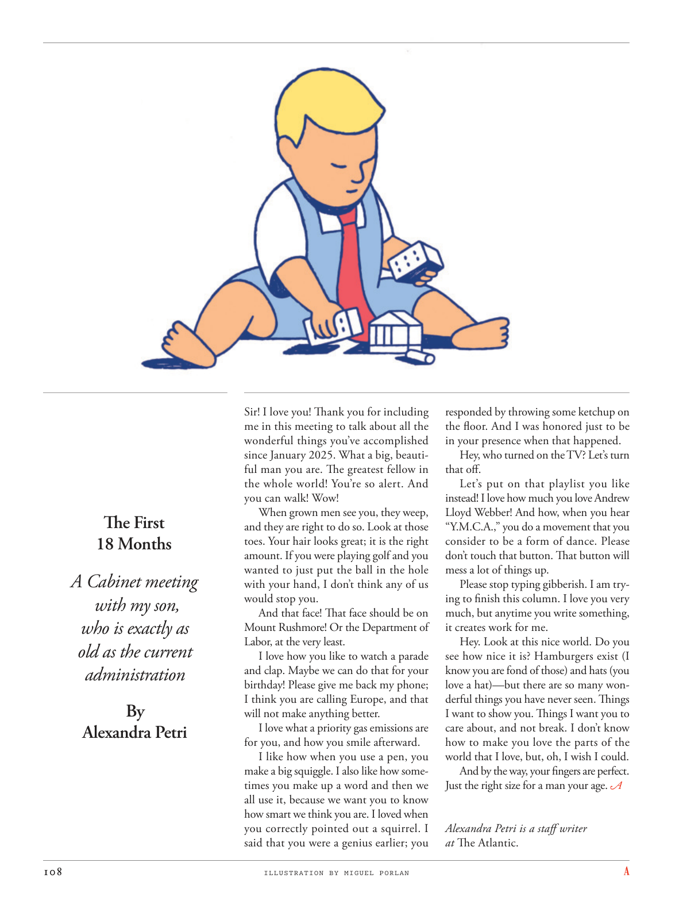

# The Atlantic — July 2026

## Page 110

---

#### The First

**【副标题翻译】** 第一个

#### 18 Months

**【副标题翻译】** 18 个月

#### A Cabinet meeting

**【副标题翻译】** 内阁会议

#### with my son,

**【副标题翻译】** 和我的儿子，

#### who is exactly as

**【副标题翻译】** 谁完全一样

#### old as the current

**【副标题翻译】** 旧的和现在的一样

#### administration

**【副标题翻译】** 行政

#### By

**【副标题翻译】** 经过

#### Alexandra Petri

**【副标题翻译】** 亚历山德拉·佩特里

Sir! I love you! Thank you for including me in this meeting to talk about all the wonderful things you’ve accomplished since January 2025. What a big, beautiful man you are. The greatest fellow in the whole world! You’re so alert. And you can walk! Wow!

**【中文翻译】** 先生！我爱你！感谢您邀请我参加这次会议，谈论您自 2025 年 1 月以来所取得的所有美好成就。您是一个多么伟大、多么美丽的男人。全世界最伟大的人！你太警觉了。而且你可以走路了！哇！

When grown men see you, they weep, and they are right to do so. Look at those toes. Your hair looks great; it is the right amount. If you were playing golf and you wanted to just put the ball in the hole with your hand, I don’t think any of us would stop you.

**【中文翻译】** 当成年男人看到你时，他们会哭泣，他们这样做是正确的。看看那些脚趾。你的头发看起来很棒；这是正确的数量。如果您正在打高尔夫球并且您只想用手将球放入洞中，我认为我们中没有人会阻止您。

And that face! That face should be on Mount Rushmore! Or the Department of Labor, at the very least. I love how you like to watch a parade and clap. Maybe we can do that for your birthday! Please give me back my phone; I think you are calling Europe, and that will not make anything better.

**【中文翻译】** 还有那张脸！那张脸应该在拉什莫尔山上！或者至少是劳工部。我喜欢你喜欢观看游行并鼓掌。也许我们可以为你做生日礼物！请把手机还给我；我认为你给欧洲打电话，这不会让事情变得更好。

I love what a priority gas emissions are for you, and how you smile afterward. I like how when you use a pen, you make a big squiggle. I also like how sometimes you make up a word and then we all use it, because we want you to know how smart we think you are. I loved when you correctly pointed out a squirrel. I said that you were a genius earlier; you

**【中文翻译】** 我喜欢你优先考虑气体排放，以及你事后微笑的样子。我喜欢当你用笔时，你会画出大大的曲线。我也喜欢有时你编一个词然后我们都使用它，因为我们想让你知道我们认为你有多聪明。我喜欢你正确地指出一只松鼠。我刚才说你是个天才；你

*ILLUSTRATION BY MIGUEL PORLAN*

*【图注与署名】米格尔·波兰绘制的插图*

responded by throwing some ketchup on the floor. And I was honored just to be in your presence when that happened. Hey, who turned on the TV? Let’s turn that off.

**【中文翻译】** 回应是将一些番茄酱扔到地板上。当那件事发生时，我很荣幸能在场。嘿，谁打开了电视？让我们把它关掉。

Let’s put on that playlist you like instead! I love how much you love Andrew Lloyd Webber! And how, when you hear “Y.M.C.A.,” you do a movement that you consider to be a form of dance. Please don’t touch that button. That button will mess a lot of things up.

**【中文翻译】** 让我们播放您喜欢的播放列表吧！我爱你对安德鲁·劳埃德·韦伯的喜爱！当你听到“Y.M.C.A.”时，你会如何做一个你认为是舞蹈形式的动作。请不要触摸那个按钮。这个按钮会让很多事情变得混乱。

Please stop typing gibberish. I am trying to finish this column. I love you very much, but anytime you write something, it creates work for me.

**【中文翻译】** 请停止输入乱码。我正在努力完成这个专栏。我非常爱你，但无论何时你写点什么，都会给我带来工作。

Hey. Look at this nice world. Do you see how nice it is? Hamburgers exist (I know you are fond of those) and hats (you love a hat)—but there are so many wonderful things you have never seen. Things I want to show you. Things I want you to care about, and not break. I don’t know how to make you love the parts of the world that I love, but, oh, I wish I could.

**【中文翻译】** 嘿。看看这个美好的世界。你看到它有多好了吗？汉堡包（我知道你喜欢那些）和帽子（你喜欢帽子）是存在的，但还有很多你从未见过的奇妙东西。我想给你看的东西。我希望你关心的事情，而不是破坏的事情。我不知道如何让你爱上我所爱的世界，但是，哦，我希望我能做到。

And by the way, your fingers are perfect. Just the right size for a man your age.

**【中文翻译】** 顺便说一句，你的手指很完美。尺寸正好适合你这个年纪的男人。

*— Alexandra Petri is a staff writer*

*【作者署名】亚历山德拉·佩特里 (Alexandra Petri) 是一名特约撰稿人*

at The Atlantic.

**【中文翻译】** 在大西洋。
