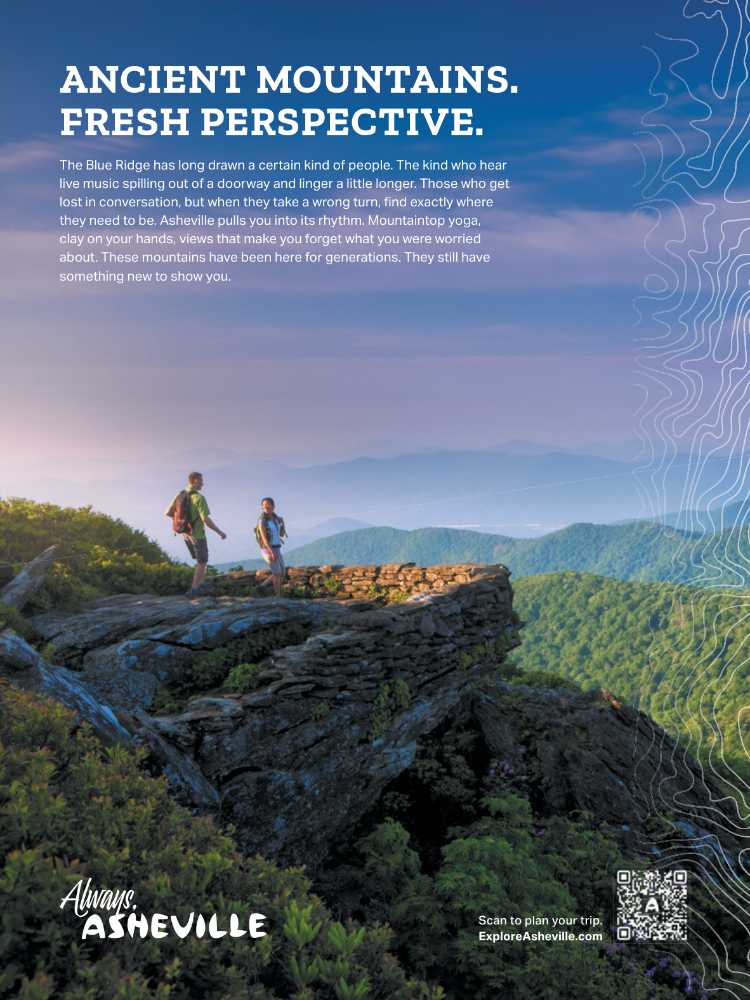

# The Atlantic — July 2026

## Page 111

---

### ANCIENT MOUNTAINS.

**【标题翻译】** 古老的山脉。

### FRESH PERSPECTIVE.

**【标题翻译】** 新鲜的视角。

The Blue Ridge has long drawn a certain kind of people. The kind who hear live music spilling out of a doorway and linger a little longer. Those who get lost in conversation, but when they take a wrong turn, find exactly where they need to be. Asheville pulls you into its rhythm. Mountaintop yoga, clay on your hands, views that make you forget what you were worried about. These mountains have been here for generations. They still have something new to show you. Scan to plan your trip. ExploreAsheville.com

**【中文翻译】** 蓝岭长期以来一直吸引着特定类型的人。那种听到门口传来现场音乐声并逗留更长时间的人。那些在谈话中迷失方向的人，但当他们走错方向时，却能准确地找到他们需要去的地方。阿什维尔将您带入它的节奏。山顶瑜伽，手上有粘土，景色让你忘记烦恼。这些山已经世代相传。他们还有一些新东西要向您展示。扫一扫，计划您的行程。探索阿什维尔.com
