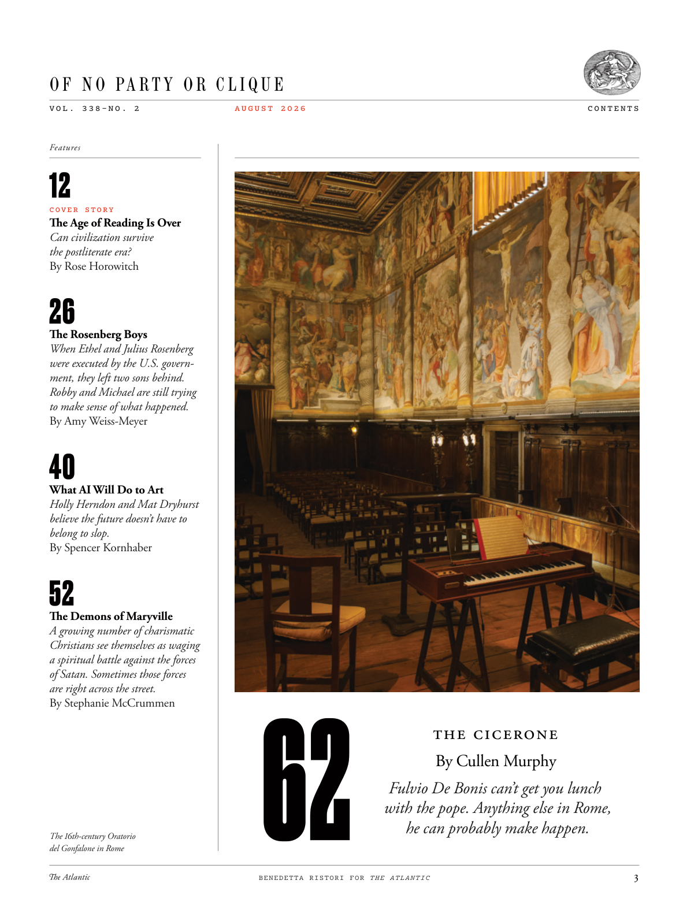

# The Atlantic — August 2026

## Page 5

---

#### O F N O PA R T Y O R C L I Q U E

**【副标题翻译】** 无党派或集团

V O L . 3 3 8 – N O . 2 C O V E R S T O R Y The Age of Reading Is Over Can civilization survive the postliterate era? By Rose Horowitch The Rosenberg Boys When Ethel and Julius Rosenberg were executed by the U.S. government, they left two sons behind.

**【中文翻译】** 音量。 3 3 8 – 否。 2 封面故事 阅读时代已经结束 文明能否在后文学时代继续存在？作者：罗丝·霍洛维奇 罗森伯格男孩 当埃塞尔和朱利叶斯·罗森伯格被美国政府处决时，他们留下了两个儿子。

Robby and Michael are still trying to make sense of what happened. By Amy Weiss-Meyer What AI Will Do to Art Holly Herndon and Mat Dryhurst believe the future doesn’t have to belong to slop.

**【中文翻译】** 罗比和迈克尔仍在试图弄清楚所发生的事情。作者：Amy Weiss-Meyer 人工智能将对艺术做什么 Holly Herndon 和 Mat Dryhurst 相信未来不一定属于污水。

By Spencer Kornhaber The Demons of Maryville A growing number of charismatic Christians see themselves as waging a spiritual battle against the forces of Satan. Sometimes those forces are right across the street.

**【中文翻译】** 作者：斯宾塞·科恩哈伯 《玛丽维尔的恶魔》 越来越多有魅力的基督徒认为自己正在与撒旦的势力进行一场属灵的战斗。有时这些力量就在街对面。

By Stephanie McCrummen The 16th-century Oratorio del Gonfalone in Rome A U G U S T 2 0 2 6

**【中文翻译】** 作者：Stephanie McCrummen 罗马 16 世纪 Oratorio del Gonfalone 8 月 2 0 2 6

#### The Cicerone

**【副标题翻译】** 西塞罗内

#### By Cullen Murphy

**【副标题翻译】** 卡伦·墨菲

#### Fulvio De Bonis can’t get you lunch

**【副标题翻译】** 富尔维奥·德博尼斯无法为你提供午餐

#### with the pope. Anything else in Rome,

**【副标题翻译】** 与教皇。罗马的其他事情，

#### he can probably make happen.

**【副标题翻译】** 他也许可以实现。

BENEDETTA RISTORI FOR THE ATLANTIC C O N T E N T S

**【中文翻译】** Benedetta Ristori 负责大西洋内容
