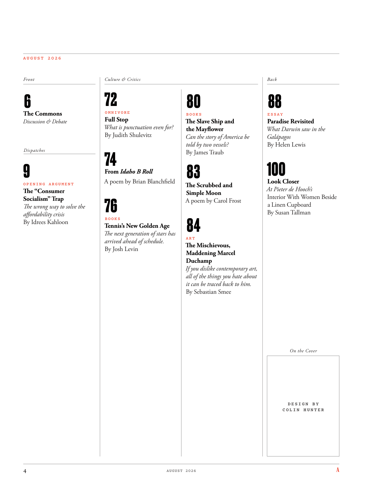

# The Atlantic — August 2026

## Page 6

---

A U G U S T 2 0 2 6 Front O M N I V O R E The Commons Full Stop Discussion & Debate What is punctuation even for? By Judith Shulevitz A poem by Brian Blanchfield From Idaho B Roll O P E N I N G A R G U M E N T The “Consumer Socialism” Trap The wrong way to solve the affordability crisis B O O K S By Idrees Kahloon Tennis’s New Golden Age The next generation of stars has arrived ahead of schedule.

**【中文翻译】** 8 月 2 0 2 6 Front O M N I V O R E The Commons 句号 讨论与辩论 标点符号的用途是什么？朱迪思·舒莱维茨 (Judith Shulevitz) 布莱恩·布兰奇菲尔德 (Brian Blanchfield) 的诗，来自爱达荷州 B Roll O P E N I N G A R G U M EN T “消费社会主义”陷阱 解决负担能力危机的错误方法 书籍 作者：伊德里斯·卡隆 (Idrees Kahloon) 网球的新黄金时代 下一代明星提前到来。

By Josh Levin B O O K S The Slave Ship and the Mayflower Can the story of America be told by two vessels? By James Traub The Scrubbed and Simple Moon A poem by Carol Frost A R T The Mischievous, Maddening Marcel Duchamp If you dislike contemporary art, all of the things you hate about it can be traced back to him.

**【中文翻译】** 作者：乔什·莱文 (Josh Levin) 书籍《奴隶船与五月花号》 两艘船能否讲述美国的故事？詹姆斯·特劳布 (James Traub) 《擦洗和简单的月亮》 卡罗尔·弗罗斯特 (Carol Frost) 的一首诗 艺术 恶作剧、令人抓狂的马塞尔·杜尚 (Marcel Duchamp) 如果你不喜欢当代艺术，那么你讨厌它的所有事情都可以追溯到他。

By Sebastian Smee Back E S S A Y Paradise Revisited What Darwin saw in the Galápagos By Helen Lewis Look Closer At Pieter de Hooch’s Interior With Women Beside a Linen Cupboard By Susan Tallman On the Cover D E S I G N B Y C O L I N H U N T E R

**【中文翻译】** 作者：Sebastian Smee 返回 E S S A Y 天堂重温达尔文在加拉帕戈斯群岛的所见 作者：Helen Lewis 近距离观察 Pieter de Hooch 的内部，亚麻橱柜旁的妇女 作者：Susan Tallman 封面设计：C O L I N H UN T E R
