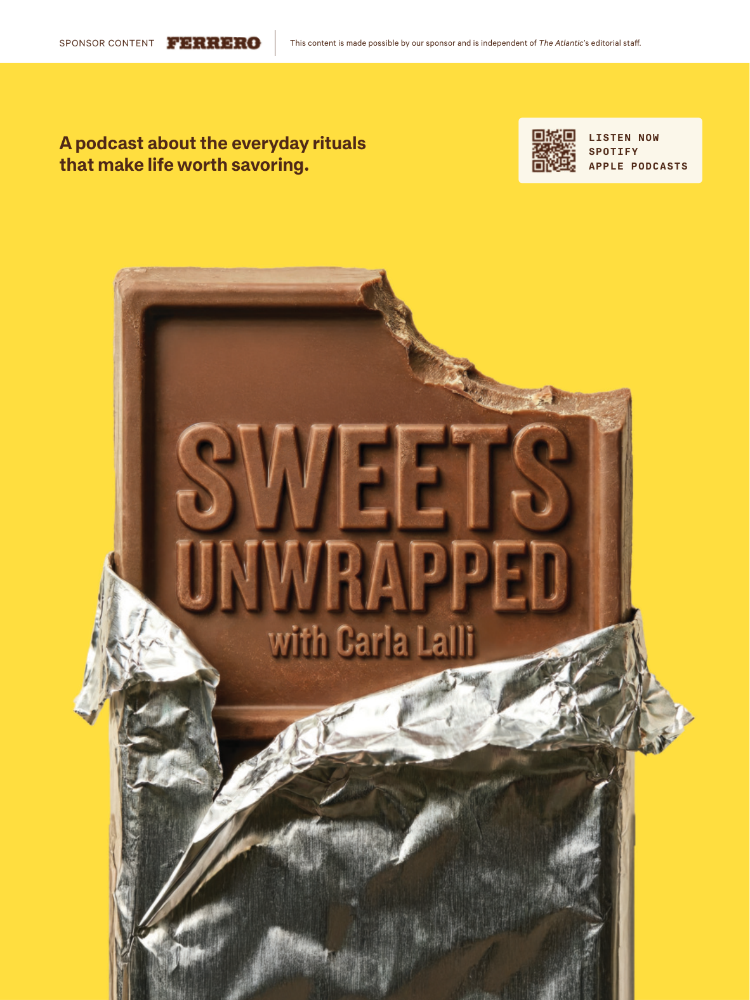

# The Atlantic — August 2026

## Page 7

---

> **[Advertisement / 赞助广告]**
>
> A podcast about the everyday rituals
>
> **【译文】** 关于日常仪式的播客
>
> that make life worth savoring.
>
> **【译文】** 让生活值得品味。
>
> This content is made possible by our sponsor and is independent of The Atlantic ’s editorial staff. LISTEN NOW SPOTIFY APPLE PODCASTS
>
> **【译文】** 该内容由我们的赞助商提供，独立于《大西洋月刊》的编辑人员。立即收听 Spotify Apple 播客
>

