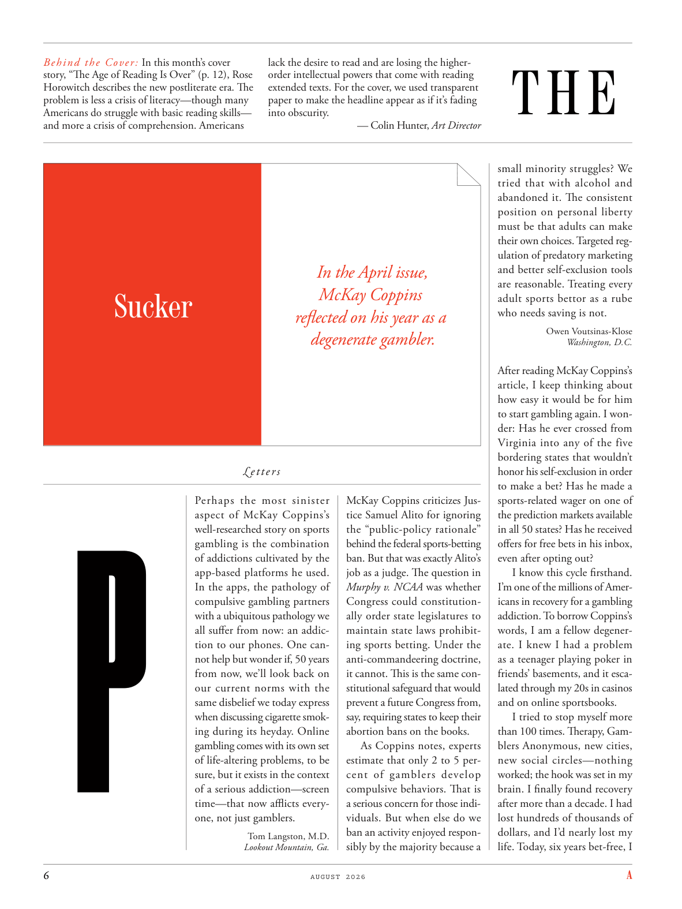

# The Atlantic — August 2026

## Page 8

---

Behind the Cover: In this month’s cover story, “The Age of Reading Is Over” (p. 12), Rose Horowitch describes the new post literate era. The problem is less a crisis of literacy—though many Americans do struggle with basic reading skills— and more a crisis of comprehension. Americans

**【中文翻译】** 封面背后：在本月的封面故事“阅读时代已经结束”（第 12 页）中，罗斯·霍洛维奇 (Rose Horowitch) 描述了新的后识字时代。问题不再是识字危机——尽管许多美国人确实在基本阅读技能方面存在困难——而更多的是理解危机。美国人

### Sucker

**【标题翻译】** 吸盘

### Lookout Mountain, Ga. P

**【标题翻译】** 乔治亚州卢考特山

Perhaps the most sinister aspect of McKay Coppins’s well-researched story on sports gambling is the combination of addictions cultivated by the app-based platforms he used.

**【中文翻译】** 麦凯·科平斯（McKay Coppins）关于体育赌博的深入研究故事中最险恶的方面也许是他使用的基于应用程序的平台所培养的成瘾组合。

In the apps, the pathology of compulsive gambling partners with a ubiquitous pathology we all suffer from now: an addiction to our phones. One cannot help but wonder if, 50 years from now, we’ll look back on our current norms with the same disbelief we today express when discussing cigarette smoking during its heyday. Online gambling comes with its own set of life-altering problems, to be sure, but it exists in the context of a serious addiction—screen time—that now afflicts everyone, not just gamblers. lack the desire to read and are losing the higherorder intellectual powers that come with reading extended texts. For the cover, we used transparent paper to make the headline appear as if it’s fading into obscurity. — Colin Hunter, Art Director

**【中文翻译】** 在这些应用程序中，强迫性赌博的病态与我们现在普遍患有的病态相伴：对手机的成瘾。人们不禁会想，50年后，我们是否会像今天在讨论吸烟全盛时期时所表达的怀疑一样，回顾我们目前的规范。诚然，在线赌博本身也带来了一系列改变生活的问题，但它存在于严重的成瘾（屏幕时间）背景下，这种成瘾现在困扰着每个人，而不仅仅是赌徒。缺乏阅读的欲望，并且正在失去阅读长篇文本所带来的高阶智力。对于封面，我们使用透明纸使标题看起来好像正在消失。 — 科林·亨特，艺术总监

#### In the April issue,

**【副标题翻译】** 在四月号中，

#### McKay Coppins

**【副标题翻译】** 麦凯·科平斯

#### reflected on his year as a

**【副标题翻译】** 回顾他作为一名

#### degenerate gambler.

**【副标题翻译】** 堕落的赌徒。

Letters McKay Coppins criticizes Justice Samuel Alito for ignoring the “public-policy rationale” behind the federal sports-betting ban. But that was exactly Alito’s job as a judge. The question in Murphy v. NCAA was whether Congress could constitutionally order state legislatures to maintain state laws prohibiting sports betting. Under the anti-commandeering doctrine, it cannot. This is the same constitutional safeguard that would prevent a future Congress from, say, requiring states to keep their abortion bans on the books.

**【中文翻译】** 麦凯·科平斯 (McKay Coppins) 批评法官塞缪尔·阿利托 (Samuel Alito) 无视联邦体育博彩禁令背后的“公共政策原理”。但这正是阿利托作为法官的工作。墨菲诉 NCAA 案的问题是国会是否可以根据宪法命令州立法机构维持禁止体育博彩的州法律。根据反征用原则，它不能。这与宪法保障措施相同，可以防止未来的国会要求各州将堕胎禁令记录在案。

As Coppins notes, experts estimate that only 2 to 5 percent of gamblers develop compulsive behaviors. That is a serious concern for those individuals. But when else do we ban an activity enjoyed respon-

**【中文翻译】** 正如 Coppins 指出的那样，专家估计只有 2% 到 5% 的赌徒会出现强迫行为。这是这些人严重关切的问题。但我们什么时候才能禁止一项受到响应的活动——

*— Tom Langston, M.D.*

*【作者署名】汤姆·兰斯顿，医学博士*

sibly by the majority because a

**【中文翻译】** 大多数人肯定是因为

### THE

**【标题翻译】** 这

small minority struggles? We tried that with alcohol and abandoned it. The consistent position on personal liberty must be that adults can make their own choices. Targeted regulation of predatory marketing and better self-exclusion tools are reasonable. Treating every adult sports bettor as a rube who needs saving is not.

**【中文翻译】** 少数人的斗争？我们用酒精尝试过，然后放弃了。关于个人自由的一贯立场必须是成年人可以做出自己的选择。对掠夺性营销的有针对性的监管和更好的自我排除工具是合理的。将每个成年体育博彩玩家视为需要储蓄的乡巴佬并非如此。

Owen Voutsinas-Klose

**【中文翻译】** 欧文·沃西纳斯·克洛泽

*— Washington, D.C.*

*【作者署名】华盛顿特区*

After reading McKay Coppins’s article, I keep thinking about how easy it would be for him to start gambling again. I wonder: Has he ever crossed from Virginia into any of the five bordering states that wouldn’t honor his self-exclusion in order to make a bet? Has he made a sports-related wager on one of the prediction markets available in all 50 states? Has he received offers for free bets in his inbox, even after opting out?

**【中文翻译】** 读完麦凯·科平斯的文章后，我一直在想他重新开始赌博是多么容易。我想知道：他是否曾经为了打赌而从弗吉尼亚州穿越到五个不遵守自我禁入令的边境州中的任何一个？他是否在所有 50 个州的预测市场之一上进行了与体育相关的投注？即使选择退出，他的收件箱中是否也收到了免费投注的优惠？

I know this cycle firsthand. I’m one of the millions of Americans in recovery for a gambling addiction. To borrow Coppins’s words, I am a fellow degenerate. I knew I had a problem as a teenager playing poker in friends’ basements, and it escalated through my 20s in casinos and on online sportsbooks.

**【中文翻译】** 我直接了解这个周期。我是数百万因赌瘾而康复的美国人之一。借用科平斯的话说，我是一个堕落的人。我知道十几岁的时候我在朋友的地下室玩扑克时遇到了问题，并且在我 20 多岁的时候，在赌场和在线体育博彩中问题不断升级。

I tried to stop myself more than 100 times. Therapy, Gamblers Anonymous, new cities, new social circles—nothing worked; the hook was set in my brain. I finally found recovery after more than a decade. I had lost hundreds of thousands of dollars, and I’d nearly lost my life. Today, six years bet-free, I

**【中文翻译】** 我试图阻止自己超过100次。治疗、匿名赌徒、新城市、新社交圈——都没有效果；钩子就在我的脑子里了。十多年后我终于康复了。我损失了数十万美元，还差点丧命。今天，六年没有赌注，我
