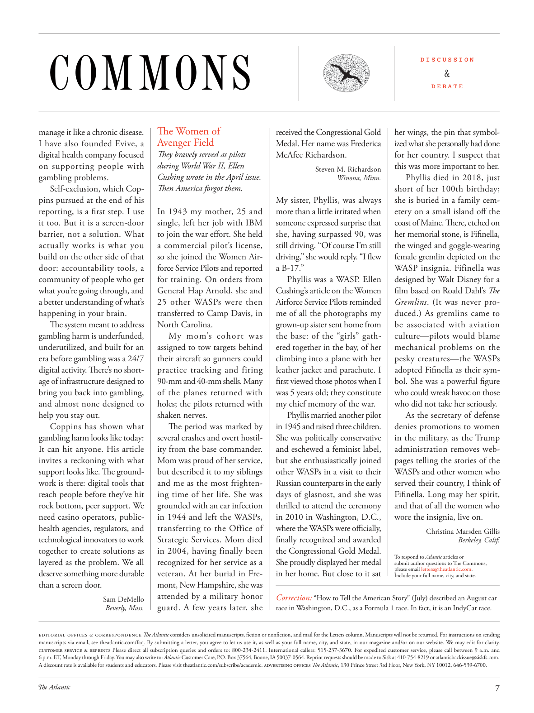

# The Atlantic — August 2026

## Page 9

---

### COMMONS

**【标题翻译】** 公共资源

The Women of manage it like a chronic disease. Avenger Field I have also founded Evive, a They bravely served as pilots digital health company focused during World War II, Ellen on supporting people with Cushing wrote in the April issue. gambling problems.

**【中文翻译】** 女性将其视为一种慢性病。 Avenger Field 我还创立了 Evive，这是一家他们勇敢地担任飞行员的数字健康公司，专注于二战期间，艾伦在四月刊中写道，支持库欣患者。赌博问题.

Th en America forgot them. Self-exclusion, which Coppins pursued at the end of his In 1943 my mother, 25 and reporting, is a first step. I use single, left her job with IBM it too. But it is a screen-door to join the war eff ort. She held barrier, not a solution. What a commercial pilot’s license, actually works is what you so she joined the Women Airbuild on the other side of that force Service Pilots and reported door: accountability tools, a for training. On orders from community of people who get General Hap Arnold, she and what you’re going through, and 25 other WASPs were then a better understanding of what’s transferred to Camp Davis, in happening in your brain.

**【中文翻译】** 然后美国就忘记了他们。科平斯在他 1943 年 25 岁的母亲去世后所追求的自我禁闭是第一步。我用的是单身，也辞去了IBM的工作。但这是加入战争的一道屏障。她持有障碍，而不是解决方案。商业飞行员执照实际上起作用的是你，所以她加入了女性空中建造部队的另一边服务飞行员并报告了门：问责工具，用于培训。根据哈普·阿诺德将军、她和你正在经历的事情以及其他 25 名 WASP 成员的命令，他们可以更好地了解转移到戴维斯营的你大脑中发生的事情。

North Carolina. The system meant to address My mom’s cohort was gambling harm is underfunded, assigned to tow targets behind under utilized, and built for an their aircraft so gunners could era before gambling was a 24/7 practice tracking and firing digital activity. Th ere’s no short90-mm and 40-mm shells. Many age of infrastructure designed to of the planes returned with bring you back into gambling, holes; the pilots returned with and almost none designed to shaken nerves. help you stay out.

**【中文翻译】** 北卡罗来纳州。该系统旨在解决我妈妈的团队的赌博危害资金不足的问题，分配给未充分利用的拖曳目标，并为他们的飞机构建，以便炮手可以在赌博成为 24/7 练习跟踪和射击数字活动之前时代。没有短的 90 毫米和 40 毫米炮弹。许多时代的基础设施旨在让飞机返回时带您重新陷入赌博、漏洞；飞行员回来时几乎没有一个旨在动摇神经的。帮助您远离外面。

The period was marked by Coppins has shown what several crashes and overt hostilgambling harm looks like today: ity from the base commander.

**【中文翻译】** 以科平斯为标志的那个时期已经展示了今天的几起坠机事件和公开的敌对赌博危害：来自基地指挥官的权力。

It can hit anyone. His article Mom was proud of her service, invites a reckoning with what but described it to my siblings support looks like. The groundand me as the most frightenwork is there: digital tools that ing time of her life. She was reach people before they’ve hit grounded with an ear infection rock bottom, peer support. We in 1944 and left the WASPs, need casino operators, publictransferring to the Office of health agencies, regulators, and Strategic Services. Mom died technological innovators to work in 2004, having finally been together to create solutions as recognized for her service as a layered as the problem. We all veteran. At her burial in Fredeserve something more durable mont, New Hampshire, she was than a screen door. attended by a military honor Sam DeMello guard. A few years later, she Beverly, Mass.

**【中文翻译】** 它可以击中任何人。他的文章“妈妈为她的服务感到自豪”，引发了人们对我的兄弟姐妹的支持的描述的反思。地面和我最害怕的工作就在那里：数字工具占据了她一生的时间。在人们因耳朵感染而陷入谷底之前，她就向他们伸出了援手，并提供了同伴的支持。我们在 1944 年离开了 WASP，需要赌场运营商、公共部门转移到卫生机构、监管机构和战略服务办公室。妈妈于 2004 年去世，在技术创新领域工作，最终共同创建了解决方案，因为她的服务与问题一样分层。我们都是老手了她被埋葬在新罕布什尔州弗雷德瑟夫这个更耐用的地方，她的葬礼不仅仅是一扇纱门。军事仪仗队卫兵萨姆·德梅洛出席了仪式。几年后，她来到了马萨诸塞州贝弗利。

edieorial offices & correspondence The Atlantic considers unsolicited manuscripts, fiction or nonfiction, and mail for the Letters column. Manuscripts will not be returned. For instructions on sending manuscripts via email, see theatlantic.com/faq. By submitting a letter, you agree to let us use it, as well as your full name, city, and state, in our magazine and/or on our website. We may edit for clarity. cuseomer service & reprines Please direct all subscription queries and orders to: 800-234-2411. International callers: 515-237-3670. For expedited customer service, please call between 9 a.m. and 6 p.m. ET, Monday through Friday. You may also write to: Atlantic Customer Care, P.O. Box 37564, Boone, IA 50037-0564. Reprint requests should be made to Sisk at 410-754-8219 or atlanticbackissue@siskfs.com.

**【中文翻译】** 编辑办公室和信件 《大西洋月刊》考虑来信专栏的未经请求的手稿、小说或非小说以及邮件。稿件将不予退还。有关通过电子邮件发送稿件的说明，请参阅 theatlantic.com/faq。提交信件即表示您同意我们在我们的杂志和/或网站上使用该信件以及您的全名、城市和州。为了清楚起见，我们可能会进行编辑。客户服务和回复 请将所有订阅查询和订单发送至：800-234-2411。国际电话：515-237-3670。如需加急客户服务，请在上午 9 点至下午 6 点之间致电。东部时间，周一至周五。您也可以写信给：Atlantic Customer Care, P.O.信箱 37564，布恩，IA 50037-0564。请致电 410-754-8219 或发送电子邮件至 atlanticbackissue@siskfs.com 向 Sisk 提出重印请求。

A discount rate is available for students and educators. Please visit theatlantic.com/subscribe/academic. advereising offices The Atlantic , 130 Prince Street 3rd Floor, New York, NY 10012, 646-539-6700. received the Congressional Gold Medal. Her name was Frederica McAfee Richardson.

**【中文翻译】** 学生和教育工作者可享受折扣率。请访问 theatlantic.com/subscribe/academic。广告办事处 The Atlantic , 130 Prince Street 3rd Floor, New York, NY 10012, 646-539-6700。获得国会金质奖章。她的名字叫弗雷德丽卡·麦卡菲·理查森。

Steven M. Richardson Winona, Minn. My sister, Phyllis, was always more than a little irritated when someone expressed surprise that she, having surpassed 90, was still driving. “Of course I’m still driving,” she would reply. “I fl ew a B-17.”

**【中文翻译】** 史蒂文·理查森 (Steven M. Richardson) 明尼苏达州威诺纳。当有人对我姐姐菲利斯 (Phyllis) 90 岁高龄还在开车表示惊讶时，她总是感到非常恼火。 “当然，我还在开车，”她回答道。 “我驾驶的是 B-17。”

Phyllis was a WASP. Ellen Cushing’s article on the Women Airforce Service Pilots reminded me of all the photographs my grown-up sister sent home from the base: of the “girls” gathered together in the bay, of her climbing into a plane with her leather jacket and parachute. I first viewed those photos when I was 5 years old; they constitute my chief memory of the war.

**【中文翻译】** 菲利斯是一名 WASP。艾伦·库欣关于空军女飞行员的文章让我想起了我长大的姐姐从基地寄回家的所有照片：“女孩”聚集在海湾里，她穿着皮夹克和降落伞爬上飞机。我第一次看到这些照片是在我五岁的时候；它们构成了我对战争的主要记忆。

Phyllis married another pilot in 1945 and raised three children. She was politically conservative and eschewed a feminist label, but she enthusiastically joined other WASPs in a visit to their Russian counterparts in the early days of glasnost, and she was thrilled to attend the ceremony

**【中文翻译】** 1945 年，菲利斯与另一位飞行员结婚，并抚养了三个孩子。她在政治上持保守态度，回避女权主义标签，但在开放初期，她热情地与其他 WASP 一起访问了俄罗斯同行，她很高兴参加仪式

*— in 2010 in Washington, D.C.,*

*【作者署名】2010 年在华盛顿特区，*

where the WASPs were offi cially, finally recognized and awarded the Congressional Gold Medal. She proudly displayed her medal in her home. But close to it sat Correction: “How to Tell the American Story” (July) described an August car

**【中文翻译】** 在那里，WASP 终于得到了正式认可并被授予国会金质奖章。她自豪地在家里展示她的奖章。但附近有更正：“如何讲述美国故事”（七月）描述了一辆八月的汽车

*— race in Washington, D.C., as a Formula 1 race. In fact, it is an IndyCar race.*

*【作者署名】在华盛顿特区举行的一级方程式比赛。事实上，这是一场印地赛车比赛。*

D I S C U S S I O N & D E B A T E her wings, the pin that symbolized what she personally had done for her country. I suspect that this was more important to her.

**【中文翻译】** 讨论和辩论她的翅膀，这枚别针象征着她个人为国家做出的贡献。我怀疑这对她来说更重要。

Phyllis died in 2018, just short of her 100th birthday; she is buried in a family cemetery on a small island off the coast of Maine. Th ere, etched on her memorial stone, is Fifi nella, the winged and goggle-wearing female gremlin depicted on the WASP insignia. Fifinella was designed by Walt Disney for a film based on Roald Dahl’s The Gremlins . (It was never produced.) As gremlins came to be associated with aviation culture—pilots would blame mechanical problems on the pesky creatures—the WASPs adopted Fifi nella as their symbol. She was a powerful figure who could wreak havoc on those who did not take her seriously.

**【中文翻译】** 菲利斯于 2018 年去世，当时正值她的 100 岁生日。她被埋葬在缅因州海岸附近一个小岛上的一个家族墓地里。她的纪念碑上刻着的是菲菲内拉 (Fifi nella)，她是 WASP 徽章上描绘的长着翅膀、戴着护目镜的女性小魔怪。 Fifinella 是由华特迪士尼为根据罗尔德达尔的《小魔怪》改编的电影设计的。 （它从未被生产出来。）随着小精灵逐渐与航空文化联系在一起——飞行员会将机械问题归咎于这些讨厌的生物——WASP 采用菲菲内拉作为他们的标志。她是一个强大的人物，可以对那些不认真对待她的人造成严重破坏。

As the secretary of defense denies promotions to women in the military, as the Trump administration removes webpages telling the stories of the WASPs and other women who served their country, I think of Fifi nella. Long may her spirit, and that of all the women who wore the insignia, live on.

**【中文翻译】** 当国防部长否认在军队中晋升女性时，当特朗普政府删除讲述 WASP 和其他为国家服务的女性故事的网页时，我想到了菲菲·内拉。愿她的精神以及所有佩戴该徽章的女性的精神长存。

Christina Marsden Gillis Berkeley, Calif. To respond to Atlantic articles or submit author questions to The Commons, please email letters@theatlantic.com . Include your full name, city, and state.

**【中文翻译】** 克里斯蒂娜·马斯登·吉利斯 (Christina Marsden Gillis) 加利福尼亚州伯克利 要回复《大西洋月刊》的文章或向 The Commons 提交作者问题，请发送电子邮件至 letter@theatlantic.com。包括您的全名、城市和州。
