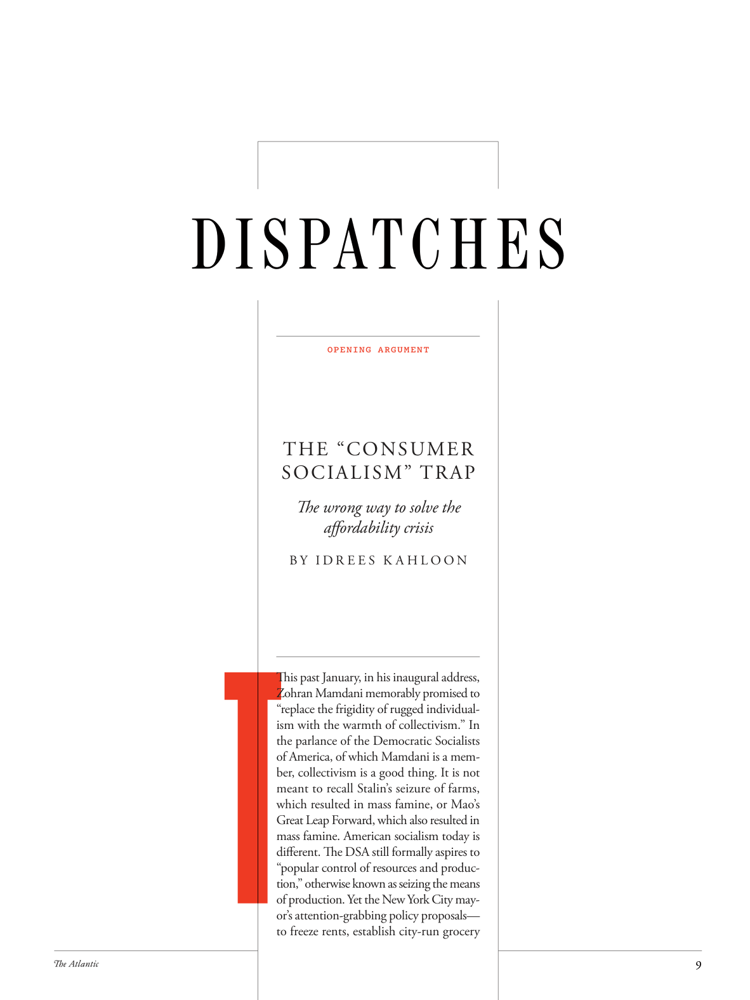

# The Atlantic — August 2026

## Page 11

---

OPENING ARGUMENT

**【中文翻译】** 开庭陈词

#### THE “CONSUMER

**【副标题翻译】** “消费者”

#### SOCIALISM” TRAP

**【副标题翻译】** 社会主义的陷阱

The wrong way to solve the aff ordability crisis B Y I D R E E S K A H L O O N

**【中文翻译】** 解决负担能力危机的错误方法 B Y I D R E E S K A H L O O N

### T

This past January, in his inaugural address, Zohran Mamdani memorably promised to “replace the frigidity of rugged individualism with the warmth of collectivism.” In the parlance of the Democratic Socialists of America, of which Mamdani is a member, collectivism is a good thing. It is not meant to recall Stalin’s seizure of farms, which resulted in mass famine, or Mao’s Great Leap Forward, which also resulted in mass famine. American socialism today is diff erent. The DSA still formally aspires to “popular control of resources and production,” otherwise known as seizing the means of production. Yet the New York City mayor’s attentiongrabbing policy proposals— to freeze rents, establish city-run grocery

**【中文翻译】** 今年一月，佐兰·马姆达尼（Zohran Mamdani）在就职演说中令人难忘地承诺“用集体主义的温暖取代粗犷的个人主义的冷漠”。用马姆达尼所属的美国民主社会主义者的话说，集体主义是一件好事。这并不是要回顾斯大林夺取农场导致大规模饥荒，或者毛泽东的大跃进也导致大规模饥荒。今天的美国社会主义则不同了。 DSA 仍然正式追求“对资源和生产的普遍控制”，也称为夺取生产资料。然而，纽约市市长引人注目的政策建议——冻结租金、建立市营杂货店
