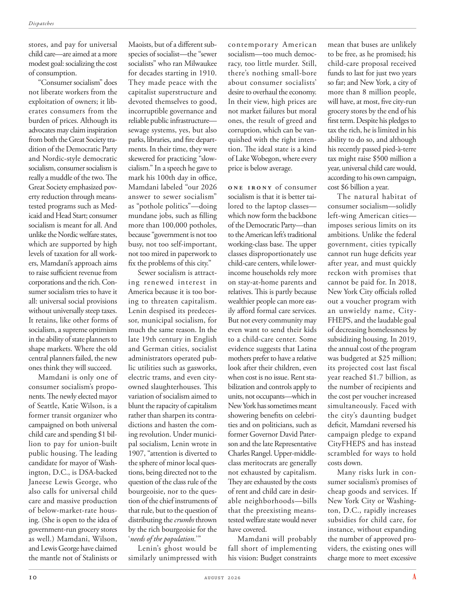

# The Atlantic — August 2026

## Page 12

---

stores, and pay for universal Maoists, but of a different subchild care—are aimed at a more species of socialist—the “sewer modest goal: socializing the cost socialists” who ran Milwaukee of consumption. for decades starting in 1910.

**【中文翻译】** 商店，并为普遍的毛主义者支付费用，但针对的是一种不同的儿童保育——其目标是更多种类的社会主义者——“下水道适度目标：社会化成本社会主义者”，他们管理着密尔沃基的消费。从 1910 年开始，已有数十年历史。

“Consumer socialism” does They made peace with the not liberate workers from the capitalist super structure and exploitation of owners; it libdevoted themselves to good, erates consumers from the incorruptible governance and burden of prices. Although its reliable public infrastructure— advocates may claim inspiration sewage systems, yes, but also from both the Great Society traparks, libraries, and fire departdition of the Democratic Party ments. In their time, they were and Nordic-style democratic skewered for practicing “slowsocialism, consumer socialism is cialism.” In a speech he gave to really a muddle of the two. The mark his 100th day in office, Great Society emphasized povMamdani labeled “our 2026 erty reduction through meansanswer to sewer socialism” tested programs such as Medas “pothole politics”—doing icaid and Head Start; consumer mundane jobs, such as filling socialism is meant for all. And more than 100,000 potholes, unlike the Nordic welfare states, because “government is not too which are supported by high busy, not too self-important, levels of taxation for all worknot too mired in paperwork to ers, Mamdani’s approach aims fix the problems of this city.” to raise sufficient revenue from Sewer socialism is attractcorporations and the rich. Coning renewed interest in sumer socialism tries to have it America because it is too borall: universal social provisions ing to threaten capitalism. without universally steep taxes.

**【中文翻译】** “消费社会主义”并没有将工人从资本主义上层建筑和业主的剥削中解放出来；他们与工人讲和。它解放了人们对善的追求，使消费者摆脱了廉洁的治理和价格负担。尽管其可靠的公共基础设施——拥护者可能会声称其灵感来自污水处理系统，是的，但也来自伟大社会的陷阱、图书馆和民主党的消防部门。在他们那个时代，他们和北欧式的民主一样，因实行“慢社会主义、消费社会主义就是社会主义”而受到批评。他在一次演讲中把两者搞得一团糟。在他上任 100 天之际，伟大社会强调，马丹尼将“通过对下水道社会主义的手段，到 2026 年实现减少就业”这一标签进行了测试，例如梅达斯的“坑洞政治”——实施 icaid 和 Head Start；消费者平凡的工作，例如填充社会主义，是为所有人准备的。与北欧福利国家不同，还有超过 10 万个坑洼，因为“政府不太受高忙碌度、不太自负、对所有工作的税收水平的支持，也不太陷入文书工作的泥潭，马姆达尼的方法旨在解决这个城市的问题。”从下水道社会主义中筹集足够的收入是吸引企业和富人的。人们对美国社会主义重新产生了兴趣，试图将其引入美国，因为它太平庸了：普遍的社会规定会威胁资本主义。没有普遍高额的税收。

Lenin despised its predecesIt retains, like other forms of sor, municipal socialism, for socialism, a supreme optimism much the same reason. In the in the ability of state planners to late 19th century in English shape markets. Where the old and German cities, socialist central planners failed, the new administrators operated pubones think they will succeed. lic utilities such as gasworks, Mamdani is only one of electric trams, and even cityconsumer socialism’s propoowned slaughterhouses. This nents. The newly elected mayor variation of socialism aimed to of Seattle, Katie Wilson, is a blunt the rapacity of capitalism former transit organizer who rather than sharpen its contracampaigned on both universal dictions and hasten the comchild care and spending $1 biling revolution. Under municilion to pay for union-built pal socialism, Lenin wrote in public housing. The leading 1907, “attention is diverted to candidate for mayor of Washthe sphere of minor local quesington, D.C., is DSA-backed tions, being directed not to the Janeese Lewis George, who question of the class rule of the also calls for universal child bourgeoisie, nor to the quescare and massive production tion of the chief instruments of of below-market-rate housthat rule, but to the question of ing. (She is open to the idea of distributing the crumbs thrown governmentrun grocery stores by the rich bourgeoisie for the as well.) Mamdani, Wilson, ‘ needs of the population .’ ” and Lewis George have claimed Lenin’s ghost would be the mantle not of Stalinists or similarly unimpressed with contemporary American socialism— too much democracy, too little murder. Still, there’s nothing small-bore about consumer socialists’ desire to overhaul the economy.

**【中文翻译】** 列宁鄙视它的前身，就像其他形式的社会主义一样，它保留了对社会主义的最高乐观主义，原因大致相同。在国家规划者的能力下，19世纪末英国塑造了市场。在旧的德国城市中，社会主义中央计划者失败了，而新的管理人员认为他们会成功。与煤气厂等公共设施相比，马姆达尼只是有轨电车之一，甚至是城市消费者社会主义所拥护的屠宰场。这个费用。新当选的西雅图市长凯蒂·威尔逊（Katie Wilson）的目标是削弱资本主义前交通组织者的贪婪，她非但没有加强其对普遍用语的反对，还加速了儿童护理和花费 1 美元的革命。根据为工会建造的伙伴社会主义支付市政费用的规定，列宁在公共住房中写道。 1907 年的主要文章“注意力被转移到华盛顿特区小地方奎辛顿领域的市长候选人身上，这是 DSA 支持的，不是针对简尼斯·刘易斯·乔治，他的阶级统治问题也要求普遍的儿童资产阶级，也不是针对低于市场价格的房屋统治的主要工具的恐慌和大规模生产，而是针对 ing 的问题。（她对 ing 的问题持开放态度。） ”和刘易斯·乔治声称，列宁的幽灵将不是斯大林主义者的衣钵，也不是对当代美国社会主义——民主太多，谋杀太少——不感兴趣。尽管如此，消费社会主义者改革经济的愿望却并非小事。

In their view, high prices are not market failures but moral ones, the result of greed and corruption, which can be vanquished with the right intention. The ideal state is a kind of Lake Wobegon, where every price is below average.

**【中文翻译】** 在他们看来，高价格不是市场失灵，而是道德失灵，是贪婪和腐败的结果，只要有正确的意图，就可以消除这种现象。理想的状态是沃比冈湖，那里的所有价格都低于平均水平。

O n e i r o n y of consumer socialism is that it is better tailored to the laptop classes— which now form the backbone of the Democratic Party—than to the American left’s traditional working-class base. The upper classes disproportionately use child-care centers, while lowerincome households rely more on stay-at-home parents and relatives. This is partly because wealthier people can more easily afford formal care services.

**【中文翻译】** 消费社会主义的讽刺之处在于，它更适合笔记本电脑阶层——现在他们是民主党的支柱——而不是美国左派传统的工人阶级基础。上层阶级不成比例地使用托儿中心，而低收入家庭则更多地依赖留在家里的父母和亲戚。部分原因是较富裕的人更容易负担得起正规护理服务。

But not every community may even want to send their kids to a child-care center. Some evidence suggests that Latina mothers prefer to have a relative look after their children, even when cost is no issue. Rent stabilization and controls apply to units, not occupants— which in New York has sometimes meant showering benefits on celebrities and on politicians, such as former Governor David Paterson and the late Representative Charles Rangel. Upper-middleclass meritocrats are generally not exhausted by capitalism.

**【中文翻译】** 但并不是每个社区都想把孩子送到托儿中心。一些证据表明，拉丁裔母亲更愿意让亲戚照顾自己的孩子，即使费用不成问题。租金稳定和控制适用于单位，而不是居住者——这在纽约有时意味着名人和政客，如前州长大卫·帕特森和已故众议员查尔斯·兰格尔，获得大量好处。中上阶层的精英人士一般不会被资本主义搞得精疲力竭。

They are exhausted by the costs of rent and child care in desirable neighborhoods— bills that the preexisting meanstested welfare state would never have covered.

**【中文翻译】** 他们对理想社区的房租和儿童保育费用感到精疲力竭，而这些费用是现有的经过经济状况调查的福利国家永远无法支付的。

Mamdani will probably fall short of implementing his vision: Budget constraints mean that buses are unlikely to be free, as he promised; his child-care proposal received funds to last for just two years so far; and New York, a city of more than 8 million people, will have, at most, five city-run grocery stores by the end of his first term. Despite his pledges to tax the rich, he is limited in his ability to do so, and although his recently passed pied-à-terre tax might raise $500 million a year, universal child care would, according to his own campaign, cost $6 billion a year.

**【中文翻译】** 马姆达尼可能无法实现他的愿景：预算限制意味着公交车不太可能像他承诺的那样免费；他的儿童保育计划收到的资金迄今为止只维持了两年；纽约这个人口超过 800 万的城市，在他的第一个任期结束时最多将拥有 5 家市营杂货店。尽管他承诺对富人征税，但他这样做的能力有限，而且尽管他最近通过的临时住所税可能每年筹集 5 亿美元，但根据他自己的竞选活动，全民儿童保育每年将花费 60 亿美元。

The natural habitat of consumer socialism—solidly left-wing American cities— imposes serious limits on its ambitions. Unlike the federal government, cities typically cannot run huge deficits year after year, and must quickly reckon with promises that cannot be paid for. In 2018, New York City officials rolled out a voucher program with an unwieldy name, CityFHEPS, and the laudable goal of decreasing homelessness by subsidizing housing. In 2019, the annual cost of the program was budgeted at $25 million; its projected cost last fiscal year reached $1.7 billion, as the number of recipients and the cost per voucher increased simultaneously. Faced with the city’s daunting budget deficit, Mamdani reversed his campaign pledge to expand CityFHEPS and has instead scrambled for ways to hold costs down.

**【中文翻译】** 消费社会主义的自然栖息地——坚定的左翼美国城市——严重限制了它的野心。与联邦政府不同，城市通常不能年复一年地出现巨额赤字，并且必须迅速考虑到无法兑现的承诺。 2018 年，纽约市官员推出了一项代金券计划，其名称不太实用：CityFHEPS，其目标值得称赞，即通过住房补贴来减少无家可归者。 2019 年，该计划的年度费用预算为 2500 万美元；由于接收者数量和每张优惠券的成本同时增加，上一财年的预计成本达到 17 亿美元。面对该市令人畏惧的预算赤字，马姆达尼推翻了扩大 CityFHEPS 的竞选承诺，转而想方设法降低成本。

Many risks lurk in consumer socialism’s promises of cheap goods and services. If New York City or Washington, D.C., rapidly increases subsidies for child care, for instance, without expanding the number of approved providers, the existing ones will charge more to meet excessive

**【中文翻译】** 消费社会主义对廉价商品和服务的承诺中潜藏着许多风险。例如，如果纽约市或华盛顿特区迅速增加儿童保育补贴，而不扩大批准的提供者数量，现有的提供者将收取更高的费用，以满足过度的需求。
