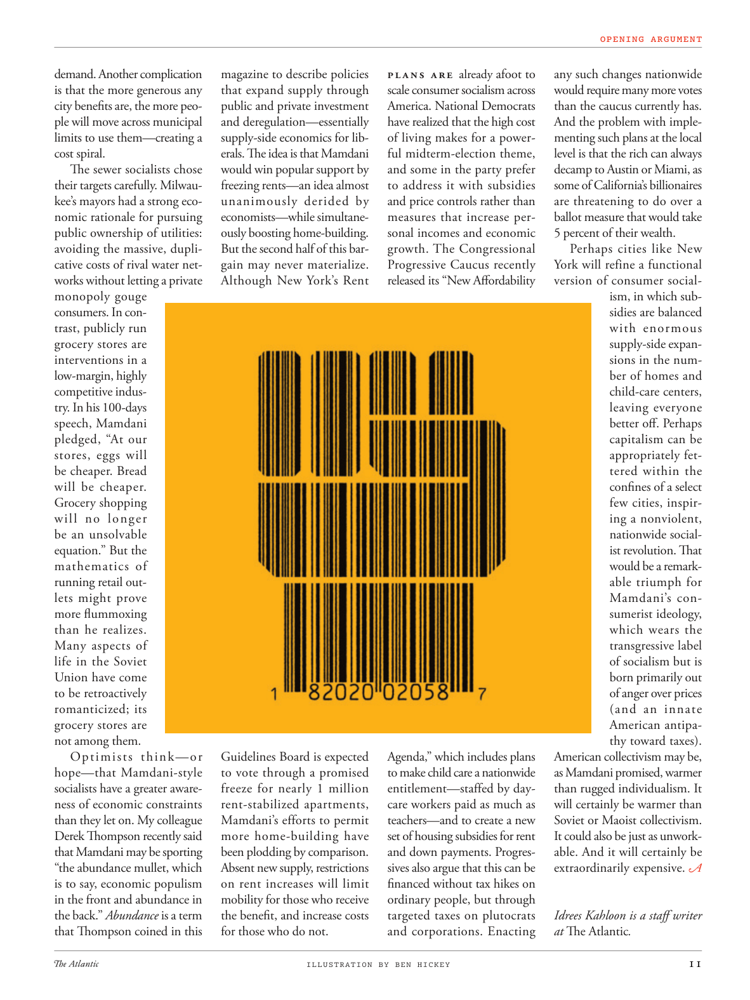

# The Atlantic — August 2026

## Page 13

---

demand. Another complication magazine to describe policies is that the more generous any that expand supply through city benefits are, the more peopublic and private investment ple will move across municipal and deregulation—essentially limits to use them—creating a supply-side economics for libcost spiral. erals. The idea is that Mamdani The sewer socialists chose would win popular support by their targets carefully. Milwaufreezing rents—an idea almost kee’s mayors had a strong ecounanimously derided by nomic rationale for pursuing economists— while simultanepublic ownership of utilities: ously boosting homebuilding. avoiding the massive, dupliBut the second half of this barcative costs of rival water netgain may never materialize. works without letting a private Although New York’s Rent monopoly gouge consumers. In contrast, publicly run grocery stores are interventions in a lowmargin, highly competitive industry. In his 100-days speech, Mamdani pledged, “At our stores, eggs will be cheaper. Bread will be cheaper.

**【中文翻译】** 要求。杂志描述政策的另一个复杂之处是，通过城市福利扩大供应的措施越慷慨，就越多的公众和私人投资将跨越市政和放松管制——本质上限制了它们的使用——创造了自由成本螺旋式的供应方经济学。埃拉尔斯。这个想法是，马姆达尼下水道社会主义者选择的下水道将赢得其目标的民众支持。密尔沃冻结租金——这一想法几乎遭到了经济学家们的经济理性的强烈嘲笑——同时公用事业公有制：大力促进住房建设。避免大规模的重复但是竞争对手水净收益的这种讨价还价成本的后半部分可能永远不会实现。尽管纽约的租金垄断公司在不让私人垄断者欺骗消费者的情况下运作。相比之下，公立杂货店是对利润率低、竞争激烈的行业的干预。马姆达尼在百日演讲中承诺，“在我们的商店，鸡蛋会更便宜。面包会更便宜。”

Grocery shopping will no longer be an unsolvable equation.” But the mathematics of running retail outlets might prove more flummoxing than he realizes.

**【中文翻译】** 去杂货店购物将不再是一个无法解决的方程式。”但经营零售店的数学可能比他意识到的更令人困惑。

Many aspects of life in the Soviet Union have come to be retroactively romanticized; its grocery stores are not among them. Optimists think—or Guidelines Board is expected hope—that Mamdani-style to vote through a promised socialists have a greater awarefreeze for nearly 1 million ness of economic constraints rentstabilized apartments, than they let on. My colleague Mamdani’s efforts to permit Derek Thompson recently said more homebuilding have that Mamdani may be sporting been plodding by comparison.

**【中文翻译】** 苏联生活的许多方面都被追溯地浪漫化了。它的杂货店不在其中。乐观主义者认为——或者指导委员会预计希望——通过承诺的社会主义者进行马姆达尼式的投票，对近 100 万租金稳定公寓的经济限制有比他们表现出来的更大的认识。我的同事马姆达尼（Mamdani）最近为德里克·汤普森（Derek Thompson）所做的努力表示，相比之下，马姆达尼（Mamdani）可能从事的更多住宅建设工作进展缓慢。

“the abundance mullet, which Absent new supply, restrictions is to say, economic populism on rent increases will limit in the front and abundance in mobility for those who receive the back.” Abundance is a term the benefit, and increase costs that Thompson coined in this for those who do not.

**【中文翻译】** “丰富的鲻鱼，如果没有新的供应，限制就是说，租金上涨的经济民粹主义将限制前面的人，而那些接受后面的人的流动性将受到限制。”汤普森为那些没有丰富性的人创造了一个术语“丰富性”，即“好处”和“增加成本”。

Plans are already afoot to scale consumer socialism across America. National Democrats have realized that the high cost of living makes for a powerful midterm-election theme, and some in the party prefer to address it with subsidies and price controls rather than measures that increase personal incomes and economic growth. The Congressional Progressive Caucus recently released its “New Affordability Agenda,” which includes plans to make child care a nationwide entitlement—staffed by daycare workers paid as much as teachers— and to create a new set of housing subsidies for rent and down payments. Progressives also argue that this can be financed without tax hikes on ordinary people, but through targeted taxes on plutocrats and corporations. Enacting

**【中文翻译】** 在美国推广消费社会主义的计划已经在酝酿之中。全国民主党人已经意识到，高生活成本是中期选举的一个强有力的主题，党内一些人更愿意通过补贴和价格控制来解决这个问题，而不是采取增加个人收入和经济增长的措施。国会进步党核心小组最近发布了“新负担能力议程”，其中包括计划将托儿服务纳入全国范围内的一项权利——配备日托工作者，其工资与教师一样——并制定一套新的租金和首付住房补贴。进步人士还认为，无需对普通民众加税，而是通过对富豪和企业有针对性的税收来筹集资金。制定

*ILLUSTRATION BY BEN HICKEY*

*【图注与署名】本·希基插图*

any such changes nationwide would require many more votes than the caucus currently has. And the problem with implementing such plans at the local level is that the rich can always decamp to Austin or Miami, as some of California’s billionaires are threatening to do over a ballot measure that would take 5 percent of their wealth.

**【中文翻译】** 全国范围内的任何此类变革都需要比核心小组目前拥有的更多的选票。在地方层面实施此类计划的问题在于，富人总是可以逃往奥斯汀或迈阿密，因为加州的一些亿万富翁威胁要取消一项将占用他们 5% 财富的投票措施。

Perhaps cities like New York will refine a functional version of consumer socialism, in which subsidies are balanced with enormous supplyside expansions in the number of homes and child-care centers, leaving everyone better off. Perhaps capitalism can be appropriately fettered within the confines of a select few cities, inspiring a nonviolent, nationwide socialist revolution. That would be a remarkable triumph for Mamdani’s consumerist ideology, which wears the transgressive label of socialism but is born primarily out of anger over prices (and an innate American antipathy toward taxes).

**【中文翻译】** 也许像纽约这样的城市将完善消费社会主义的功能版本，其中补贴与住房和儿童保育中心数量的巨大供给侧扩张相平衡，让每个人都过得更好。也许资本主义可以被适当地束缚在少数几个城市的范围内，从而激发一场非暴力的、全国性的社会主义革命。对于马姆达尼的消费主义意识形态来说，这将是一个非凡的胜利，这种意识形态虽然贴着社会主义的违法标签，但其诞生主要是出于对价格的愤怒（以及美国人与生俱来的对税收的反感）。

American collectivism may be, as Mamdani promised, warmer than rugged individualism. It will certainly be warmer than Soviet or Maoist collectivism.

**【中文翻译】** 正如马姆达尼所承诺的那样，美国的集体主义可能比粗犷的个人主义更温暖。它肯定会比苏联或毛主义的集体主义更温暖。

It could also be just as unworkable. And it will certainly be extraordinarily expensive.

**【中文翻译】** 它也可能同样行不通。而且它肯定会非常昂贵。

*— Idrees Kahloon is a staff writer*

*【作者署名】Idrees Kahloon 是特约撰稿人*

at The Atlantic .

**【中文翻译】** 在大西洋。
