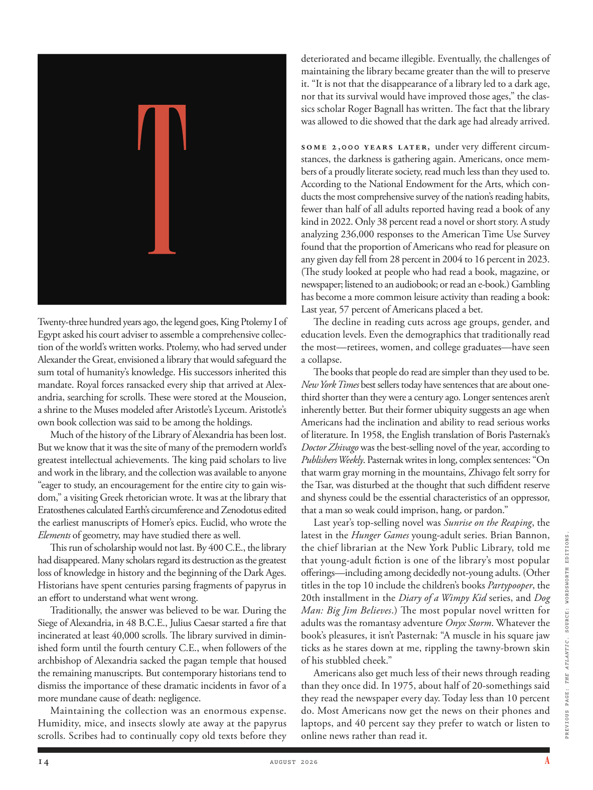

# The Atlantic — August 2026

## Page 16

---

Twenty-three hundred years ago, the legend goes, King Ptolemy I of Egypt asked his court adviser to assemble a comprehensive collection of the world’s written works. Ptolemy, who had served under Alexander the Great, envisioned a library that would safeguard the sum total of humanity’s knowledge. His successors inherited this mandate. Royal forces ransacked every ship that arrived at Alexandria, searching for scrolls. These were stored at the Mouseion, a shrine to the Muses modeled after Aristotle’s Lyceum. Aristotle’s own book collection was said to be among the holdings.

**【中文翻译】** 传说，两千三百年前，埃及国王托勒密一世要求他的宫廷顾问收集世界各地的书面作品的综合集。曾在亚历山大大帝手下服役的托勒密设想建立一座能够保护人类全部知识的图书馆。他的继任者继承了这一使命。皇家军队洗劫了每艘抵达亚历山大的船只，寻找卷轴。这些物品被存放在缪斯神庙（Mouseion），这是一座仿照亚里士多德学园建造的缪斯神殿。据说亚里士多德自己的藏书也在其中。

Much of the history of the Library of Alexandria has been lost. But we know that it was the site of many of the premodern world’s greatest intellectual achievements. The king paid scholars to live and work in the library, and the collection was available to anyone “eager to study, an encouragement for the entire city to gain wisdom,” a visiting Greek rhetorician wrote. It was at the library that Eratosthenes calculated Earth’s circumference and Zenodotus edited the earliest manuscripts of Homer’s epics. Euclid, who wrote the Elements of geometry, may have studied there as well.

**【中文翻译】** 亚历山大图书馆的大部分历史已经丢失。但我们知道，它是前现代世界许多最伟大的智力成就的发源地。一位来访的希腊修辞学家写道，国王向学者支付在图书馆生活和工作的费用，所有渴望学习的人都可以使用这些藏书，这是对整个城市获得智慧的鼓励。正是在图书馆，埃拉托色尼计算了地球的周长，泽诺多图斯编辑了荷马史诗最早的手稿。 《几何原本》的作者欧几里得可能也曾在那里学习过。

This run of scholarship would not last. By 400 C.E., the library had disappeared. Many scholars regard its destruction as the greatest loss of knowledge in history and the beginning of the Dark Ages.

**【中文翻译】** 这轮奖学金不会持续太久。到公元 400 年，图书馆消失了。许多学者将其毁灭视为历史上最大的知识损失和黑暗时代的开始。

Historians have spent centuries parsing fragments of papyrus in an eff ort to understand what went wrong. Traditionally, the answer was believed to be war. During the Siege of Alexandria, in 48 B.C.E., Julius Caesar started a fi re that incinerated at least 40,000 scrolls. The library survived in diminished form until the fourth century C.E., when followers of the archbishop of Alexandria sacked the pagan temple that housed the remaining manuscripts. But contemporary historians tend to dismiss the importance of these dramatic incidents in favor of a more mundane cause of death: negligence.

**【中文翻译】** 历史学家花了几个世纪的时间来解析纸莎草纸碎片，试图找出问题所在。传统上，答案被认为是战争。公元前 48 年，亚历山大城被围困期间，尤利乌斯·凯撒纵火焚烧了至少 40,000 个卷轴。该图书馆以缩减的形式幸存下来，直到公元四世纪，亚历山大大主教的追随者洗劫了存放剩余手稿的异教寺庙。但当代历史学家往往忽视这些戏剧性事件的重要性，而倾向于更常见的死亡原因：过失。

Maintaining the collection was an enormous expense. Humidity, mice, and insects slowly ate away at the papyrus scrolls. Scribes had to continually copy old texts before they deteriorated and became illegible. Eventually, the challenges of maintaining the library became greater than the will to preserve it. “It is not that the disappearance of a library led to a dark age, nor that its survival would have improved those ages,” the classics scholar Roger Bagnall has written. The fact that the library was allowed to die showed that the dark age had already arrived.

**【中文翻译】** 维护藏品是一项巨大的开支。潮湿、老鼠和昆虫慢慢地侵蚀着纸莎草卷轴。抄写员必须不断地抄写旧文本，以免它们变质并变得难以辨认。最终，维护图书馆的挑战变得比保护它的意愿更大。古典学者罗杰·巴格纳尔（Roger Bagnall）写道：“并不是说图书馆的消失导致了黑暗时代，也不是说它的存在会改善那个时代。”图书馆被允许消亡这一事实表明黑暗时代已经到来。

Some 2,000 years later, under very diff erent circumstances, the darkness is gathering again. Americans, once members of a proudly literate society, read much less than they used to.

**【中文翻译】** 大约2000年后，在截然不同的情况下，黑暗再次聚集。美国人曾经是一个以识字为荣的社会的成员，但他们的阅读量却比以前少了很多。

According to the National Endowment for the Arts, which conducts the most comprehensive survey of the nation’s reading habits, fewer than half of all adults reported having read a book of any kind in 2022. Only 38 percent read a novel or short story. A study analyzing 236,000 responses to the American Time Use Survey found that the proportion of Americans who read for pleasure on any given day fell from 28 percent in 2004 to 16 percent in 2023.

**【中文翻译】** 美国国家艺术基金会对全国阅读习惯进行了最全面的调查，根据该机构的数据，到 2022 年，只有不到一半的成年人表示读过任何类型的书籍。只有 38% 的人读过长篇小说或短篇小说。一项研究分析了美国时间利用调查的 236,000 份回复，发现每天以阅读为乐趣的美国人比例从 2004 年的 28% 下降到 2023 年的 16%。

(The study looked at people who had read a book, magazine, or newspaper; listened to an audio book; or read an ebook.) Gambling has become a more common leisure activity than reading a book: Last year, 57 percent of Americans placed a bet.

**【中文翻译】** （该研究调查了读过书、杂志或报纸；听过有声读物；或读过电子书的人。）赌博已成为比读书更常见的休闲活动：去年，57% 的美国人下注。

The decline in reading cuts across age groups, gender, and education levels. Even the demographics that traditionally read the most—retirees, women, and college graduates— have seen a collapse.

**【中文翻译】** 阅读能力的下降涉及各个年龄段、性别和教育水平。即使是传统上读书最多的人群——退休人员、女性和大学毕业生——也出现了崩溃。

The books that people do read are simpler than they used to be. New York Times best sellers today have sentences that are about onethird shorter than they were a century ago. Longer sentences aren’t inherently better. But their former ubiquity suggests an age when Americans had the inclination and ability to read serious works of literature. In 1958, the English translation of Boris Pasternak’s Doctor Zhivago was the best-selling novel of the year, according to Publishers Weekly . Pasternak writes in long, complex sentences: “On that warm gray morning in the mountains, Zhivago felt sorry for the Tsar, was disturbed at the thought that such diffi dent reserve and shyness could be the essential characteristics of an oppressor, that a man so weak could imprison, hang, or pardon.”

**【中文翻译】** 人们读的书比以前更简单。如今，《纽约时报》畅销书的句子比一个世纪前短了约三分之一。句子越长并不一定越好。但它们以前的普遍存在表明，在那个时代，美国人有阅读严肃文学作品的倾向和能力。据《出版商周刊》报道，1958 年，鲍里斯·帕斯捷尔纳克的《日瓦戈医生》的英译本成为当年最畅销的小说。帕斯捷尔纳克用长而复杂的句子写道：“在山里那个温暖、灰色的早晨，日瓦戈为沙皇感到难过，一想到如此缺乏自信和害羞可能是压迫者的基本特征，以至于一个如此软弱的人可以被监禁、绞死或赦免，他感到不安。”

Last year’s top-selling novel was Sunrise on the Reaping , the latest in the Hunger Games young-adult series. Brian Bannon, the chief librarian at the New York Public Library, told me that young-adult fiction is one of the library’s most popular offerings— including among decidedly not-young adults. (Other titles in the top 10 include the children’s books Partypooper , the 20th installment in the Diary of a Wimpy Kid series, and Dog Man: Big Jim Believes .) The most popular novel written for adults was the romantasy adventure Onyx Storm . Whatever the book’s pleasures, it isn’t Pasternak: “A muscle in his square jaw ticks as he stares down at me, rippling the tawny-brown skin of his stubbled cheek.”

**【中文翻译】** 去年最畅销的小说是《收割日出》，这是《饥饿游戏》青少年系列的最新作品。纽约公共图书馆的馆长布莱恩·班农 (Brian Bannon) 告诉我，年轻成人小说是图书馆最受欢迎的作品之一，其中包括那些绝对不年轻的成年人。 （排名前 10 名的其他书籍包括儿童读物《Partypooper》、《小屁孩日记》系列的第 20 部以及《狗侠：大吉姆的信仰》。）最受欢迎的成人小说是浪漫冒险小说《玛瑙风暴》。不管这本书有什么乐趣，它都不是帕斯捷尔纳克：“当他低头看着我时，他的方下巴上的一块肌肉在颤动，让他满是胡茬的脸颊上黄褐色的皮肤泛起涟漪。”

Americans also get much less of their news through reading than they once did. In 1975, about half of 20somethings said they read the newspaper every day. Today less than 10 percent do. Most Americans now get the news on their phones and laptops, and 40 percent say they prefer to watch or listen to online news rather than read it. PREVIOUS PAGE: THE ATLANTIC . SOURCE: WORDSWORTH EDITIONS.

**【中文翻译】** 美国人通过阅读获得的新闻也比以前少了很多。 1975 年，大约一半的 20 多岁的人说他们每天都读报纸。如今，这样做的人还不到 10%。大多数美国人现在通过手机和笔记本电脑获取新闻，40% 的人表示他们更喜欢观看或收听在线新闻，而不是阅读新闻。上一页：大西洋。资料来源：华兹华斯版。
